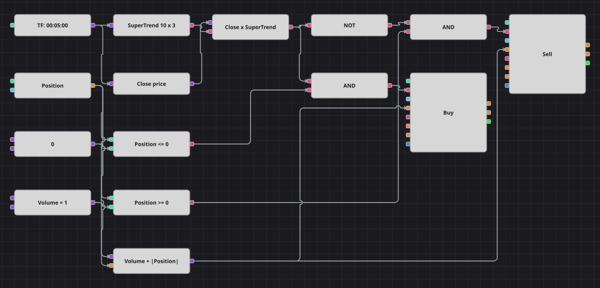

# Диаграмма стратегии разворота по Supertrend
[English](README.md) | [中文](README_zh.md) | [Español](README_es.md) | [Deutsch](README_de.md) | [Português](README_pt.md) | [日本語](README_ja.md)

Supertrend рисует одну линию, которая при росте идёт под ценой, а при падении — над ней, отступая от медианной цены на несколько средних истинных диапазонов. Схема торгует момент, когда закрытие переходит через эту линию: покупает переход вверх, продаёт переход вниз и держит сторону до следующего разворота.

## Обзор стратегии

- Индикатор Supertrend считается по завершённым свечам: период ATR задаёт, насколько далеко линия стоит от цены, а множитель масштабирует это расстояние.
- Конвертер берёт цену закрытия каждой свечи, а кубик пересечения сравнивает её с линией Supertrend и срабатывает только на свече, где они действительно пересеклись.
- После первого сигнала стратегия всегда в рынке: ни стопа, ни тейка нет — есть только смена стороны линии.

## Правила входа и выхода

- **Вход в лонг**: Закрытие пересекает линию Supertrend снизу вверх, а позиция ещё не в лонге. Заявка покупает объём Volume плюс модуль текущей позиции: из нуля это открытие лонга, из шорта — разворот сразу в лонг.
- **Вход в шорт**: Закрытие пересекает линию Supertrend сверху вниз, а позиция ещё не в шорте. Заявка продаёт объём Volume плюс модуль текущей позиции: из нуля это открытие шорта, из лонга — разворот сразу в шорт.
- **Выход**: Отдельного выхода и защитного стопа нет: из позиции выводит только обратный переход линии, разворачивающий её одной заявкой.

## Параметры

| Параметр | По умолчанию | Описание |
|---|---|---|
| ATR period | 10 | Период ATR, на котором строится линия Supertrend. |
| ATR multiplier | 3 | Множитель ATR, задающий отступ линии от медианной цены. |
| Volume | 1 | Базовый объём заявки в лотах; при развороте к нему прибавляется открытая позиция. |
| Candles | 00:05:00 | Таймфрейм свечей, на котором работает вся диаграмма. |

## Детали диаграммы

- Кубик свечей питает кубик индикатора с Supertrend и через конвертер отдаёт цену закрытия той же свечи.
- Оба значения приходят в кубик пересечения, выход которого — сигнал на лонг, а логическое НЕ от него — сигнал на шорт.
- Каждый сигнал объединяется логическим И со сравнением позиции с нулём, поэтому вход никогда не наращивает уже открытую в ту же сторону позицию.
- Кубик формулы считает Volume плюс модуль позиции и подаёт результат на вход объёма обоих кубиков изменения позиции — так одна рыночная заявка разворачивает позицию.

## Использование

Импортируйте файл `.json` в Designer, прогоните схему на исторических данных в тестере, затем подстройте параметры или сами кубики под свой инструмент, прежде чем торговать вживую.
