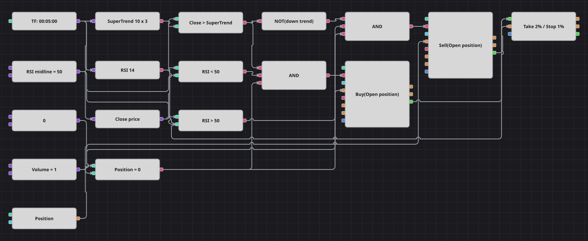

# Supertrend + RSI 戦略のダイアグラム
[English](README.md) | [Русский](README_ru.md) | [中文](README_zh.md) | [Español](README_es.md) | [Deutsch](README_de.md) | [Português](README_pt.md)

オシレーターをブレーキに使ったトレンドフォローのダイアグラムです。価格に追随して反転する ATR バンドである SuperTrend が方向を決め、RSI が値動きにまだ余地があるかを判断します。RSI が中央線より下にある間だけ買い、上にある間だけ売ります。エグジットはシグナルではなく、エントリー約定に対して置く定率の利食いと損切りです。

## 戦略の概要

- SuperTrend は 10 期間の ATR に 3 を掛けて作られ、線は価格の後ろをラチェット状に追い、終値がそれを抜けたときだけ向きを変えます。
- RSI は反転シグナルではなくブレーキとして働きます。オシレーターが 50 の落ち着いた側にある間だけエントリーを許すため、すでに伸び切った値動きを避けられます。
- エントリーはノーポジションのときだけ行われます。ポジションとゼロの明示的な比較と、注文ブロック側の建玉オープン条件の両方で守られています。
- エグジットはすべて保護ブロックに任され、利食い 2%・損切り 1% という元の戦略が起動するのと同じ組み合わせを使います。

## エントリーとエグジットの条件

- **ロングエントリー**: 終値が SuperTrend の線より上、RSI が中央線 50 より下、かつポジションがゼロのとき。注文は共通数量を成行で買い、保護ブロックがその約定に利食いと損切りをただちに設定します。
- **ショートエントリー**: 終値が SuperTrend の線より下、RSI が中央線 50 より上、かつポジションがゼロのとき。注文は共通数量を成行で売り、保護ブロックが同様に 2 つのエグジットを設定します。
- **エグジット**: シグナルによるエグジットもドテンもありません。2% の利食いか 1% の損切りのうち、先に到達した保護注文がポジションを閉じます。

## パラメーター

| パラメーター | 既定値 | 説明 |
|---|---|---|
| SuperTrend ATR Period | 10 | SuperTrend 内部の ATR 期間。大きくするとバンドが広がり反転が減ります。 |
| SuperTrend Multiplier | 3 | SuperTrend の ATR 倍率。追随線とメディアン価格との距離です。 |
| RSI Length | 14 | 相対力指数の平滑化期間。 |
| RSI Midline | 50 | エントリーフィルターが参照する RSI の水準。元のコードは宣言された売られすぎ・買われすぎ水準ではなく 50 と比較します。 |
| Take Profit, % | 2 | エントリー価格からの利食いまでの距離（％）。 |
| Stop Loss, % | 1 | エントリー価格からの損切りまでの距離（％）。 |
| Volume | 1 | 注文数量（ロット）。 |
| Candles | 00:05:00 | ダイアグラム全体が用いるローソク足の時間軸。 |

## ダイアグラムの詳細

- ローソク足ブロックが SuperTrend、RSI、そして同じ足の終値を取り出す変換ブロックに接続されます。
- 終値と SuperTrend 出力の比較が上昇トレンドの判定になり、その論理否定が下降トレンドの判定になります。そのため 2 つの方向が同じ足で同時に成立することはありません。
- 50 という 1 つの共通定数が両方の RSI 比較に供給されるので、中央線を動かせば 2 つのフィルターが同時に動きます。
- それぞれの論理積がトレンド・オシレーター・ノーポジションという 3 条件をまとめ、建玉オープン条件も設定されたポジション変更ブロックを起動します。
- 2 つのポジション変更ブロックは自分の約定を保護ブロックへ渡し、保護ブロックは進行中の足の終値を基準に利食いと損切りの注文を出します。
- 元のコードが取引の間に置く 100 本分の待ち時間は再現していません。利用できるブロックに足数のカウンターがないため、保護がポジションを解消し次第すぐに次のエントリーが可能になります。

## 使い方

`.json` ファイルを Designer に読み込み、バックテスターで過去データを使って実行し、実運用の前にパラメーターやブロック自体を自分の銘柄に合わせて調整してください。
