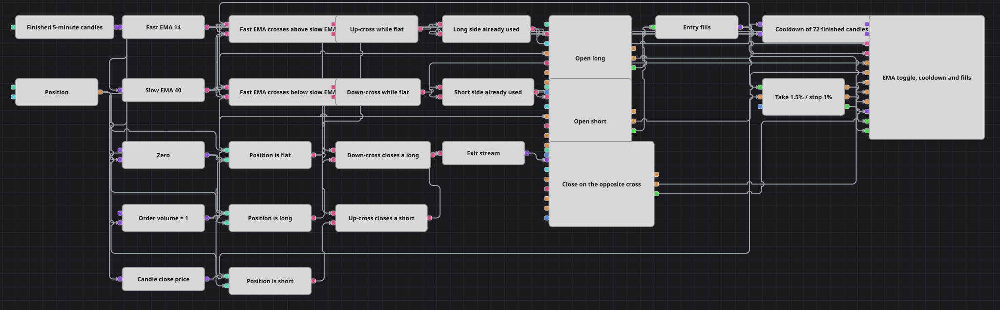

# Conmutador de tendencia con bloqueo de enfriamiento
[English](README.md) | [Русский](README_ru.md) | [中文](README_zh.md) | [Deutsch](README_de.md) | [Português](README_pt.md) | [日本語](README_ja.md)

Dos medias exponenciales que se cruzan sobre una serie de velas rápida producen muchas más señales de las veces que la tendencia cambia realmente, y una sucesión de cruces alrededor de un mismo nivel de precio puede llenar la cuenta de entradas que se anulan entre sí. Este diagrama toma un cruce, lo gasta y después cierra con llave ese lado durante un número fijo de velas. El cierre es un bloque Flag, la cuenta atrás que vuelve a abrirlo es un bloque Delay value, y lo que pone en marcha esa cuenta atrás es un Combination que une las ejecuciones de ambas direcciones en una sola línea llamada «ha habido una entrada».

## Resumen de la estrategia

- Las velas cerradas de una única serie alimentan una media móvil exponencial rápida y otra lenta; nada en el diagrama reacciona a una vela que todavía se está formando.
- Dos bloques Crossing leen el mismo par de medias con sus entradas intercambiadas, de modo que uno es verdadero exactamente en la barra en la que la media rápida cruza por encima de la lenta y el otro exactamente en la barra en la que la cruza por debajo.
- Un bloque Position comparado con cero indica si la cuenta está plana, larga o corta, y esa respuesta es lo que convierte un cruce en una señal permitida y no en una simple observación.
- Cada dirección tiene su propio Flag. La señal de entrada es su disparador, y un Flag deja pasar un disparador solo la primera vez que se activa, por lo que la segunda señal de ese lado y todas las siguientes se descartan en silencio.
- Las entradas son bloques Position modify que abren únicamente desde una cuenta plana, lo que mantiene sincronizadas la señal permitida y la orden realmente colocada.
- Ambos bloques de entrada envían sus ejecuciones a un único Combination, y esa única línea arma el bloque Delay value, entrega la ejecución a Position protection y dibuja las ejecuciones en el gráfico.
- Delay value cuenta velas cerradas después de la ejecución y emite un pulso cuando la cuenta se agota; ese pulso está conectado al conector de reinicio de ambos Flag, y los dos lados vuelven a quedar operativos.
- Un cruce contrario mientras hay una posición abierta lo recoge un segundo Combination y cierra la operación, mientras que las distancias de take-profit y stop-loss pueden terminarla antes.

## Reglas de entrada y salida

- **Entrada en largo**: La media rápida cruza por encima de la lenta en una vela cerrada mientras la cuenta está plana. La condición lógica que une esos dos hechos dispara el Flag largo; si el Flag sigue bloqueado por una entrada larga anterior, la señal muere ahí y no se ordena nada. En caso contrario, el Flag se dispara una vez, Position modify compra a mercado con el volumen configurado y el Flag permanece activado hasta que la cuenta atrás lo libera.
- **Entrada en corto**: La media rápida cruza por debajo de la lenta en una vela cerrada mientras la cuenta está plana. La señal pasa por el Flag corto bajo la misma regla y Position modify vende a mercado con el mismo volumen. Los dos Flag son independientes, así que un lado largo bloqueado no impide tomar una posición corta.
- **Salida**: Un cruce a la baja estando largo y un cruce al alza estando corto se encuentran en un Combination que dispara un Position modify configurado para cerrar, y este calcula por sí mismo el volumen de cierre. Position protection funciona en paralelo sobre la ejecución de entrada y puede terminar la operación antes, a la distancia del take-profit o del stop-loss. Nada se invierte con una sola orden: la posición vuelve primero a plana y el lado contrario se abre después, con un cruce que encuentra la cuenta vacía y ese lado desbloqueado.

## Parámetros

| Parámetro | Por defecto | Descripción |
|---|---|---|
| Candles | 00:05:00 | Marco temporal de la serie de velas sobre la que funciona todo el diagrama. También fija la unidad del enfriamiento, que se cuenta en velas de esta serie. |
| Fast EMA Length | 14 | Longitud de la media móvil exponencial rápida. |
| Slow EMA Length | 40 | Longitud de la media móvil exponencial lenta. Manténgala claramente por encima de la rápida; medias de longitud parecida se cruzan constantemente y el pestillo acabaría haciendo todo el filtrado. |
| Cooldown Candles | 72 | Número de velas cerradas durante las que un lado permanece bloqueado después de ejecutarse una entrada. Aumentarlo reduce el número de operaciones; reducirlo permite que un tramo lateral produzca varias entradas seguidas. |
| Volume | 1 | Tamaño de una entrada, en unidades del instrumento. Ambas direcciones lo utilizan. |
| Take Profit, % | 1.5 | Distancia del take-profit, en porcentaje del precio de entrada. |
| Stop Loss, % | 1 | Distancia del stop-loss, en porcentaje del precio de entrada. |

## Detalles del diagrama

- Un Flag nunca emite falso. Es un pestillo, no una compuerta: informa del momento en que se activa, y todo lo que bloquea lo bloquea callando, y por eso lo que vuelve a abrir un lado es el conector de reinicio y no un Not lógico.
- Delay value solo se arma desde un estado vacío. Una ejecución que llega cuando la cuenta atrás ya está en marcha no la prolonga, de modo que la pausa se mide desde la primera ejecución de una serie y no desde la última.
- La cuenta atrás la impulsa la propia serie de velas: las velas entran en la entrada de conteo y la decrementan, por lo que la pausa se expresa en barras y sigue el marco temporal en lugar de un reloj de pared.
- El pulso de reinicio abre ambos lados a la vez, y cada lado se bloquea por separado. Una dirección que no ha operado durante la pausa queda desbloqueada por un pulso que pagó la otra dirección, y esa es la diferencia deliberada entre un pestillo por lado y un único temporizador global.
- La condición de entrada exige una cuenta plana y el bloque de entrada se niega a trabajar desde cualquier otro estado de forma intencionada: la señal gasta el pestillo, así que una señal que no pudiera ejecutarse desperdiciaría la pausa de ese lado.

## Uso

Importe el archivo `.json` en Designer, ejecútelo sobre datos históricos en el probador y después ajuste los parámetros o los propios bloques a su instrumento antes de operar en real.
