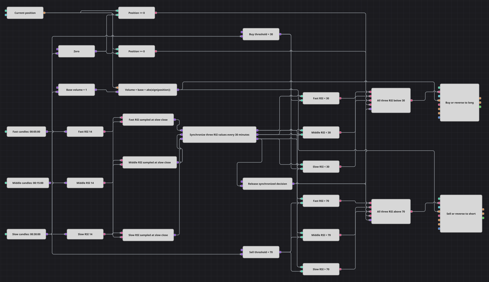

# 3 時間枠 RSI 合意ストラテジー図
[English](README.md) | [Русский](README_ru.md) | [中文](README_zh.md) | [Español](README_es.md) | [Deutsch](README_de.md) | [Português](README_pt.md)

このダイアグラムは、5 分足、15 分足、30 分足で形成済みの RSI 値を待ち、低速時間枠の各確定時に 3 値を取得して 1 つの同期グループとして評価します。すべてが 30 未満ならロングを開始または反転し、すべてが 70 超ならショートを開始または反転します。

## ストラテジーの概要

- 確定足の 3 ストリームが、5 分、15 分、30 分の各時間枠で独立した RSI(14) を計算します。
- 30 分 RSI のイベントが各ストリームの最新値を取得します。Sync は 3 つのサンプルを 30 分間隔でグループ化し、出力後に消去します。
- 判定は形成済み 30 分 RSI 値ごとに 1 回行い、3 つの同期出力がすべて比較を更新した後に限ります。
- 3 つの RSI がすべて買いしきい値未満ならロング設定、すべて売りしきい値超ならショート設定です。
- ポジションゲートは、すでに保有している方向への追加注文を防ぎます。反対設定では数量 2 の成行反転を送り、ゼロポジションからは数量 1 で入ります。
- 独立した損切り、利確、時間決済、クールダウンはありません。次に成立した反対設定だけが決済となり、直ちに新しい方向を確立します。

## エントリーとエグジットの条件

- **ロングエントリー**: 同期した Fast RSI、Middle RSI、Slow RSI がすべて厳密に 30 未満で、Position がゼロ以下であることを要求します。`Base Volume + abs(sign(Position))` を成行で買います。ゼロポジションからは数量 1、このダイアグラムが作った数量 1 のショートからは数量 2 です。
- **ショートエントリー**: 同期した 3 つの RSI がすべて厳密に 70 超で、Position がゼロ以上であることを要求します。同じ計算数量を成行で売ります。ゼロポジションからは数量 1、このダイアグラムが作った数量 1 のロングからは数量 2 です。
- **エグジット**: ロングは条件を満たすショート設定だけで閉じ、ショートは条件を満たすロング設定だけで閉じます。反転注文が数量 1 のエクスポージャーを閉じると同時に、新方向へ数量 1 を開きます。
- **ポジションの範囲**: 正規化した式は、このダイアグラムが作るポジションを対象にしています。外部ポジションの絶対量が基準数量 1 を超える場合、数量 2 の反転注文で目標状態に到達するとは限りません。

## パラメーター

| パラメーター | 既定値 | 説明 |
|---|---|---|
| 高速ローソク足系列 | 00:05:00 | Fast RSI が使う確定 5 分足。 |
| 中速ローソク足系列 | 00:15:00 | Middle RSI が使う確定 15 分足。 |
| 低速ローソク足系列 | 00:30:00 | 同期判定を予定する確定 30 分足。 |
| Fast RSI 期間 | 14 | 高速足ストリーム上の RSI 平均期間。 |
| Fast RSI ソース | 未設定 | 代替のインジケーター入力フィールドは選択されていません。 |
| Middle RSI 期間 | 14 | 中速足ストリーム上の RSI 平均期間。 |
| Middle RSI ソース | 未設定 | 代替のインジケーター入力フィールドは選択されていません。 |
| Slow RSI 期間 | 14 | 低速足ストリーム上の RSI 平均期間。 |
| Slow RSI ソース | 未設定 | 代替のインジケーター入力フィールドは選択されていません。 |
| 買いしきい値 | 30 | ロングエントリーを許可する合意の厳密な上限。 |
| 売りしきい値 | 70 | ショートエントリーを許可する合意の厳密な下限。 |
| 基準数量 | 1 | 目標エクスポージャーとゼロからのエントリー量。反転では既定量の 2 倍を使います。 |

## ダイアグラムの詳細

- 各 Candles ブロックは確定値だけを出力し、保存済みの小さい足から自分の時間枠を構築できます。各 RSI は、それぞれ 14 値のウォームアップが完了してから出力を始めます。
- Fast RSI と Middle RSI は Slow RSI より早く形成されます。Slow RSI の各イベントが indicator value 型の 3 つの Variable を発動するため、不完全なウォームアップ区間が Sync キューの先頭に残りません。
- Sync には入力と出力が正確に 3 組接続され、Interval は `00:30:00`、Clear Sockets は有効です。出力は共通の判定時刻で、最新の高速 RSI、最新の中速 RSI、現在の低速 RSI を運びます。
- 6 つの Comparison ブロックが厳密な `< Buy Threshold` と `> Sell Threshold` を適用します。6 比較が現在グループをすべて処理した後にだけ、ブール解放パルスが 2 つの 5 入力 AND ゲートへ届きます。
- Current Position は、ロング経路では `<=`、ショート経路では `>=` でゼロと比較されます。これによりゼロからのエントリーまたは反対ポジションの反転を許可し、同方向への繰り返しエントリーを抑えます。
- Formula は `Base Volume + abs(sign(Position))` を計算します。維持されるエクスポージャーでは、ゼロからは 1、保有中は 2 となり、データ購読が複数でも値は有界です。
- Buy と Sell の Modify position ブロックは、方向と可否が外部ゲートで決まっているため、NoCondition の成行動作を使います。保護ブロックと Chart ブロックはありません。
- しきい値は RSI 期間および足系列から意図的に分離されています。時間枠や期間を変更するとウォームアップ時刻も変わりますが、Sync は評価前に新しい 3 サンプルを待ちます。

## 使用方法

`.json` ファイルを Designer にインポートし、30 分 RSI を形成できる十分な履歴でバックテスターを実行してください。ライブ取引の前に、3 つの足系列、RSI 期間、しきい値、基準数量を銘柄に合わせて調整します。
