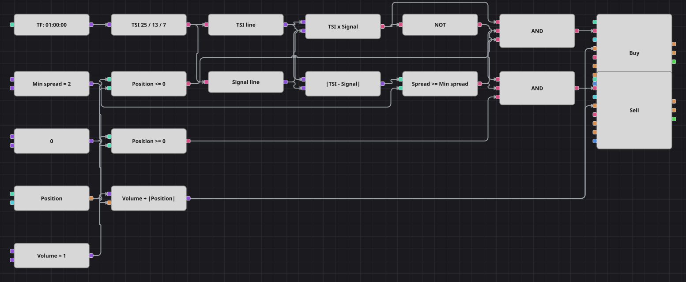

# Диаграмма стратегии пересечения TSI и его сигнальной линии
[English](README.md) | [中文](README_zh.md) | [Español](README_es.md) | [Deutsch](README_de.md) | [Português](README_pt.md) | [日本語](README_ja.md)

True Strength Index — это дважды сглаженный моментум: он поворачивает поздно, но почти не обманывает. В паре со своей экспоненциальной сигнальной линией он ведёт себя как медленный MACD: пересечение задаёт направление, а расстояние между линиями показывает, насколько убедителен разворот. Схема берёт только те пересечения, где это расстояние уже превысило минимум, и тем самым отделяет реальную смену контроля от линий, которые просто задевают друг друга.

## Обзор стратегии

- Один кубик True Strength Index несёт обе линии; два конвертера достают из одного значения саму линию TSI и её сигнальную линию.
- Кубик пересечения сравнивает линии и сообщает направление пересечения, а логическое НЕ превращает тот же выход в пересечение вниз.
- Формула измеряет абсолютный зазор между линиями, а сравнение требует, чтобы он был не меньше минимального расхождения, иначе пересечение не принимается.
- Проверка позиции решает, разрешён ли вход, а объём заявки равен общему объёму плюс модуль позиции, поэтому встречный сигнал разворачивает позицию одной заявкой.

## Правила входа и выхода

- **Вход в лонг**: Линия TSI пересекает сигнальную линию снизу вверх, зазор между ними не меньше минимального расхождения, а позиция не в лонге. Заявка покупает общий объём плюс размер открытого шорта, поэтому одна рыночная заявка закрывает шорт и открывает лонг.
- **Вход в шорт**: Линия TSI пересекает сигнальную линию сверху вниз, зазор между ними не меньше минимального расхождения, а позиция не в шорте. Заявка продаёт общий объём плюс размер открытого лонга.
- **Выход**: Собственного правила выхода и защитного стопа нет — ровно как в оригинале: позиция держится, пока обратное пересечение её не развернёт. Упрощений два. Оригинал после каждого входа ждёт десять свечей и только потом снова смотрит на сигналы; кубика, который хранит счётчик баров между свечами, нет, поэтому пауза убрана, а повторный вход в ту же сторону по-прежнему запрещает проверка позиции. Оригинал при развороте отправляет две рыночные заявки, на мгновение удваивая размер; здесь ту же работу делает формула объёма в одной заявке.

## Параметры

| Параметр | По умолчанию | Описание |
|---|---|---|
| TSI First Length | 25 | Первый период сглаживания True Strength Index. |
| TSI Second Length | 13 | Второй период сглаживания True Strength Index. |
| TSI Signal Length | 7 | Период экспоненциальной сигнальной линии, построенной по индексу. |
| Min spread | 2 | Минимальный абсолютный зазор между индексом и его сигнальной линией, при котором пересечение засчитывается. |
| Volume | 1 | Объём заявки в лотах. |
| Candles | 01:00:00 | Таймфрейм свечей, на котором работает вся диаграмма. Оригинал работает на четырёхчасовых свечах; на месяце истории завершённых баров слишком мало, чтобы дважды сглаженный индекс успел сформироваться и ещё поторговать, поэтому схема переведена на часовые свечи. |

## Детали диаграммы

- Кубик свечей питает кубик True Strength Index, комплексное значение которого два конвертера разбирают на сам индекс и его сигнальную линию.
- В кубик пересечения индекс подан верхним входом, а сигнальная линия нижним, поэтому его выход истинен на пересечении вверх и ложен на пересечении вниз.
- Формула зазора и её сравнение считаются на каждой свече, а кубик пересечения подаёт голос только на пересечениях, поэтому каждое логическое И срабатывает ровно на том баре, где произошло отфильтрованное пересечение.
- Оба кубика изменения позиции берут объём из одной формулы, которая добавляет модуль позиции к общей константе объёма.

## Использование

Импортируйте файл `.json` в Designer, прогоните схему на исторических данных в тестере, затем подстройте параметры или сами кубики под свой инструмент, прежде чем торговать вживую.
