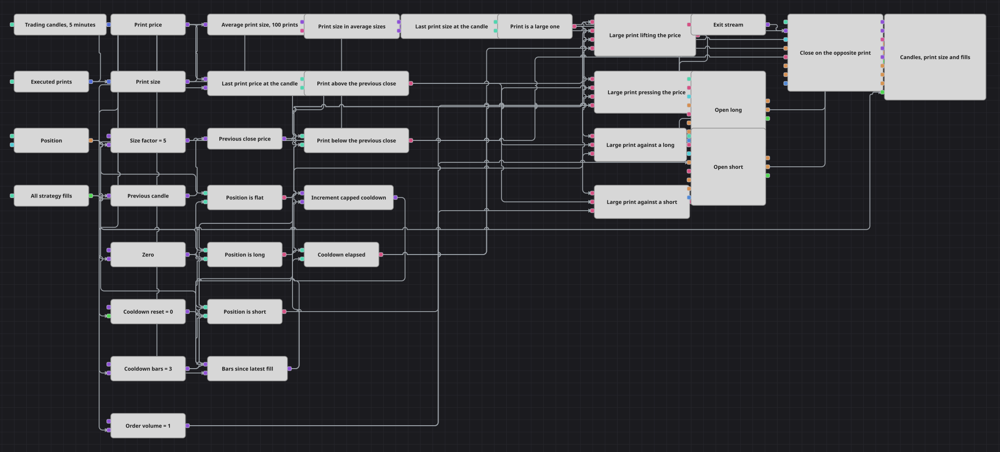

# 逐笔成交解读策略图解
[English](README.md) | [Русский](README_ru.md) | [Español](README_es.md) | [Deutsch](README_de.md) | [Português](README_pt.md) | [日本語](README_ja.md)

一根K线说明这段时间里发生了什么，逐笔成交则说明它是怎么发生的。本图订阅已成交的逐笔数据流，把每一笔成交的数量与最近一百笔成交的平均数量相比较，并把数量达到该均值数倍的成交看作某个着急的人留下的脚印。读数在每根K线走完时取一次，因此一条每天触发上千次的数据流仍然只在每根K线上产生一个决策。

## 策略概览

- 逐笔数据流同时提供信号的两半：一个转换器读取每笔成交的数量，另一个读取它的价格。
- 对最近一百笔成交数量取移动平均，使本图对该品种上一笔普通成交有多大始终保持动态的概念，因此其中没有任何东西与特定的价格水平或合约规模绑定。
- 一个公式把每笔成交的数量除以该均值，将其化为一个普通的倍数：1 表示一笔普通成交，5 表示这笔成交是近期常态的五倍。
- 一个变量保存这个倍数，另一个变量保存成交价格，直到K线收盘。K线是它们的触发源，正是这一点把逐笔速度的测量与K线速度的决策放在了同一个时钟上。
- 与 Size Factor 的比较回答这笔成交是不是大单。上一根K线的收盘价——由前值（Previous value）方块和一个转换器取得——回答它的方向。
- 持仓（Position）方块与零比较三次，为入场给出一个空仓判断，为离场给出一个多头判断和一个空头判断。
- 策略成交（Strategy trades）报告每一笔自身成交并重置一个K线计数器，使本图在任何成交（无论入场还是离场）之后的若干根K线内不再进入市场。
- 两个入场都是设置为仅开仓的持仓修改（Position modify）方块，离场是第三个设置为平仓的同类方块，因此同一时间只持有一个仓位，并且在建立反向仓位之前先把它平掉。

## 入场与出场规则

- **做多入场**: 在K线收盘之前最后穿过的那笔成交，其数量至少达到平均成交数量的 Size Factor 倍，价格高于上一根K线的收盘价，持仓为空仓，且冷却期已过。持仓修改按市价买入 Order Volume 所指定的数量。
- **做空入场**: 同样是这种大额成交，但价格低于上一根K线的收盘价，同样从空仓出发且冷却期已过。持仓修改按市价卖出 Order Volume 所指定的数量。
- **离场**: 没有止盈，也没有止损。当持仓为多头时，一笔大额成交在上一根收盘价下方穿过，多头被平掉；空头则由上方的大额成交平掉。两个离场判断汇入同一个组合（Combination），由它触发设置为平仓的持仓修改方块；使持仓归零的那笔成交同样会重新开始冷却，因此下一次入场要等过同样数量的K线。

## 参数

| 参数 | 默认值 | 说明 |
|---|---|---|
| Candles | 00:05:00 | 整个图所依据的K线周期；每一次对逐笔成交的读数都在其中一根收盘时取得。 |
| Average Prints | 100 | 用最近多少笔成交构成倍数所对照的平均数量。窗口越短，跟随活跃度变化越快，均值本身也越跳动。 |
| Size Factor | 5 | 一笔成交要达到平均数量的多少倍才算作大单。调高它可得到更稀少、更有选择性的信号；当逐笔成交清淡、没有成交符合条件时调低它。 |
| Cooldown Bars | 3 | 任何一笔成交之后，必须过去多少根走完的K线才允许下一次入场。 |
| Order Volume | 1 | 每张入场委托的数量，以品种单位计。平仓委托的数量取自已开持仓，不读取该值。 |

## 图表详情

- 这个度量是一个比值，而不是合约手数，因此同一个 Size Factor 在以单位的小数报价的品种上和在以整手报价的品种上读起来是一样的。
- 均值包含正被它衡量的那笔成交本身，因此一笔特别大的成交会把自己的标尺略微抬高；在一百笔成交的窗口下，一笔达到常态五倍的成交读出来仍在四以上。
- 被读取的那笔成交是K线收盘前最后到达的一笔。保存它的变量，正是横在每天触发上千次的数据流与每根K线只做一次的决策之间的东西；没有它，数量判断和价格判断就会按不同的时钟给出答案，永远无法一致。
- 冷却计数器由策略成交方块重置，而不是由入场方块重置，因此平仓成交同样会开始这段等待。没有它，一笔交易的离场与下一笔的入场就会落在相邻的两根K线上。
- 图表面板绘制K线、平均成交数量、保存下来的倍数与 Size Factor 线、入场与离场委托以及每一笔自身成交，因此产生了交易的那笔成交可以在它所属的K线旁边找到。

## 使用方法

将 `.json` 文件导入 Designer，在回测器中用历史数据运行，然后根据自己的交易品种调整参数或方块，确认无误后再用于实盘。
