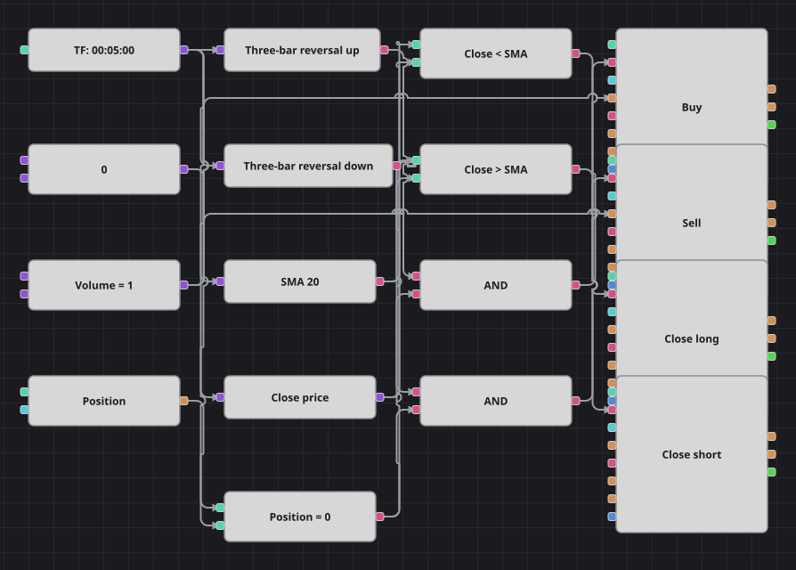

# 三根K线反转策略图
[English](README.md) | [Русский](README_ru.md) | [Español](README_es.md) | [Deutsch](README_de.md) | [Português](README_pt.md) | [日本語](README_ja.md)

两根K线把行情压低，第二根还创出比第一根更低的低点，随后第三根掉头向上，收盘价高于第二根的最高价。这一串走势说明卖方用尽了最后一次推动并被完全回击，本图就买入。镜像形态则做空。之后由收盘价的简单移动平均线接管这笔交易，决定何时结束。

## 策略概览

- 两个K线形态方块各持一条三根K线的公式，整个形态由一个方块识别，而不必堆砌大量比较方块。
- 做多公式要求：一根阴线，接着一根创新低的阴线，再接着一根收盘高于中间那根最高价的阳线。
- 做空公式完全镜像：阳线、创新高的阳线，再是一根收盘低于中间那根最低价的阴线。
- 简单移动平均线不参与入场，只作为放弃这笔交易的界线，与原始策略一致。

## 入场与出场规则

- **做多入场**: 向上形态方块报告三根K线反转已完成，且当前空仓。订单买入一手并开多。
- **做空入场**: 向下形态方块报告镜像反转已完成，且当前空仓。订单卖出一手并开空。
- **离场**: K线收盘低于移动平均线即平多，收盘高于移动平均线即平空，两者都通过处于平仓模式的修改持仓方块完成，这与原策略相同。原代码既没有止损也没有止盈，本图同样没有。未能照搬的是原策略每笔交易之后数百根K线的停顿：用方块搭出计数器必须把信号回接到图中，那会让数据流形成环路，所以这里遇到形态就交易，成交次数因此明显多于原策略。

## 参数

| 参数 | 默认值 | 说明 |
|---|---|---|
| SMA Length | 20 | 用于平仓的简单移动平均线周期。 |
| Volume | 1 | 下单数量（手）。 |
| Candles | 00:05:00 | 整张图使用的K线周期。原策略基于1分钟K线，这里改用5分钟，以匹配随附的历史数据并让形态更清晰。 |

## 图表详情

- K线方块分出四条支路：两个形态方块、移动平均线，以及从K线中取出收盘价的转换方块。
- 每个形态方块含三条公式，对应形态中的每根K线，只在完成形态的那根K线上输出真；公式中带 p 前缀的值读取前一根K线。
- 持仓方块与零常量比较，这一个判断同时保护两个入场，因此一个形态只产生一笔交易。
- 两个入场方块都发送市价单，数量取自同一个常量；两个离场方块直接由与均线的比较触发，只有在有持仓可平时才动作。

## 使用方法

将 `.json` 文件导入 Designer，在回测器中用历史数据运行，然后根据自己的交易品种调整参数或方块，确认无误后再用于实盘。
