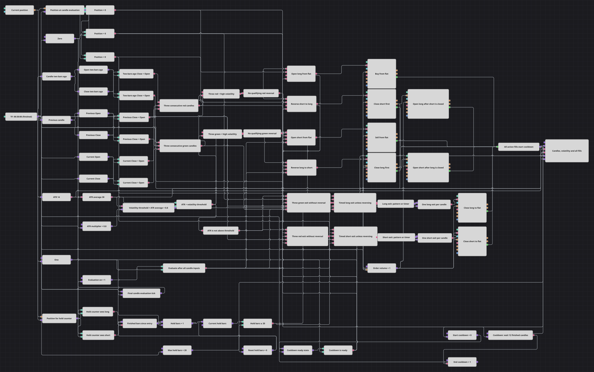

# 3本の陰線と時間決済のストラテジーダイアグラム
[English](README.md) | [Русский](README_ru.md) | [中文](README_zh.md) | [Español](README_es.md) | [Deutsch](README_de.md) | [Português](README_pt.md)

このダイアグラムは、ボラティリティが高いときに同色のローソク足が3本連続した場面を取引します。ATR 14 が30値平均の0.8倍を上回る状況で3本の陰線はロング条件、3本の陽線はショート条件になります。フラットなら直接エントリーし、反対ポジションは約定確認付きの2段階処理で反転します。保有中のポジションは反対色の3本パターン、または確定足20本の経過でも決済されます。各アクション列の後には確定足12本のクールダウンが始まります。

## 戦略の概要

- 確定済み30分足だけを処理します。2つの Previous value と6つの Converter が現在足と過去2本の Open と Close を取り出し、各足で3本連続の陰線・陽線をローリング判定します。
- ATR 14 と、そのATR値に対する30期間単純平均の両方が形成済みである必要があります。高ボラティリティは厳密な `ATR > ATR平均 × 0.8` で、指標のウォームアップ中は取引判断を行いません。
- 条件を満たす3本の陰線はフラットから買うかショートを反転し、3本の陽線はフラットから売るかロングを反転します。反転ではまずReduceOnlyで1単位を閉じ、決済Orderが完全約定してから新方向へ1単位を建てます。
- 高ボラティリティ反転にならない場合、3本の陽線はロングを、3本の陰線はショートを閉じます。状態付きカウンターも保有期間が確定足20本に達すると決済し、同じ足の反転は時間決済より優先されます。
- 3つの Combination がロングの2つの決済理由、ショートの2つの決済理由、8アクションすべての約定ストリームをまとめます。約定後の確定足12本は新しいアクションを禁止し、13本目が最初の判断可能足です。ストップロス、テイクプロフィット、ポジション保護ブロックはありません。

## エントリーとエグジットの条件

- **ロングエントリー**: 現在足と過去2本の確定足がすべて始値より下で引け、ATR 14 が `ATR平均 × 0.8` を厳密に上回り、クールダウンが準備済みなら、フラットから Order Volume 1 の NoCondition 成行買いを送信します。ショートからは、まず数量1のReduceOnly成行買いを送り、完全約定したOrderが数量値を再出力して数量1のNoCondition成行買いを起動します。
- **ショートエントリー**: 現在足と過去2本の確定足がすべて始値より上で引け、ATR 14 が `ATR平均 × 0.8` を厳密に上回り、クールダウンが準備済みなら、フラットから Order Volume 1 の NoCondition 成行売りを送信します。ロングからは、まず数量1のReduceOnly成行売りを送り、完全約定したOrderが数量値を再出力して数量1のNoCondition成行売りを起動します。
- **エグジット**: 3本連続の陽線が同時に高ボラティリティ反転を構成しない場合、または Max Hold Bars が20に達した場合にロングを閉じます。ショートは3本の陰線、または20本経過で対称的に閉じます。パターンとタイマーのイベントは方向別にまとめられ、Flag は各足で独立決済を最大1回に制限します。各独立決済と段階的反転の両約定が共通クールダウンへ送られます。

## パラメーター

| パラメーター | 既定値 | 説明 |
|---|---|---|
| Candles Series | 00:30:00 | 30分足系列。確定足だけがパターン、指標、カウンター、クールダウン、取引判断を更新します。 |
| ATR Length | 14 | 形成済みの値だけを出力する Average True Range の期間です。 |
| ATR Average Length | 30 | ATR値から計算する単純移動平均の期間です。この平均が形成されるまで判断を待ちます。 |
| ATR Multiplier | 0.8 | ATR平均に掛ける倍率です。現在ATRが得られたしきい値を厳密に上回る場合だけ条件を満たします。 |
| Max Hold Bars | 20 | ポジションが非フラットの間に数える確定足数で、この値に達すると時間決済が可能になります。 |
| Cooldown Bars | 12 | アクション列の後に禁止される後続の確定足数です。13本目で判断を再開します。 |
| Order Volume | 1 | フラットからのエントリー、ReduceOnly決済、決済約定後のエントリーに使う固定数量です。このダイアグラム自身が作る1単位ポジション向けです。 |

## ダイアグラムの詳細

- [ローソク足](https://doc.stocksharp.com/ja/topics/designer/strategies/using_visual_designer/elements/data_sources/candles.html)ブロックは確定済み30分足を出力します。2つの [Previous value](https://doc.stocksharp.com/ja/topics/designer/strategies/using_visual_designer/elements/common/prev_value.html) がシフト1と2を保持し、6つの [Converter](https://doc.stocksharp.com/ja/topics/designer/strategies/using_visual_designer/elements/common/converter.html) が3組の Open/Close を抽出します。
- 6つの [Comparison](https://doc.stocksharp.com/ja/topics/designer/strategies/using_visual_designer/elements/common/comparison.html) が厳密な `Close < Open` と `Close > Open` で各足を分類します。3入力の [Logical condition](https://doc.stocksharp.com/ja/topics/designer/strategies/using_visual_designer/elements/common/logical_condition.html) 2つがローリングする陰線・陽線パターンを作り、同時線では両方がfalseになります。
- 形成済み値の2つの [Indicator](https://doc.stocksharp.com/ja/topics/designer/strategies/using_visual_designer/elements/common/indicator.html) が ATR 14 と ATR の SMA 30 を計算します。[Formula](https://doc.stocksharp.com/ja/topics/designer/strategies/using_visual_designer/elements/common/formula.html) が平均を0.8倍し、厳密な比較が高ボラティリティフラグを出します。
- 現在の [Position](https://doc.stocksharp.com/ja/topics/designer/strategies/using_visual_designer/elements/positions/current.html) は各足で2回取得され、取引ルーティングと保有カウンターに使われます。[Variable](https://doc.stocksharp.com/ja/topics/designer/strategies/using_visual_designer/elements/data_sources/variable.html) と Formula は非フラット時だけカウンターを増やし、確認済みアクション約定でリセットします。
- 2つのブール [Combination](https://doc.stocksharp.com/ja/topics/designer/strategies/using_visual_designer/elements/common/combination.html) がパターン決済とタイマー決済を数えたり変更したりせずにまとめます。方向別の [Flag](https://doc.stocksharp.com/ja/topics/designer/strategies/using_visual_designer/elements/common/flag.html) が独立決済の重複を防ぎ、同じ足がすでに反転条件を満たす場合は優先ゲートがその決済を抑止します。
- 8つの [Modify position](https://doc.stocksharp.com/ja/topics/designer/strategies/using_visual_designer/elements/positions/modify.html) がフラットからの2エントリー、2つの独立決済、2つの段階的反転を実装します。各反転は `ReduceOnly close 1 → fully matched Order → NoCondition open 1` を使い、約定Orderは同じイベント周期で数量も再出力します。
- MyTrade の Combination が全アクション約定を [N values](https://doc.stocksharp.com/ja/topics/designer/strategies/using_visual_designer/elements/common/delay_value.html) クールダウンへ送ります。最初の約定が12本のカウントを始め、同じ反転の第2段階は動作中のカウントを再開しません。[Chart panel](https://doc.stocksharp.com/ja/topics/designer/strategies/using_visual_designer/elements/common/chart.html) はローソク足、ATR、平均、しきい値、全アクション約定を受け取ります。

## 使い方

`.json` ファイルを Designer に読み込み、バックテスターで過去データを使って実行し、実運用の前にパラメーターやブロック自体を自分の銘柄に合わせて調整してください。
