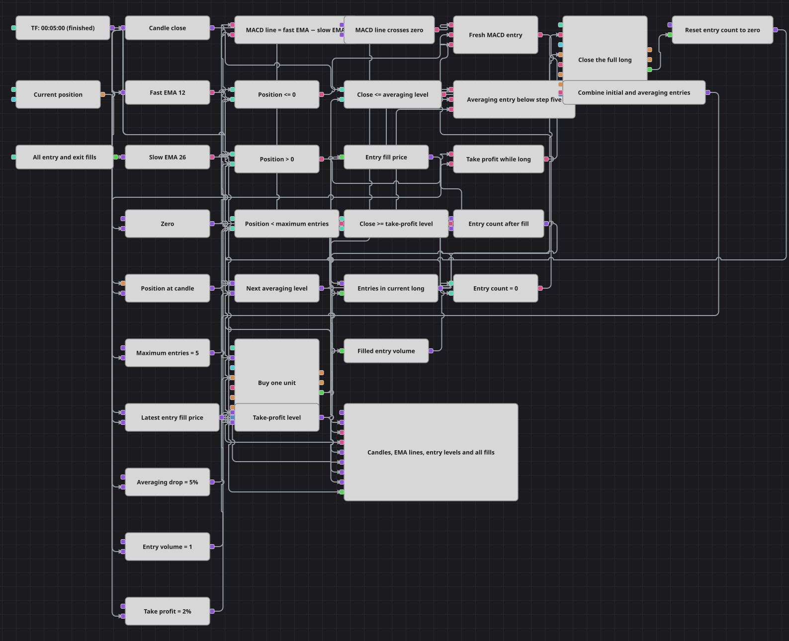

# MACD 与加仓信号合并策略图
[English](README.md) | [Русский](README_ru.md) | [Español](README_es.md) | [Deutsch](README_de.md) | [Português](README_pt.md) | [日本語](README_ja.md)

该图把 EMA 差值的新上穿事件与基于价格的加仓事件合并为一个做多入口。每次买入一单位，每轮持仓最多包含五次入场，价格从最近一次成交价回升两个百分点后卖出全部已计数数量。

## 策略概览

- 已完成的五分钟蜡烛向 EMA(12)、EMA(26) 和收盘价分支提供数据。
- 公式 `Fast EMA - Slow EMA` 生成图中使用的 MACD 线，Crossing 检测它向上穿越零轴。
- 只有当 Position 不为正且入场计数为零时，零轴上穿才会建立第一笔多头。
- 持有多头时，若收盘价比最近一次入场成交价低至少 5%，且计数少于五次，则再买入一单位。
- Combination 只合并这两个布尔入场事件，并把结果送到一个市价 Buy 方块。
- 收盘价比最近一次入场成交价高至少 2% 时，卖出全部已计数仓位，并为下一轮重置成交计数。

## 入场与离场规则

- **首次做多**：EMA(12) 减 EMA(26) 向上穿越零轴，Position 小于或等于零，并且 Entries in Current Long 等于零。按市价买入一单位。
- **加仓**：Position 为正，计数低于 Maximum Entries，且已完成蜡烛的收盘价不高于 `Latest Entry Fill × (1 - Averaging Drop / 100)`。按市价再买入一单位。
- **离场**：Position 为正时，已完成蜡烛的收盘价达到或超过 `Latest Entry Fill × (1 + Take Profit / 100)`。按市价卖出全部已计数数量并重置计数。
- **范围**：该图仅做多，并管理由自身入场流建立的单位数量。没有做空入口，也没有止损。

## 参数

| 参数 | 默认值 | 说明 |
|---|---|---|
| 蜡烛序列 | 00:05:00 | 所有决策使用的已完成五分钟蜡烛。 |
| 快速 EMA 周期 | 12 | 快速指数移动平均线的周期。 |
| 快速 EMA 输入字段 | 未设置 | 未选择其他指标输入字段。 |
| 慢速 EMA 周期 | 26 | 慢速指数移动平均线的周期。 |
| 慢速 EMA 输入字段 | 未设置 | 未选择其他指标输入字段。 |
| 最大入场次数 | 5 | 一轮多头中最多允许的单单位买入次数。 |
| 加仓跌幅 | 5 | 相对最近入场成交价触发下一次买入所需的跌幅百分比。 |
| 止盈 | 2 | 相对最近入场成交价触发全部离场所需的涨幅百分比。 |
| 入场数量 | 1 | 每次首次买入或加仓买入的固定市价数量。 |

## 图表细节

- Candles 只输出已完成值，并可用更小周期的已存蜡烛构建五分钟序列。
- 两个 EMA 方块只输出已形成值，因此第一个可操作的 MACD 差值要等慢速 EMA 预热完成后出现。
- 公式 `a - b` 接收快速和慢速 EMA，Crossing 将其结果与零值 Variable 比较。
- Position 提供方向检查，独立的 Entries in Current Long Variable 则执行零计数要求和五次入场上限。
- 每次 Buy 成交都把订单平均价写入 Latest Entry Fill。每张入场单只成交一次，所以该值就是两个百分比水平使用的成交价。
- 延迟计数路径在每次 Buy 后加上已成交订单数量。全部离场成交会在下一根蜡烛决策前把同一计数器写回零。
- Combination 的类型为布尔值，只有 Fresh MACD Entry 与 Averaging Entry Below Step Five 两个输入。Entry Volume 在两条分支之后发布，使动作方块使用当前蜡烛的最终结果。
- 图表接收蜡烛、两条 EMA、MACD 线、最近入场价、加仓水平、止盈水平以及全部进出场成交。

## 使用方法

在 Designer 中导入 `Three_Signals_Combined.json`，提供足够的数据让 EMA(26) 形成，并在所选交易品种上测试五分钟设置。用于实盘前，请评估五次入场的风险以及没有止损的影响。
