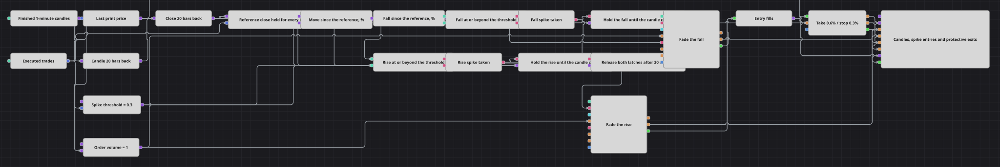

# Diagrama da estratégia Tick Spike Fade
[English](README.md) | [Русский](README_ru.md) | [中文](README_zh.md) | [Español](README_es.md) | [Deutsch](README_de.md) | [日本語](README_ja.md)

Um spike não aparece no preço de fechamento. O preço pode se afastar meio por cento de onde estava vinte minutos atrás e voltar antes que o minuto termine, e o candle que o registra fica igual a qualquer outro. Este diagrama observa a fita de negócios: cada negócio executado é medido contra o fechamento de vinte barras atrás, e o primeiro negócio suficientemente distante arma um dos lados da operação. A ordem então vai para o lado oposto — uma alta é vendida, uma queda é comprada — e é enviada no fechamento da barra em que o spike apareceu.

## Visão geral da estratégia

- Uma série de candles de um minuto é o relógio do diagrama. Apenas candles finalizados seguem adiante, de modo que o preço de referência, o temporizador de liberação e o momento em que um sinal armado vira uma ordem são todos contados em barras fechadas.
- A fita de negócios é assinada junto com os candles, e um conversor extrai o preço de cada negócio executado. Esse preço do negócio, e não o fechamento de um candle, é o preço atual de todo o diagrama.
- Um bloco Previous value guarda o candle de vinte barras atrás e um conversor toma o seu fechamento. Essa é a referência contra a qual o preço atual é medido, distante o bastante para que um único minuto de ruído não alcance o limiar.
- Uma variável mantém essa referência e a libera a cada negócio, de modo que a fórmula seguinte tem as duas entradas atualizadas no ritmo da fita. Ela calcula em percentual a distância entre o último negócio e o fechamento de referência, e é protegida para que uma referência igual a zero não produza resultado algum.
- Uma segunda fórmula inverte o sinal desse percentual, o que permite que uma única constante de limiar sirva para as duas direções: a comparação com ela responde por uma alta, e a mesma comparação sobre o valor invertido responde por uma queda.
- Cada direção tem o seu próprio Flag. O primeiro negócio que cruza o limiar aciona o seu Flag e o Flag emite um único pulso; todo negócio posterior do mesmo movimento é ignorado, de modo que um spike produz uma decisão, e não cem.
- Esse pulso arma um bloco N values configurado para um valor, que o libera no próximo candle finalizado. A decisão é tomada entre candles, na fita, e a ordem é enviada em um candle.
- O Position modify abre a mercado sob a condição de abertura de posição, de modo que um diagrama que já carrega algo nunca aumenta a posição. Em seguida o Position protection assume a operação, e a sua entrada Price também é alimentada pela fita.

## Regras de entrada e saída

- **Entrada comprada**: O último negócio executado está abaixo do fechamento de vinte barras atrás por uma distância igual ou maior que o limiar, e o Flag de queda está livre. O Flag dispara o seu único pulso, a retenção de um valor o libera no fechamento da barra em andamento, e o Position modify compra o volume da ordem a mercado.
- **Entrada vendida**: O último negócio executado está acima do fechamento de vinte barras atrás por uma distância igual ou maior que o limiar, e o Flag de alta está livre. O Flag dispara o seu único pulso e, no fechamento da barra em que o spike apareceu, o Position modify vende o volume da ordem a mercado.
- **Saída**: Não há sinal de saída nem regra própria de fechamento. O Position protection toma a execução de entrada e coloca um take-profit a 0.6% e um stop-loss a 0.3% do preço de execução; como a sua entrada Price é alimentada pela fita, os dois níveis são testados a cada negócio executado, e não uma vez por minuto. O que for tocado primeiro fecha a posição com uma ordem a mercado, e o diagrama volta a ficar zerado bem antes de o temporizador de liberação terminar.

## Parâmetros

| Parâmetro | Padrão | Descrição |
|---|---|---|
| Candles | 00:01:00 | Time frame da série de candles. É o relógio do diagrama: o fechamento de referência, o temporizador de liberação e o momento em que um sinal armado vira uma ordem são todos contados nesses candles. |
| Lookback Bars | 20 | A que distância no passado o fechamento de referência é tomado, em candles. Um número maior mede o movimento em uma janela mais longa e torna o mesmo limiar mais difícil de alcançar. |
| Spike Threshold, % | 0.3 | A que distância o último negócio precisa estar do fechamento de referência, em percentual, para o movimento contar como spike. Um único valor serve para as duas direções. |
| Cooldown Bars | 30 | Quantos candles finalizados passam depois de um spike até que os Flags sejam liberados e o diagrama possa reagir de novo. |
| Order Volume | 1 | Tamanho da ordem, em lotes. |
| Take Profit, % | 0.6 | Distância do take-profit em relação ao preço de execução, em percentual, testada a cada negócio executado. |
| Stop Loss, % | 0.3 | Distância do stop-loss em relação ao preço de execução, em percentual, testada a cada negócio executado. |

## Detalhes do diagrama

- Ler o preço atual na fita é o que transforma a comparação em um detector de spikes. Um movimento que se afasta um terço de por cento e volta dentro do mesmo minuto quase não deixa marca no preço de fechamento, mas cada negócio dele passa pela comparação, e o primeiro que cruza a linha aciona o Flag.
- A referência é um fechamento de vinte barras atrás, e não o penúltimo fechamento. Em um minuto até um movimento violento é pequeno, e um limiar baixo o bastante para reagir a ele dispararia com o ruído comum.
- Os Flags são o que faz de um spike uma única operação. Um Flag permanece acionado até que o temporizador de liberação conte trinta candles finalizados, de modo que um movimento que continua se estendendo não pode ser vendido três vezes no caminho de subida.
- A ordem é temporizada por um candle, embora a decisão tenha sido tomada em um negócio: a retenção de um valor passa o sinal armado para o primeiro candle que termina depois dele, e a ordem de entrada carrega o horário desse candle.
- As duas distâncias de proteção são percentuais do preço de execução, e não passos fixos, de modo que os mesmos números significam a mesma coisa em um instrumento cotado perto de 65 000 e em outro cotado perto de 5.

## Uso

Importe o arquivo `.json` no Designer, execute-o sobre dados históricos no backtester e depois ajuste os parâmetros ou os próprios blocos ao seu instrumento antes de operar ao vivo.
