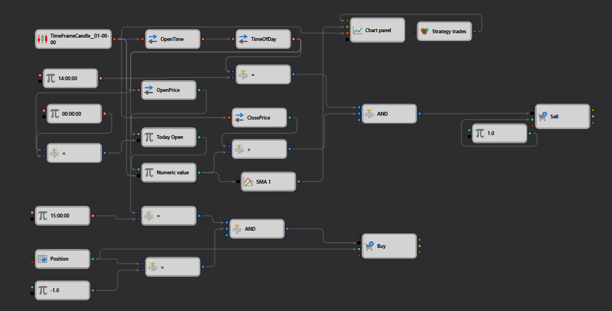

# Example of Handling Date and Time in StockSharp Strategy Designer

## Overview

This example in the StockSharp Strategy Designer demonstrates a sophisticated setup that integrates date and time handling within a trading strategy. The strategy utilizes time-specific conditions to make trading decisions based on the candle data and time of day, making it a practical example for scenarios where trades are time-sensitive.

## Description of the Schema

The schema presented in the JSON file outlines a complex interaction between various nodes that handle time-based data to trigger trading actions:

1. **TimeFrameCandle Node**: This node processes [candle data](https://doc.stocksharp.com/topics/designer/strategies/using_visual_designer/elements/data_sources/candles.html) for a specified timeframe. It's essential for strategies that rely on historical price movements to predict future trends.

2. **OpenTime and CloseTime Nodes**: These nodes [extract](https://doc.stocksharp.com/topics/designer/strategies/using_visual_designer/elements/converters/converter.html) the opening and closing times from candle data, which are critical for determining the specific periods during which trading conditions are evaluated.

3. **Comparison Nodes (Equals, Greater Than)**: These nodes [compare](https://doc.stocksharp.com/topics/designer/strategies/using_visual_designer/elements/common/comparison.html) specific times (like 14:00:00 or 15:00:00) to the current time extracted from the candle data. This setup allows the strategy to activate or deactivate based on whether it matches the specified times.

4. **Chart Panel Node**: Implements [visualization components](https://doc.stocksharp.com/topics/designer/strategies/using_visual_designer/elements/common/chart.html) that likely display trading data and indicators in a comprehensible format, assisting in real-time decision-making and strategy adjustments.

5. **Trading Nodes (Buy, Sell)**: These are activated when certain time conditions are met, allowing the strategy to execute [buy or sell orders](https://doc.stocksharp.com/topics/designer/strategies/using_visual_designer/elements/trading/register_order.html) based on the comparison results and the trading logic defined within the strategy.

## Workflow

- The **TimeFrameCandle Node** collects and processes candle data at regular intervals.
- **OpenTime and CloseTime Nodes** parse this data to extract specific time points.
- **Comparison Nodes** are used to check these times against predefined values (e.g., 14:00:00 for an entry condition and 15:00:00 for an exit condition).
- When conditions are met (e.g., current time equals 14:00:00), trading nodes (Buy or Sell) are triggered to execute trades based on the strategy's logic.
- The **Chart Panel Node** visually represents these trades and candle data, providing a clear view of the strategy's operation and market conditions.

## Practical Application

This setup is particularly useful for strategies that need to execute trades at specific times of the day, such as:
- **Opening Range Breakouts**, where trades are placed around the opening of a market session.
- **Closing Auction Strategies**, targeting price movements and liquidity variations that occur at the close of the trading session.

## Conclusion

This example from the StockSharp Strategy Designer illustrates a robust framework for developing time-sensitive trading strategies that can automatically execute trades at predefined times. It is an excellent demonstration of how traders can leverage the capabilities of the Strategy Designer to create complex, rule-based trading strategies that respond dynamically to real-time market data and specific temporal conditions.