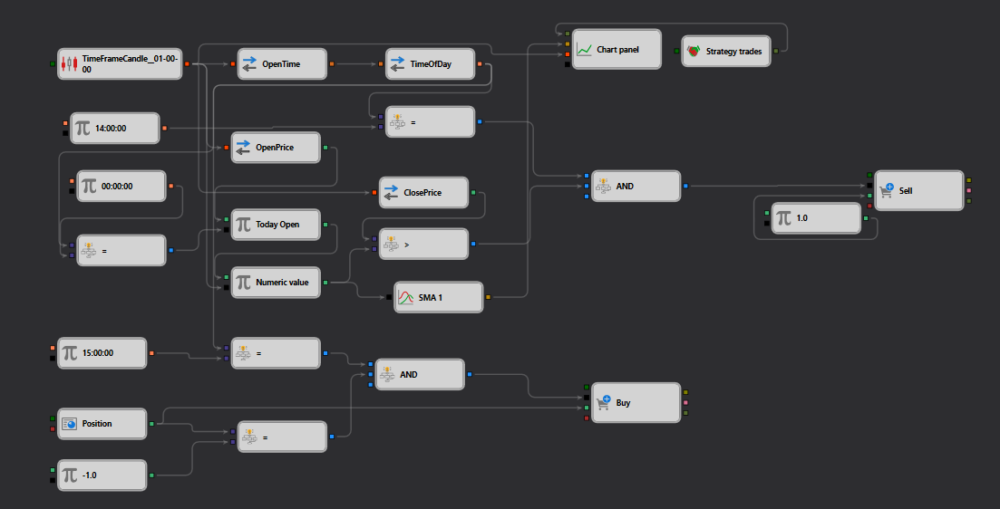

# Пример обработки даты и времени в StockSharp Strategy Designer
[English](README.md) | [中文](README_zh.md) | [Español](README_es.md) | [Deutsch](README_de.md) | [Português](README_pt.md) | [日本語](README_ja.md)

## Обзор

Данный пример в StockSharp Strategy Designer демонстрирует сложную схему, интегрирующую обработку даты и времени в торговую стратегию. Стратегия использует условия, зависящие от времени, для принятия торговых решений на основе данных свечей и времени суток, что делает её практическим примером для сценариев, где сделки привязаны ко времени.

## Описание схемы

Схема, представленная в файле JSON, описывает сложное взаимодействие различных узлов, обрабатывающих данные о времени для запуска торговых действий:

1. **Узел TimeFrameCandle**: обрабатывает [данные свечей](https://doc.stocksharp.com/topics/designer/strategies/using_visual_designer/elements/data_sources/candles.html) за указанный таймфрейм. Необходим для стратегий, опирающихся на исторические ценовые движения для прогнозирования будущих трендов.

2. **Узлы OpenTime и CloseTime**: [извлекают](https://doc.stocksharp.com/topics/designer/strategies/using_visual_designer/elements/converters/converter.html) время открытия и закрытия из данных свечей — критически важно для определения конкретных периодов, в течение которых оцениваются торговые условия.

3. **Узлы сравнения (Equals, Greater Than)**: [сравнивают](https://doc.stocksharp.com/topics/designer/strategies/using_visual_designer/elements/common/comparison.html) конкретные значения времени (например, 14:00:00 или 15:00:00) с текущим временем, извлечённым из данных свечей. Такая схема позволяет стратегии активироваться или деактивироваться в зависимости от соответствия указанному времени.

4. **Узел панели графика**: реализует [компоненты визуализации](https://doc.stocksharp.com/topics/designer/strategies/using_visual_designer/elements/common/chart.html), отображающие торговые данные и индикаторы в понятном формате и помогающие принимать решения в реальном времени и корректировать стратегию.

5. **Торговые узлы (Покупка, Продажа)**: активируются при выполнении определённых временных условий, позволяя стратегии исполнять [ордера на покупку или продажу](https://doc.stocksharp.com/topics/designer/strategies/using_visual_designer/elements/positions/modify.html) на основе результатов сравнения и торговой логики, заданной в стратегии.

## Рабочий процесс

- **Узел TimeFrameCandle** собирает и обрабатывает данные свечей через регулярные интервалы.
- **Узлы OpenTime и CloseTime** разбирают эти данные для извлечения конкретных временных точек.
- **Узлы сравнения** сопоставляют это время с заранее заданными значениями (например, 14:00:00 для условия входа и 15:00:00 для условия выхода).
- При выполнении условий (например, текущее время равно 14:00:00) торговые узлы (Покупка или Продажа) активируются для исполнения сделок в соответствии с логикой стратегии.
- **Узел панели графика** наглядно отображает эти сделки и данные свечей, обеспечивая чёткое представление об операциях стратегии и рыночных условиях.

## Практическое применение

Данная схема особенно полезна для стратегий, требующих исполнения сделок в конкретное время суток, например:
- **Пробои диапазона открытия** — сделки размещаются в момент открытия торговой сессии.
- **Аукционные стратегии на закрытии** — нацелены на ценовые движения и изменения ликвидности в конце торговой сессии.

## Заключение

Данный пример из StockSharp Strategy Designer демонстрирует надёжную основу для разработки привязанных ко времени торговых стратегий, которые могут автоматически исполнять сделки в заранее установленное время. Это превосходная демонстрация того, как трейдеры могут использовать возможности Strategy Designer для создания сложных, основанных на правилах торговых стратегий, динамически реагирующих на рыночные данные в реальном времени и конкретные временные условия.
