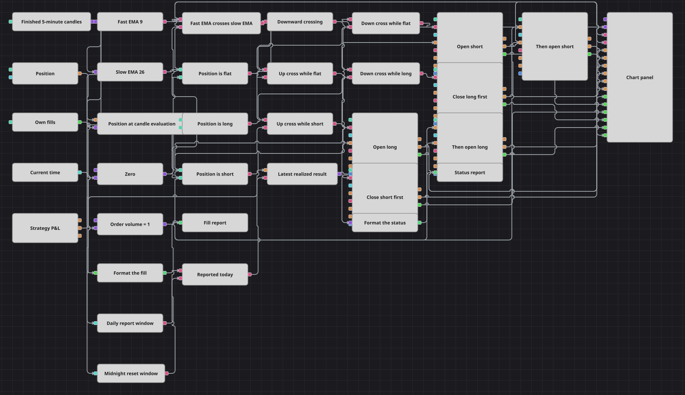

# Схема стратегии Trade Report Alerts
[English](README.md) | [中文](README_zh.md) | [Español](README_es.md) | [Deutsch](README_de.md) | [Português](README_pt.md) | [日本語](README_ja.md)

Эта схема — пример отчётности, а не изобретения сигналов. Сделки даёт обычное пересечение экспоненциальных скользящих средних с периодами 9 и 26 на завершённых пятиминутных свечах, а всё вокруг превращает эти сделки в читаемый текст: каждая собственная сделка в момент исполнения становится одной строкой лога, а раз в день ветка, управляемая часами, выводит реализованный результат стратегии. Отчётная часть читает торговую и никогда не выставляет, не изменяет и не блокирует ни одной собственной заявки.

## Обзор стратегии

- Завершённые пятиминутные свечи подаются на быструю ExponentialMovingAverage с периодом 9 и медленную с периодом 26. Блок Crossing сводит эту пару к единственному событию: `true`, когда быстрая линия пересекает медленную снизу вверх, `false` — когда сверху вниз, и ничего между этими моментами.
- Позиция считывается один раз за свечу — через снимок, который выпускает сама свеча, — и три сравнения с нулём описывают её как нулевую, длинную или короткую. Все решения строятся на этом снимке, поэтому сделка, пришедшая в середине бара, не может заново открыть уже принятое решение.
- Из нулевой позиции пересечение вверх открывает длинную позицию, а пересечение вниз — короткую. Оба входных блока несут условие Open-position, поэтому они молчат, пока удерживается любая позиция, и не могут нагромождать заявку на заявку.
- Из удерживаемой позиции противоположное пересечение закрывает её блоком Close-position, который берёт объём заявки из самой позиции. Событие заявки этого закрытия затем запускает вход в новом направлении, поэтому переворот записан двумя явными шагами, а не одной увеличенной заявкой.
- Одно вынесенное в параметры значение Volume подаётся на все четыре входных блока; два закрывающих блока объём не получают, потому что блок Close-position и так знает, сколько открыто.
- Блок Strategy trades подхватывает каждую собственную сделку стратегии и через String formatter отправляет её в уведомление типа Log, поэтому каждое исполнение оставляет одну строку с направлением, объёмом, инструментом и ценой.
- Вторая ветка отчитывается по часам, а не по рынку. Current time подаётся на два окна Working time — окно отчёта около полудня и окно сброса сразу после полуночи, — а Flag, поставленный между ними, превращает всё окно отчёта ровно в один импульс в день.
- Этот единственный импульс выпускает реализованный результат стратегии из переменной, которая хранит последнее переданное ей значение, форматирует его и пишет в лог. Поскольку переменная стартует с нуля, строка статуса появляется и в тот день, когда не было ни одной сделки.

## Правила входа и выхода

- **Вход в лонг**: Пересечение быстрой экспоненциальной средней выше медленной, проверенное в момент, когда снимок на время свечи показывает нулевую позицию, отправляет рыночную заявку на покупку объёмом Volume. Если же открыта короткая позиция, то же пересечение сначала закрывает её полностью, а возникшая заявка на закрытие немедленно запускает вход в длинную позицию, так что направление меняется в пределах одной свечи.
- **Вход в шорт**: Пересечение быстрой экспоненциальной средней ниже медленной, проверенное в момент, когда снимок на время свечи показывает нулевую позицию, отправляет рыночную заявку на продажу объёмом Volume. Если же открыта длинная позиция, то же пересечение сначала закрывает её полностью, а возникшая заявка на закрытие немедленно запускает вход в короткую позицию.
- **Выход**: Ни стопа, ни тейк-профита, ни блока защиты здесь нет: позиция удерживается до противоположного пересечения, которое полностью закрывает её блоком Close-position, берущим объём из позиции. Отчётная ветка наблюдает за сделками и прибылью и никогда не выставляет, не заменяет и не отменяет заявок, поэтому отключение уведомлений не изменило бы торговое поведение.

## Параметры

| Параметр | По умолчанию | Описание |
|---|---|---|
| Candles | 00:05:00 | Тайм-фрейм серии свечей; индикаторы и все построенные на них решения двигают только завершённые свечи. |
| Fast EMA Length | 9 | Период быстрой ExponentialMovingAverage; это более быстрая половина пары пересечения. |
| Slow EMA Length | 26 | Период медленной ExponentialMovingAverage; это более медленная половина пары пересечения. |
| Volume | 1 | Объём, подаваемый на четыре входных блока. Два закрывающих блока его игнорируют и берут размер из открытой позиции. |
| Report Window Begin | 12:00:00 | Начало дневного окна отчёта. Первый момент внутри него поднимает отчёт о статусе. |
| Report Window End | 12:05:00 | Конец дневного окна отчёта. Оно должно быть лишь достаточно широким, чтобы часы один раз попали внутрь; флаг оставляет от отчёта одну строку при любой ширине. |
| Day Reset Begin | 00:00:00 | Начало окна сброса, которое снимает флаг и разрешает новый отчёт на следующий день. |
| Day Reset End | 00:05:00 | Конец окна сброса. Между этим моментом и началом окна отчёта ветка молчит. |
| Fill Report Caption | Trade report | Заголовок, который пишется в каждом уведомлении о сделке, — по нему в логе узнают строки по отдельным сделкам. |
| Status Report Caption | Strategy status | Заголовок, который пишется в уведомлении о дневном статусе, — он отделяет его от строк по отдельным сделкам. |

## Детали диаграммы

- Блок [Candles](https://doc.stocksharp.com/en/topics/designer/strategies/using_visual_designer/elements/data_sources/candles.html) выдаёт только завершённые пятиминутные свечи, а два блока [Indicator](https://doc.stocksharp.com/en/topics/designer/strategies/using_visual_designer/elements/common/indicator.html) считают по ним значения ExponentialMovingAverage с периодами 9 и 26. Фильтр «только сформированные» выключен, поэтому обе линии доступны с самого начала воспроизведения и обе выводятся на график.
- Блок [Crossing](https://doc.stocksharp.com/en/topics/designer/strategies/using_visual_designer/elements/common/crossing.html) срабатывает только на пересечении; [Logical condition](https://doc.stocksharp.com/en/topics/designer/strategies/using_visual_designer/elements/common/logical_condition.html) типа NOT превращает его событие «вниз» в положительный триггер. Текущая [Position](https://doc.stocksharp.com/en/topics/designer/strategies/using_visual_designer/elements/positions/current.html) сохраняется в [Variable](https://doc.stocksharp.com/en/topics/designer/strategies/using_visual_designer/elements/data_sources/variable.html), которая выпускается раз в свечу, а три блока [Comparison](https://doc.stocksharp.com/en/topics/designer/strategies/using_visual_designer/elements/common/comparison.html) превращают её в признаки нулевой, длинной и короткой позиции, которые четыре условия AND объединяют с пересечением.
- Шесть блоков [Modify position](https://doc.stocksharp.com/en/topics/designer/strategies/using_visual_designer/elements/positions/modify.html) работают по этим четырём условиям: два входа из нулевой позиции с условием `OpenPosition`, два закрытия с условием `ClosePosition` и ещё два входа `OpenPosition`, запускаемые событием заявки соответствующего закрытия, — именно поэтому переворот происходит в два шага. Все шесть выставляют рыночные заявки, и ни один из них не ждёт онлайн-подключения.
- [Strategy trades](https://doc.stocksharp.com/en/topics/designer/strategies/using_visual_designer/elements/common/trades_by_strategy.html) выдаёт каждую собственную сделку. [String Formatter](https://doc.stocksharp.com/en/topics/designer/strategies/using_visual_designer/elements/notifying/string_format.html) оформляет её по шаблону `Fill: {Order.Side} {Trade.TradeVolume:0.########} {Order.Security.Id} @ {Trade.TradePrice:0.########}`, а [Notification](https://doc.stocksharp.com/en/topics/designer/strategies/using_visual_designer/elements/notifying/notification.html) типа `Log` пишет её под заголовком отчёта о сделках.
- [Current time](https://doc.stocksharp.com/en/topics/designer/strategies/using_visual_designer/elements/time/current_time.html) подаётся на две проверки [Working time](https://doc.stocksharp.com/en/topics/designer/strategies/using_visual_designer/elements/time/working_time.html); окно отчёта устанавливает [Flag](https://doc.stocksharp.com/en/topics/designer/strategies/using_visual_designer/elements/common/flag.html), а окно сброса его снимает — именно это ограничивает ветку одним импульсом в день. Импульс выпускает реализованное значение блока [P&L](https://doc.stocksharp.com/en/topics/designer/strategies/using_visual_designer/elements/common/pnl_strategy.html) из переменной, предустановленной в ноль, второй String Formatter пишет `Daily status: realized result {0}`, а второе уведомление `Log` его публикует.

## Использование

Импортируйте файл `.json` в Designer, прогоните схему на исторических данных в тестере, затем подстройте параметры или сами кубики под свой инструмент, прежде чем торговать вживую.
