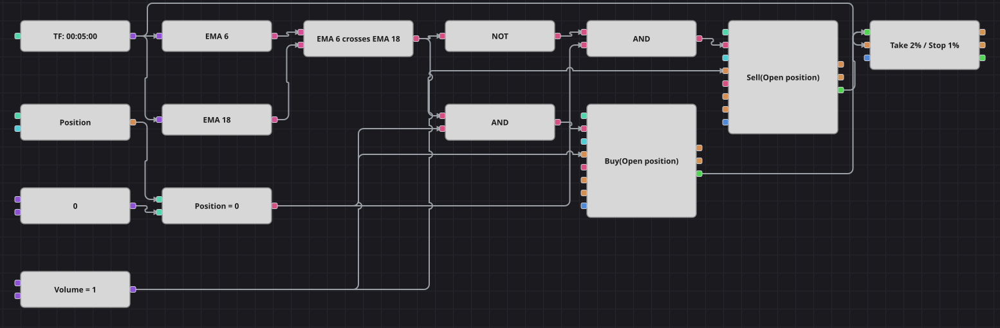

# Trailing Stop (EMA Crossover) Strategy Diagram
[Русский](README_ru.md) | [中文](README_zh.md) | [Español](README_es.md) | [Deutsch](README_de.md) | [Português](README_pt.md) | [日本語](README_ja.md)

A short trend diagram whose point is the exit rather than the entry. Two exponential moving averages decide the side, but nothing in the signal path ever closes a trade: the position modify blocks only ever open, and a protection block carries the trade to its take-profit or its stop-loss. The trailing switch of that block is left off, because the original strategy declares a trailing distance and never uses it.

## Strategy Overview

- A fast and a slow ExponentialMovingAverage are calculated on the same candle series.
- Entries are taken only from a flat position, so an existing trade is never reversed or added to.
- Both entry blocks send their own trades into a protection block, which places the take-profit and the stop-loss as a percentage of the fill price.
- That protection block is the only way out of a trade; the diagram has no exit signal of its own.

## Entry and Exit Rules

- **Long entry**: The fast EMA crosses above the slow EMA while the position is exactly zero. The order buys one lot and opens a long.
- **Short entry**: The fast EMA crosses below the slow EMA while the position is exactly zero. The order sells one lot and opens a short.
- **Exit**: The protection block closes the position at a take-profit of 2% or a stop-loss of 1% from the entry price. Until one of the two is hit, the opposite crossing is ignored, because entries require a flat position.

## Parameters

| Parameter | Default | Description |
|---|---|---|
| Fast EMA Length | 6 | Length of the fast exponential moving average. |
| Slow EMA Length | 18 | Length of the slow exponential moving average. |
| Take Profit, % | 2 | Take-profit distance, in percent of the entry price. |
| Stop Loss, % | 1 | Stop-loss distance, in percent of the entry price. |
| Volume | 1 | Order volume, in lots. |
| Candles | 00:05:00 | Candle time frame the whole diagram works on. |

## Diagram Details

- The candle block feeds both indicator blocks and also supplies the price the protection block watches.
- The crossing block emits true when the fast EMA goes above the slow one and false when it goes below, so a logical NOT produces the short signal from the same output.
- One comparison against a zero constant is enough as a position guard, and both position modify blocks additionally run in open-only mode.
- The own trades of both entry blocks are wired into the protection block, which is what turns a fill into a take-profit and a stop-loss order.

## Usage

Import the `.json` file into Designer, run it in the backtester on historical data, then adjust the parameters or the blocks themselves to fit your instrument before trading it live.
