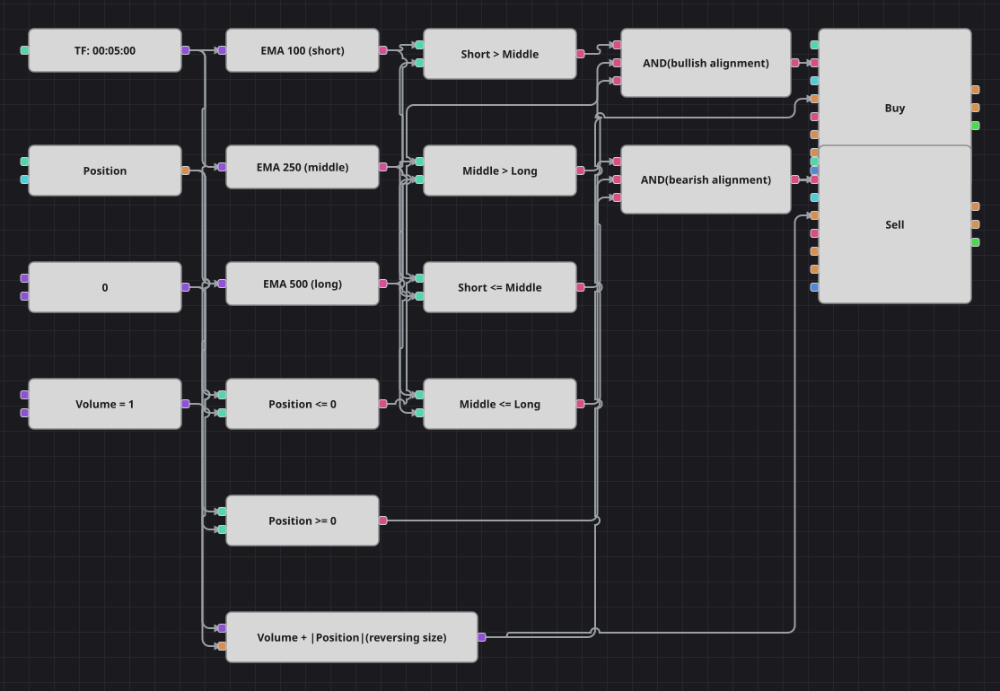

# 3本のEMA整列戦略のダイアグラム
[English](README.md) | [Русский](README_ru.md) | [中文](README_zh.md) | [Español](README_es.md) | [Deutsch](README_de.md) | [Português](README_pt.md)

期間の大きく異なる3つの ExponentialMovingAverage ブロックを同じローソク足で計算し、その並び順をトレンドとみなします。短期が中期より上、中期が長期より上なら上昇、逆の並びなら下降です。戦略は常に建玉を持ち、1回の注文でドテンします。

## 戦略の概要

- 使うのは価格だけです。オシレーターもボラティリティ・フィルターも使わず、3本の指数移動平均の相対的な位置関係だけを見ます。
- 強気の状態は短期>中期かつ中期>長期、弱気の状態は短期≦中期かつ中期≦長期です。線がもつれた中間状態ではシグナルは出ません。
- 現在のポジションがすべてのエントリーを制御するため、数百本続く整列でも注文は1回だけです。
- 専用のエグジットはありません。注文数量が「数量＋ポジションの絶対値」なので、1回の注文で古い方向を閉じて新しい方向を建てます。

## エントリーとエグジットの条件

- **ロングエントリー**: 短期 ExponentialMovingAverage が中期より上、中期が長期より上で、まだ買い建てではない状態。注文は数量＋ポジションの絶対値を買い、ノーポジションなら新規の買い、売り持ちならドテン買いになります。
- **ショートエントリー**: 短期 ExponentialMovingAverage が中期以下、中期が長期以下で、まだ売り建てではない状態。注文は数量＋ポジションの絶対値を売り、ノーポジションなら新規の売り、買い持ちならドテン売りになります。
- **エグジット**: 専用のエグジットブロックはありません。反対の整列が現れたときだけ建玉を離れ、ドテン数量のおかげでダイアグラムはローソク足1本たりとも市場の外に出ません。

## パラメーター

| パラメーター | 既定値 | 説明 |
|---|---|---|
| Short EMA period | 100 | 最も速い ExponentialMovingAverage の期間。 |
| Middle EMA period | 250 | 中間の ExponentialMovingAverage の期間。 |
| Long EMA period | 500 | 最も遅い ExponentialMovingAverage の期間。 |
| Volume | 1 | 注文の基本数量（ロット）。ドテン時にはポジションの絶対値が加算されます。 |
| Candles | 00:05:00 | ダイアグラム全体が用いるローソク足の時間軸。 |

## ダイアグラムの詳細

- 1つのローソク足ブロックが3つの指標ブロックすべてに供給するため、移動平均は常に同じ確定足で計算されます。
- 4つの比較ブロックが2つの状態を作ります。強気側は厳密な「より大きい」を2つ、弱気側は「以下」を2つで、これは元コードの否定条件そのものです。
- それぞれの論理積が2つの移動平均比較と、ゼロ定数と比べたポジションを結び、ポジション変更ブロックを1つ起動します。
- 数式ブロックが数量定数にポジションの絶対値を足して両方の発注ブロックに渡します。これがエントリーをドテンに変えています。
- 意図的な簡略化: 元の戦略は1分足ですが本図は5分足のため、同じ期間設定でも5倍の時間を覆います。また元の戦略は前の足で既に整列していたかを記憶しますが、そのフラグは省きました。ポジション判定が同じように再エントリーを防ぐためです。宣言されている2％のストップはコード上で一度も適用されないので、保護ブロックは描いていません。

## 使い方

`.json` ファイルを Designer に読み込み、バックテスターで過去データを使って実行し、実運用の前にパラメーターやブロック自体を自分の銘柄に合わせて調整してください。
