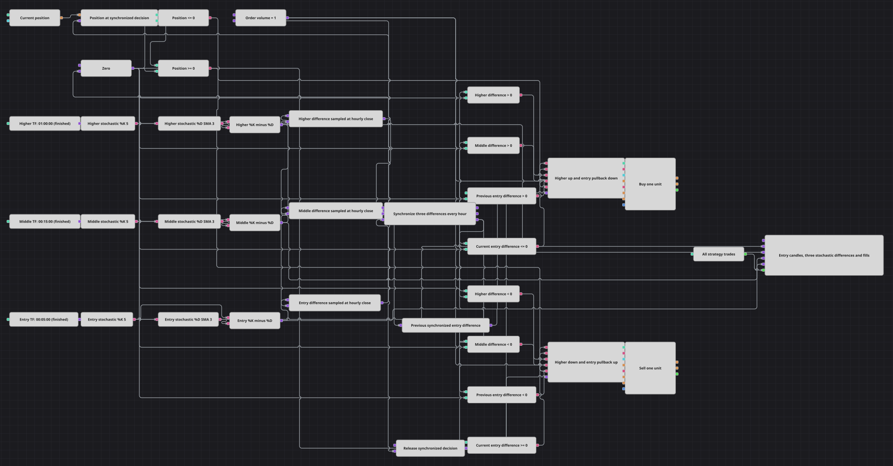

# Схема стратегии трёх таймфреймов Stochastic
[English](README.md) | [中文](README_zh.md) | [Español](README_es.md) | [Deutsch](README_de.md) | [Português](README_pt.md) | [日本語](README_ja.md)

Схема объединяет сформированный импульс Stochastic(5,3) по 60-минутным, 15-минутным и 5-минутным свечам. Раз в час она синхронизирует три разности %K-%D и торгует разворот импульса на пяти минутах, согласованный с двумя старшими таймфреймами.

## Обзор стратегии

- Три потока завершённых свечей дают данные за 60, 15 и 5 минут и могут собираться из меньших таймфреймов.
- Для каждого потока рассчитывается Stochastic %K(5), затем SMA(3) сглаживает %K до %D, после чего %D вычитается из %K.
- Часовая разность снимает последние значения всех трёх потоков; Sync выдаёт одну полную группу из трёх значений при каждом закрытии часовой свечи.
- Предыдущее синхронизированное значение пятиминутной разности выявляет разворот у нулевой линии, а текущая позиция не позволяет наращивать её сверх одной единицы.
- Оба действия являются рыночными операциями объёмом 1, а Strategy trades передаёт каждое исполнение на график.

## Правила входа и выхода

- **Вход в лонг**: Если предыдущая входная разность выше нуля, текущая входная разность не выше нуля, обе старшие разности выше нуля и позиция не длинная, купить одну единицу по рынку.
- **Вход в шорт**: Если предыдущая входная разность ниже нуля, текущая входная разность не ниже нуля, обе старшие разности ниже нуля и позиция не короткая, продать одну единицу по рынку.
- **Выход**: Отдельной ветви выхода нет. Допустимое встречное действие объёмом 1 закрывает противоположную позицию в одну единицу до нуля; более поздний допустимый сигнал может открыть другое направление. В схеме нет стоп-лосса, тейк-профита и задержки между сделками.

## Параметры

| Параметр | По умолчанию | Описание |
|---|---|---|
| Higher Candles Series | 01:00:00 | Завершённые 60-минутные свечи для расчёта старшего таймфрейма и часового импульса решения. |
| Higher Stochastic %K Length | 5 | Период Stochastic %K на старшем таймфрейме. |
| Higher Stochastic %K Source | Not set | Дополнительное поле входа индикатора не выбрано; старшие свечи подключены напрямую. |
| Higher Stochastic %D SMA Length | 3 | Период сглаживания старшего %K для получения %D. |
| Higher Stochastic %D SMA Source | Not set | Дополнительное поле входа индикатора не выбрано; старший %K подключён напрямую. |
| Middle Candles Series | 00:15:00 | Завершённые 15-минутные свечи для расчёта среднего таймфрейма. |
| Middle Stochastic %K Length | 5 | Период Stochastic %K на среднем таймфрейме. |
| Middle Stochastic %K Source | Not set | Дополнительное поле входа индикатора не выбрано; средние свечи подключены напрямую. |
| Middle Stochastic %D SMA Length | 3 | Период сглаживания среднего %K для получения %D. |
| Middle Stochastic %D SMA Source | Not set | Дополнительное поле входа индикатора не выбрано; средний %K подключён напрямую. |
| Entry Candles Series | 00:05:00 | Завершённые 5-минутные свечи для расчёта входного таймфрейма и графика. |
| Entry Stochastic %K Length | 5 | Период Stochastic %K на входном таймфрейме. |
| Entry Stochastic %K Source | Not set | Дополнительное поле входа индикатора не выбрано; входные свечи подключены напрямую. |
| Entry Stochastic %D SMA Length | 3 | Период сглаживания входного %K для получения %D. |
| Entry Stochastic %D SMA Source | Not set | Дополнительное поле входа индикатора не выбрано; входной %K подключён напрямую. |
| Order Volume | 1 | Фиксированный рыночный объём для обоих действий. |

## Детали диаграммы

- Все индикаторы выдают только сформированные значения. SMA(3) получает соответствующий выход %K, поэтому каждая разность точно равна %K минус его среднее по трём значениям.
- Часовая разность запускает три числовых блока выборки до передачи их значений в Sync; поэтому средний и входной блоки дают последние доступные показания на этот момент.
- Sync очищает каждую завершённую группу и выдаёт три согласованных значения. Блок Previous value сохраняет одну синхронизированную входную разность для следующего часового сравнения.
- Позиция фиксируется вместе с синхронизированным решением. Значение не выше нуля разрешает покупку, а значение не ниже нуля разрешает продажу, что блокирует наращивание в том же направлении.
- График получает пять потоков: пятиминутные свечи, три необработанные разности %K-%D и все исполнения стратегии.

## Использование

Импортируйте файл `.json` в Designer, прогоните схему на исторических данных в тестере, затем подстройте параметры или сами кубики под свой инструмент, прежде чем торговать вживую.
