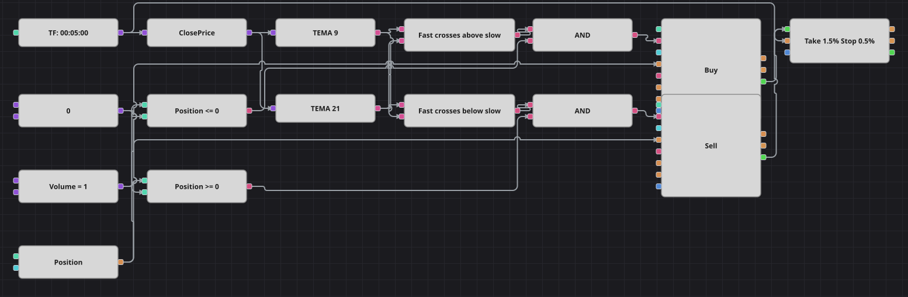

# Diagramm der TRIX-Crossover-Strategie
[English](README.md) | [Русский](README_ru.md) | [中文](README_zh.md) | [Español](README_es.md) | [Português](README_pt.md) | [日本語](README_ja.md)

TRIX ist hier kein fertiger Indikator, sondern eine im Diagramm gebaute Reihe, genau wie die Originalstrategie sie baut: ein dreifach exponentieller Durchschnitt und seine relative Veränderung pro Bar. Auslöser ist der Nulldurchgang der schnellen Reihe, die langsame muss sich stärker als eine Schwelle in dieselbe Richtung bewegen, und ein prozentuales Ziel samt Stop schließt den Trade.

## Strategieübersicht

- Rohstoff sind zwei dreifach exponentielle Durchschnitte des Schlusskurses über 9 und 21 Bars; je ein Baustein für den Vorwert hält sie eine Kerze zurück.
- Der langsame TRIX ist ein Formelbaustein: der Durchschnitt minus seinem Vorwert, geteilt durch eben diesen Vorwert - die relative Veränderung pro Bar, die das Original im Code berechnet.
- Der Nulldurchgang des schnellen TRIX ist als Kreuzung des schnellen Durchschnitts mit seinem eigenen Vorwert gezeichnet. Da ein Kursdurchschnitt positiv ist, entspricht das Vorzeichen der relativen Veränderung dem der Differenz, der Kreuzungsbaustein ist also ein exakter Ersatz und spart die Division.
- Die Schwelle auf dem langsamen TRIX hält das Diagramm aus der Seitwärtsphase heraus: Die Wende der schnellen Reihe wird nur angenommen, solange sich die langsame um mehr als 0,05 Prozent je Bar in dieselbe Richtung bewegt.
- Das Original läuft auf Vier-Stunden-Kerzen mit einem Ziel von 1500 und einem Stop von 500 in absoluten Preiseinheiten; das Diagramm ist auf Fünf-Minuten-Kerzen skaliert, und beide Abstände werden im selben Verhältnis drei zu eins zu Prozentwerten des Einstiegspreises.
- Der eingebaute Trix-Indikator wird bewusst nicht verwendet: Er ist eine Kette aus drei aufeinanderfolgenden Glättungen mit einem Skalierungsfaktor, seine Werte und Signale unterscheiden sich also vom dreifach exponentiellen Durchschnitt, auf dem die Strategie beruht.

## Ein- und Ausstiegsregeln

- **Long-Einstieg**: Der schnelle TRIX durchbricht null nach oben, der schnelle Dreifachdurchschnitt dreht also nach einem Rückgang nach oben, der langsame TRIX liegt über der Schwelle und die Position ist nicht long. Die Order kauft ein Lot zum Marktpreis: aus der Neutralstellung ein Long-Einstieg, gegen einen gleich großen Short dessen Schließung.
- **Short-Einstieg**: Der schnelle TRIX durchbricht null nach unten, der schnelle Dreifachdurchschnitt dreht also nach einem Anstieg nach unten, der langsame TRIX liegt unter der negativen Schwelle und die Position ist nicht short. Die Order verkauft ein Lot zum Marktpreis: aus der Neutralstellung ein Short-Einstieg, gegen einen gleich großen Long dessen Schließung.
- **Ausstieg**: Der Absicherungsbaustein schließt den Trade am Ziel oder am Stop, beide in Prozent des Einstiegspreises; ansonsten wird die Position bis zum Gegensignal gehalten, das sie schließt, da alle Orders dasselbe Volumen verwenden.

## Parameter

| Parameter | Standard | Beschreibung |
|---|---|---|
| Fast TEMA length | 9 | Periode des schnellen dreifach exponentiellen Durchschnitts, auf dem die Auslösereihe beruht. |
| Slow TEMA length | 21 | Periode des langsamen dreifach exponentiellen Durchschnitts, auf dem die Bestätigungsreihe beruht. |
| Volume | 1 | Ordervolumen in Lots; dieselbe Konstante versorgt beide Orderbausteine. |
| Take profit, % | 1.5 | Abstand des Take-Profits in Prozent des Einstiegspreises. |
| Stop loss, % | 0.5 | Abstand des Stop-Loss in Prozent des Einstiegspreises. |
| Candles | 00:05:00 | Zeiteinheit der Kerzen, mit der das gesamte Diagramm arbeitet. |

## Diagrammdetails

- Ein Konverter liest den Schlusskurs aus der Kerze und speist beide Indikatorbausteine; derselbe Wert geht als aktueller Preis an den Absicherungsbaustein.
- Hinter jedem Durchschnitt steht ein Baustein für den Vorwert: Das schnelle Paar geht in einen Kreuzungsbaustein, das langsame in einen Formelbaustein, der die Differenz durch den Vorwert teilt.
- Der Kreuzungsbaustein meldet die Wende nach oben, ein NICHT-Baustein invertiert sie zur Wende nach unten; zwei Vergleiche stellen die langsame Reihe der positiven und der negativen Schwellenkonstante gegenüber.
- Jedes logische UND verbindet Wende, Bestätigung und Positionsprüfung und löst einen Baustein zur Positionsänderung aus; beide geben ihren Abschluss an den Absicherungsbaustein weiter.

## Verwendung

Importieren Sie die `.json`-Datei in Designer, testen Sie sie im Backtester mit historischen Daten und passen Sie danach Parameter oder Bausteine an Ihr Instrument an, bevor Sie live handeln.
