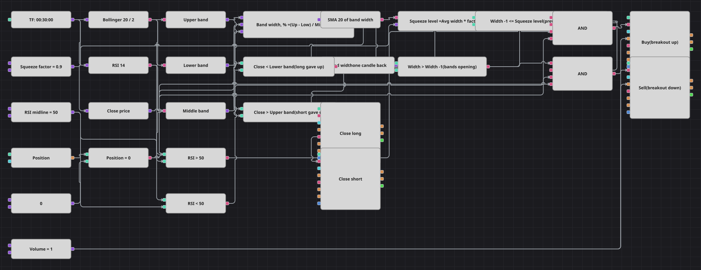

# Diagramm der TTM-Squeeze-Strategie
[English](README.md) | [Русский](README_ru.md) | [中文](README_zh.md) | [Español](README_es.md) | [Português](README_pt.md) | [日本語](README_ja.md)

Ruhige Märkte bleiben nicht ruhig. Dieses Diagramm misst die Breite der Bollinger-Bänder als Prozentsatz des Mittelbands, betrachtet den Markt als gestaucht, solange diese Breite unter ihrem eigenen gleitenden Durchschnitt liegt, und handelt die erste Kerze, auf der sich die Bänder wieder öffnen. Die Richtung gibt der RSI vor.

## Strategieübersicht

- Bandbreite = (oberes Band - unteres Band) / Mittelband * 100, damit die Stauchungsmessung nicht vom Kursniveau des Instruments abhängt.
- Ein einfacher gleitender Durchschnitt dieser Breite, multipliziert mit dem Squeeze-Faktor, bildet die Linie, unterhalb derer der Markt als gestaucht gilt.
- Gehandelt wird die Ausdehnung, nicht die Stauchung: Die vorige Kerze musste im Squeeze liegen, und die aktuelle Breite muss größer sein als ihre.
- Der RSI gegenüber seiner Mittellinie liefert die Richtung, und das gegenüberliegende Bollinger-Band ist die Stelle, an der der Trade aufgegeben wird.

## Ein- und Ausstiegsregeln

- **Long-Einstieg**: Die Bandbreite liegt über ihrem Wert auf der Vorkerze, dieser Vorwert lag auf oder unter dem Squeeze-Niveau, der RSI steht über 50 und die Position ist neutral. Die Kauforder eröffnet einen Long über ein Lot.
- **Short-Einstieg**: Die Bandbreite liegt über ihrem Wert auf der Vorkerze, dieser Vorwert lag auf oder unter dem Squeeze-Niveau, der RSI steht unter 50 und die Position ist neutral. Die Verkaufsorder eröffnet einen Short über ein Lot.
- **Ausstieg**: Ein Long wird geschlossen, wenn der Schlusskurs unter das untere Bollinger-Band fällt, ein Short, wenn er über das obere steigt: Der Ausbruch ist gescheitert und lief in die Gegenrichtung. Beide Ausstiege arbeiten im Schließmodus; auch die Originalstrategie kennt weder Stop noch Ziel.

## Parameter

| Parameter | Standard | Beschreibung |
|---|---|---|
| Bollinger Period | 20 | Glättungsperiode der Bollinger-Bänder. |
| Bollinger Width | 2 | Bandbreite der Bollinger-Bänder in Standardabweichungen. |
| RSI Length | 14 | Periode des RSI, der die Richtung bestätigt. |
| Width Average Length | 20 | Länge des gleitenden Durchschnitts über die Bandbreite selbst. |
| Squeeze Factor | 0.9 | Anteil dieses Durchschnitts, unterhalb dessen der Markt als gestaucht gilt; kleiner gewählt werden die Signale seltener und strenger. |
| RSI Midline | 50 | RSI-Niveau, das die bullische von der bärischen Lesart trennt. |
| Volume | 1 | Ordervolumen in Lots. |
| Candles | 00:30:00 | Zeiteinheit der Kerzen, mit der das gesamte Diagramm arbeitet. |

## Diagrammdetails

- Der Bollinger-Baustein wird von drei Konvertern gelesen: oberes Band, unteres Band und Mittelband; ein vierter Konverter nimmt den Schlusskurs der Kerze.
- Ein Formelbaustein macht aus den drei Bändern die prozentuale Breite, die anschließend sowohl in einen Baustein für den gleitenden Durchschnitt als auch in einen für den Vorwert läuft, sodass die Breite mit ihrer eigenen Vergangenheit verglichen wird.
- Eine zweite Formel multipliziert die durchschnittliche Breite mit dem Squeeze-Faktor, und zwei Vergleiche liefern die Signale für Stauchung und Ausdehnung.
- Jeder Einstieg ist ein logisches UND aus vier Bedingungen: Ausdehnung, Stauchung, RSI-Richtung und neutrale Position; beide Einstiegsbausteine beziehen ihr Volumen aus derselben Konstante.
- Die Originalstrategie führt zusätzlich ein laufendes Minimum der Breite, zählt drei enge Bars, filtert die Richtung mit einer EMA(20) und pausiert nach jedem Trade fünfzehn Bars; das Diagramm ersetzt das laufende Minimum durch den gleitenden Durchschnitt der Breite und verzichtet auf Zähler, EMA und Pause, die sich mit Bausteinen nicht abbilden lässt.

## Verwendung

Importieren Sie die `.json`-Datei in Designer, testen Sie sie im Backtester mit historischen Daten und passen Sie danach Parameter oder Bausteine an Ihr Instrument an, bevor Sie live handeln.
