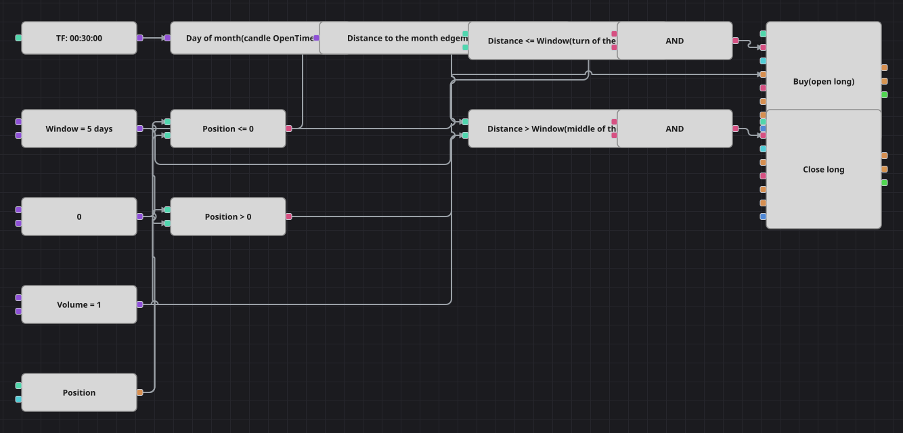

# Turn of the Month Strategy Diagram
[Русский](README_ru.md) | [中文](README_zh.md) | [Español](README_es.md) | [Deutsch](README_de.md) | [Português](README_pt.md) | [日本語](README_ja.md)

This diagram trades a calendar effect rather than a price pattern: it carries a long position across the boundary between two months and holds nothing in the middle of the month. There is no indicator at all; the only input is the date stamped on each finished candle.

## Strategy Overview

- A converter reads the day number out of the candle open time, and a small formula turns it into the distance to the nearest month edge: min(day - 1, 31 - day).
- One threshold defines the whole window: while that distance is at or below it the date counts as the turn of the month, above it the date counts as the middle of the month.
- The original counts trading days and skips weekends; a diagram has no loop, so calendar days are used instead and the window is symmetric around the month boundary. On a 31-day month it covers the first six and the last six calendar days, on a short month a day or two less.
- The strategy is long-only, so the position guard decides between opening and closing, and there is no short branch at all.
- The 10-bar pause between trades from the original is left out: with a window that lasts several days and entries gated by the position, it changes nothing.

## Entry and Exit Rules

- **Long entry**: The distance to the month edge is at or below the window and the position is not long. The order buys the fixed volume and opens the long that is meant to be carried across the month boundary.
- **Short entry**: There is no short entry. The strategy only ever holds a long position or nothing at all, exactly as the original does.
- **Exit**: The distance to the month edge is greater than the window and the position is long. The closing block sends a market order for the size of the open position, so the diagram is flat through the middle of the month. There is no stop loss and no take profit.

## Parameters

| Parameter | Default | Description |
|---|---|---|
| Window, days | 5 | Half-width of the calendar window, in days: the date counts as the turn of the month while it is no further than this from the first or the last day. |
| Volume | 1 | Order volume, in lots, used to open the long; the exit closes whatever size is open. |
| Candles | 00:30:00 | Candle time frame the whole diagram works on. |

## Diagram Details

- The candle block feeds a converter typed as a candle whose property path is OpenTime.Day, which yields the calendar day as a plain number.
- The formula block folds that number into the distance to the nearest month edge, so a single threshold covers both the end of one month and the start of the next.
- Two comparison blocks split the calendar into the window and its complement; two more compare the position against a zero constant.
- Each logical AND joins one calendar condition with one position condition: the first triggers an open-position block, the second a close-position block that takes its size from the position itself.

## Usage

Import the `.json` file into Designer, run it in the backtester on historical data, then adjust the parameters or the blocks themselves to fit your instrument before trading it live.
