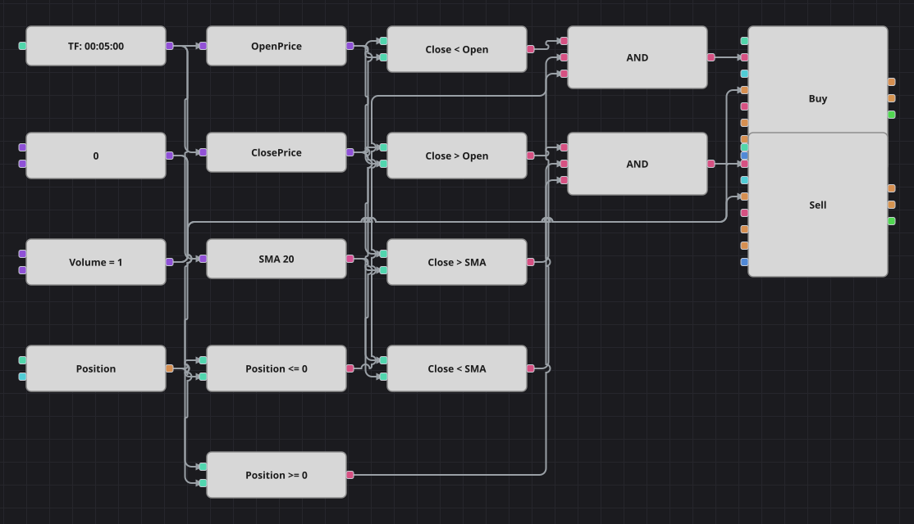

# Diagramm der Umkehrstrategie nach einer verlorenen Sitzung
[English](README.md) | [Русский](README_ru.md) | [中文](README_zh.md) | [Español](README_es.md) | [Português](README_pt.md) | [日本語](README_ja.md)

Die Idee ist die Umkehr nach einer schlechten Sitzung: Eine Sitzung, die tiefer endet als sie begann, überlässt der nächsten oft einen Rebound. Deshalb wartet das Diagramm, bis sich der Markt über seinen gleitenden Durchschnitt zurückgearbeitet hat, und kauft diese Erholung; nach einer höher geschlossenen Sitzung läuft alles spiegelbildlich. Trotz des Namens enthält die Originalstrategie überhaupt keinen Wochentagsfilter, und dieses Diagramm ebenso wenig.

## Strategieübersicht

- Zwei Kerzenreihen arbeiten nebeneinander: Die Sitzungsreihe entscheidet die Richtung, die schnellere Handelsreihe bestimmt den Zeitpunkt.
- Das Urteil über die Sitzung ist ein einziger Vergleich des Schlusses der Sitzungskerze mit ihrer eigenen Eröffnung, es muss also kein Zustand zwischen den Kerzen gemerkt werden.
- Der einfache gleitende Durchschnitt auf der Handelsreihe dient als Bestätigung: Nach einer verlorenen Sitzung wird erst gekauft, wenn der Kurs bereits über den Durchschnitt zurückgekehrt ist.
- Da das Urteil einmal je Sitzungskerze eintrifft, kann das logische UND nur einmal pro Sitzung feuern - genau die Regel eines Einstiegs pro Sitzung aus dem Original.

## Ein- und Ausstiegsregeln

- **Long-Einstieg**: Die letzte Sitzung schloss unter ihrer Eröffnung, die Handelskerze schließt über dem einfachen gleitenden Durchschnitt und die Position ist neutral. Die Order kauft das gemeinsame Volumen zum Marktpreis.
- **Short-Einstieg**: Die letzte Sitzung schloss über ihrer Eröffnung, die Handelskerze schließt unter dem einfachen gleitenden Durchschnitt und die Position ist neutral. Die Order verkauft das gemeinsame Volumen zum Marktpreis.
- **Ausstieg**: Ausgestiegen wird an der Seite des Durchschnitts, nicht an einem Kursziel: Ein Schluss zurück unter den Durchschnitt schließt einen Long, ein Schluss zurück darüber einen Short. Es gibt weder Stop-Loss noch Take-Profit, genau wie in der Originalstrategie.

## Parameter

| Parameter | Standard | Beschreibung |
|---|---|---|
| MA Period | 20 | Länge des einfachen gleitenden Durchschnitts, der die Wende auf der Handelsreihe bestätigt. |
| Volume | 1 | Ordervolumen in Lots. |
| Trading candles | 00:05:00 | Zeiteinheit, auf der Ein- und Ausstiege getaktet werden. |

## Diagrammdetails

- Der Baustein der Sitzungskerzen speist zwei Konverter, einen für die Eröffnung und einen für den Schluss; die beiden Vergleiche dazwischen liefern die Merkmale gefallene und gestiegene Sitzung.
- Der Baustein der Handelskerzen speist den gleitenden Durchschnitt und einen Konverter für den Schlusskurs; zwei Vergleiche legen diesen Schluss auf die eine oder andere Seite des Durchschnitts.
- Jedes logische UND verbindet ein Sitzungsmerkmal, die Seite des Durchschnitts und die Prüfung auf Neutralstellung, bevor es einen Einstiegsbaustein mit der Bedingung Position eröffnen auslöst.
- Die Ausstiegsbausteine hängen direkt an den beiden Vergleichen mit dem Durchschnitt und tragen die Bedingung Position schließen, sodass jeder nur seine eigene Seite glattstellt.

## Verwendung

Importieren Sie die `.json`-Datei in Designer, testen Sie sie im Backtester mit historischen Daten und passen Sie danach Parameter oder Bausteine an Ihr Instrument an, bevor Sie live handeln.
