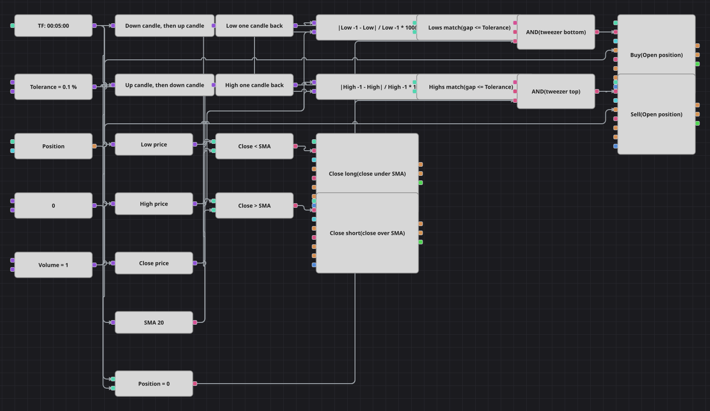

# Diagrama da estratégia de pinça de fundo
[English](README.md) | [Русский](README_ru.md) | [中文](README_zh.md) | [Español](README_es.md) | [Deutsch](README_de.md) | [日本語](README_ja.md)

Uma pinça são dois candles vizinhos que se viram um contra o outro no mesmo nível: depois de um candle de baixa, um de alta para quase na mesma mínima, e o par marca um fundo. A imagem espelhada nas máximas marca um teto. Como duas mínimas quase nunca coincidem até o último tick, o diagrama mede a distância entre elas em porcentagem e as considera iguais enquanto essa distância não passar da tolerância.

## Visão geral da estratégia

- Um bloco de padrão de candles reconhece apenas a troca de cor do par: candle de baixa seguido de alta para o fundo, de alta seguido de baixa para o topo.
- A igualdade das extremidades é medida à parte por uma fórmula, de modo que a tolerância continua sendo um parâmetro otimizável do esquema em vez de ficar congelada no texto do padrão.
- A média móvel simples não participa da entrada; ela só decide quando a operação acabou.
- Toda entrada é protegida pela posição, então a pinça é sempre uma tentativa de reversão e nunca um aumento de posição já aberta.

## Regras de entrada e saída

- **Entrada comprada**: O bloco de padrão informa um candle de baixa seguido de um de alta, a distância entre as duas mínimas não passa da tolerância em porcentagem da mínima anterior e a posição está zerada. A ordem compra o volume compartilhado a mercado.
- **Entrada vendida**: O bloco de padrão informa um candle de alta seguido de um de baixa, a distância entre as duas máximas não passa da tolerância em porcentagem da máxima anterior e a posição está zerada. A ordem vende o volume compartilhado a mercado.
- **Saída**: O primeiro candle que fecha abaixo da média móvel simples encerra uma compra, e o primeiro que fecha acima encerra uma venda; as duas saídas são blocos de modificação de posição em modo de fechamento e nunca abrem nada. O original não tem stop loss nem take profit, e este diagrama também não. Duas coisas do original não puderam ser expressas com os blocos disponíveis: a pausa de quinhentas barras após cada operação, porque nenhum bloco guarda contador entre candles, e o tempo gráfico de um minuto, ajustado para os candles de cinco minutos do histórico embarcado.

## Parâmetros

| Parâmetro | Padrão | Descrição |
|---|---|---|
| Tolerance, % | 0.1 | Quanto as duas extremidades podem se afastar, em porcentagem do nível do candle anterior. |
| SMA Length | 20 | Período de suavização da média móvel simples que encerra as operações. |
| Volume | 1 | Volume da ordem, em lotes. |
| Candles | 00:05:00 | Tempo gráfico dos candles com que todo o diagrama trabalha. |

## Detalhes do diagrama

- O bloco de candles alimenta os dois blocos de padrão, a média móvel e três conversores que leem a mínima, a máxima e o fechamento.
- Dois blocos de valor anterior guardam a mínima e a máxima do candle anterior, e duas fórmulas transformam cada par na distância percentual entre as extremidades.
- Duas comparações testam essas distâncias contra a constante de tolerância compartilhada, e mais uma compara a posição com zero.
- Cada E lógico une o padrão, a coincidência das extremidades e a checagem de posição zerada, e então aciona um bloco de entrada que obtém o volume da constante compartilhada.

## Uso

Importe o arquivo `.json` no Designer, execute-o sobre dados históricos no backtester e depois ajuste os parâmetros ou os próprios blocos ao seu instrumento antes de operar ao vivo.
