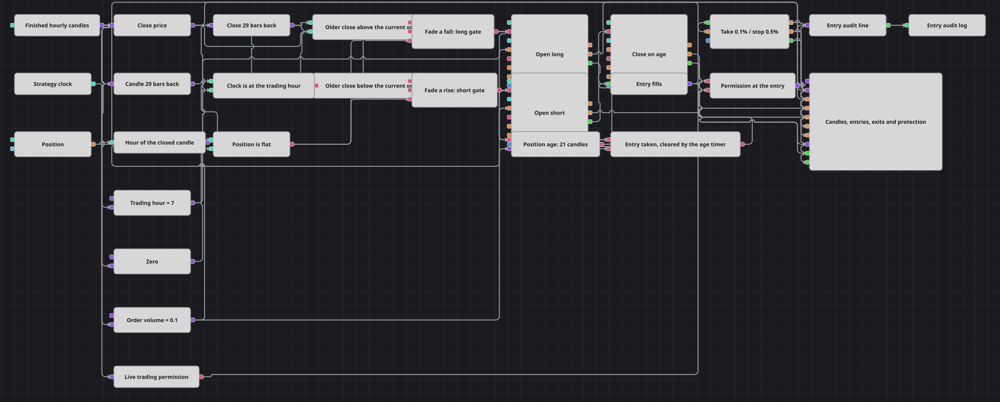

# Twenty Pips Once a Day 戦略ダイアグラム
[English](README.md) | [Русский](README_ru.md) | [中文](README_zh.md) | [Español](README_es.md) | [Deutsch](README_de.md) | [Português](README_pt.md)

このダイアグラムは、1日に最大1回だけ逆張りのポジションを取ります。1日1回、指定した時刻（時）に、かつ口座がフラット（ノーポジション）のときに限り、確定した1時間足の終値を29本前のローソク足の終値と比較し、その期間のドリフトに逆らって仕掛けます。下落したあとに買い、上昇したあとに売ります。決済は、小さめのテイクプロフィット、広めのストップロス、そしてポジションの保有本数の上限が担います。

## 戦略の概要

- すべては確定した1時間足によって駆動されます。形成途中のローソク足の内部では何も評価されないため、あらゆる判断は確定した価格に基づいて行われます。
- 前の値 (Previous value) は29本前のローソク足を保持します。その終値を現在の終値と比較することで、およそ1日と1/4に相当する期間のドリフトを測ります。
- この比較が、そのドリフトに逆らう売買方向を決めます。過去の終値が現在の終値より高ければ相場は下落したことになり、スキーマは買います。過去の終値が現在の終値より低ければ相場は上昇したことになり、スキーマは売ります。2つの比較はいずれも厳密な不等号なので、期間の終わりが始まりとぴったり同じ値になった場合はシグナルがまったく出ません。
- 時刻 (Time) は、たった今確定したローソク足に対応する時刻を供給し、コンバーター (Converter) がその「時」を取り出し、Trading Hour パラメーターとの比較が1日1本のローソク足だけエントリーの窓を開きます。
- 現在のポジションはフラットでなければなりません。1日1回の時刻フィルターと、エントリー用ブロックに設定された「Open position」条件と合わせて、これがスキーマの同時保有を常に1ポジションに保ちます。
- どちらのエントリーも固定数量の成行注文です。その約定は1つにまとめられてポジション保護 (Position protection) に渡され、ポジション保護が 0.1% のテイクプロフィットまたは 0.5% のストップロスでポジションを決済します。これはこのアイデアの土台となっている1対5の比率そのものです。
- N個の値 (N values) カウンターは、受け付けられたエントリーによって起動され、確定したローソク足を21本数えます。数え終わると、Close position に設定されたポジション変更 (Position modify) ブロックが、残っている建玉を手仕舞います。これにより、どちらの目標にも届かなかったポジションが無期限に持ち越されることはありません。
- 取引許可 (Is trade allowed) はプラットフォームのライブ取引許可を監視します。エントリーが受け付けられるたびに、スキーマはその時点の許可状態を記録し、ログに1行書き出します。これは拒否権ではなく報告です。ヒストリカル再生では許可が与えられることはないため、これを条件にエントリーを止めると、ダイアグラム全体が何も行わなくなってしまいます。

## エントリーとエグジットの条件

- **ロングエントリー**: 確定した1時間足の時刻の「時」が Trading Hour と一致し、ポジションがフラットで、29本前の終値が現在の終値より高い場合、「Open position」条件のもとで Volume の数量を成行で買います。
- **ショートエントリー**: 確定した1時間足の時刻の「時」が Trading Hour と一致し、ポジションがフラットで、29本前の終値が現在の終値より低い場合、「Open position」条件のもとで Volume の数量を成行で売ります。
- **エグジット**: ポジション保護 (Position protection) は、エントリー約定価格から測った 0.1% のテイクプロフィットまたは 0.5% のストップロスでポジションを決済し、その価格チェックにはローソク足の終値が供給されます。どちらの水準にも達しなかった場合は、エントリーから確定ローソク足21本後に N個の値 (N values) カウンターが発火し、Close position ブロックが残りを手仕舞います。ポジション保護がすでにポジションを決済していた場合、この動作は決済すべき建玉を見つけられず、何も行いません。

## パラメーター

| パラメーター | 既定値 | 説明 |
|---|---|---|
| Candles | 01:00:00 | 作業に使うローソク足の時間軸。確定したローソク足のみが処理されるため、形成途中の足の内部で注文が発生することはありません。 |
| Lookback Bars | 29 | 基準となる終値を何本前から取得するか。エントリーが逆らうドリフトを測る期間の長さです。 |
| Trading Hour | 7 | 1日のエントリーの窓が開く時刻（時）。確定したローソク足に付随する戦略時刻から読み取られます。 |
| Volume | 0.1 | 両方のエントリー注文の固定数量。適応的なサイズ調整はなく、どのエントリーも同じ数量です。 |
| Max Position Bars | 21 | 損益にかかわらず手仕舞われるまでに、ポジションが存続できる確定ローソク足の本数。 |
| Take Profit % | 0.1 | ポジション保護 (Position protection) がポジションを決済する有利方向への値動き。エントリー価格に対する割合で指定します。 |
| Stop Loss % | 0.5 | ポジション保護がポジションを決済する不利方向への値動き。エントリー価格に対する割合で指定します。ストップは固定式で、トレーリングではありません。 |

## ダイアグラムの詳細

- [ローソク足 (Candles)](https://doc.stocksharp.com/en/topics/designer/strategies/using_visual_designer/elements/data_sources/candles.html) ブロックは確定足のみに設定され、[前の値 (Previous value)](https://doc.stocksharp.com/en/topics/designer/strategies/using_visual_designer/elements/common/prev_value.html) は価格ではなくローソク足そのものに対して置かれ、その後ろに [コンバーター (Converter)](https://doc.stocksharp.com/en/topics/designer/strategies/using_visual_designer/elements/converters/converter.html) が続きます。2つの [比較 (Comparison)](https://doc.stocksharp.com/en/topics/designer/strategies/using_visual_designer/elements/common/comparison.html) ブロックが、2つの終値を買い方向と売り方向に変換します。どちらも厳密な不等号なので、値の変わらなかった期間ではどちらも出ません。
- [時刻 (Time)](https://doc.stocksharp.com/en/topics/designer/strategies/using_visual_designer/elements/time/current_time.html) はここではラベルではなくデータソースです。コンバーターがその Hour を読み取り、比較が [変数 (Variable)](https://doc.stocksharp.com/en/topics/designer/strategies/using_visual_designer/elements/data_sources/variable.html) と突き合わせます。「時」のチェックもフラット判定も、どちらもローソク足に紐づいています。比較対象となる定数がローソク足のストリームによってトリガーされるためで、エントリーのゲートは確定足1本につき1回しか成立しません。
- [ポジション (Position)](https://doc.stocksharp.com/en/topics/designer/strategies/using_visual_designer/elements/positions/current.html) とゼロとの比較がフラット判定を与え、2つの [論理条件 (Logical condition)](https://doc.stocksharp.com/en/topics/designer/strategies/using_visual_designer/elements/common/logical_condition.html) ブロックが、ドリフト・「時」・ポジションを売買方向ごとに1つのシグナルへまとめます。2つの [ポジション変更 (Position modify)](https://doc.stocksharp.com/en/topics/designer/strategies/using_visual_designer/elements/positions/modify.html) ブロックはいずれも「Open position」条件を備えており、これがポジション保有中の重複エントリーに対する2番目の防御になります。
- 受け付けられたシグナルは [N個の値 (N values)](https://doc.stocksharp.com/en/topics/designer/strategies/using_visual_designer/elements/common/delay_value.html) も起動します。これは確定したローソク足を数え、数え終わると Close position に設定された3つ目のポジション変更ブロックをトリガーします。このブロックは数量を受け取りません。決済する数量は建玉から導かれ、フラットな口座では単に注文が出ないだけです。
- [結合 (Combination)](https://doc.stocksharp.com/en/topics/designer/strategies/using_visual_designer/elements/common/combination.html) は、両方のエントリー方向の約定を [ポジション保護 (Position protection)](https://doc.stocksharp.com/en/topics/designer/strategies/using_visual_designer/elements/positions/protect.html) 向けに1つにまとめます。並行して、[フラグ (Flag)](https://doc.stocksharp.com/en/topics/designer/strategies/using_visual_designer/elements/common/flag.html) がエントリーごとにちょうど1回だけパルスを出し、保有本数のカウンターによってリセットされます。そのパルスが [取引許可 (Is trade allowed)](https://doc.stocksharp.com/en/topics/designer/strategies/using_visual_designer/elements/time/trade_allow.html) の読み取り値を変数にラッチし、[文字列フォーマット (String format)](https://doc.stocksharp.com/en/topics/designer/strategies/using_visual_designer/elements/notifying/string_format.html) ブロックがそれを、取ったポジション1つにつき1行の [通知 (Notification)](https://doc.stocksharp.com/en/topics/designer/strategies/using_visual_designer/elements/notifying/notification.html) ログ行に変換します。

## 使い方

`.json` ファイルを Designer に読み込み、バックテスターで過去データを使って実行し、実運用の前にパラメーターやブロック自体を自分の銘柄に合わせて調整してください。
