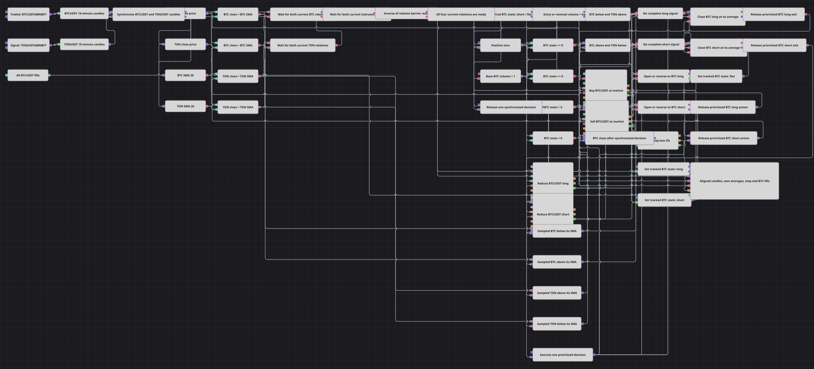

# 双资产各自均线策略图
[English](README.md) | [Русский](README_ru.md) | [Español](README_es.md) | [Deutsch](README_de.md) | [Português](README_pt.md) | [日本語](README_ja.md)

该图对齐BTCUSDT@BNBFT和TONUSDT@BNBFT已完成的十五分钟K线，将每个收盘价与为对应交易品种计算的20期简单移动平均线进行比较，并利用相反的关系管理BTCUSDT多头与空头敞口。由成交驱动的有符号状态锁存器、一步式市价反转、常规退出和本地固定2%止损共同构成完整流程。

## 策略概览

- 两个独立的证券变量仅配置BTCUSDT和TONUSDT的K线订阅。订单动作与Strategy trades流使用所选的Strategy Security，必须将其设置为BTCUSDT@BNBFT，以便与Traded Security参数一致。
- 只有已完成的十五分钟K线进入Sync模块。每个对齐后的K线对在一条支路提供BTC Close和BTC SMA(20)，在另一条支路提供TON Close和TON SMA(20)；只有两条均线都已形成后才开始决策。
- 多头关系严格要求同时满足`BTC Close < BTC SMA(20)`与`TON Close > TON SMA(20)`。空头关系严格要求同时满足`BTC Close > BTC SMA(20)`与`TON Close < TON SMA(20)`。等值不满足任一完整关系。
- 数值型有符号状态锁存器记录该图管理的BTC状态：`-1`表示空头，`0`表示空仓，`1`表示多头。从空仓出发，完整关系提交一单位市价入场；从相反状态出发，动作数量变为两单位，通过一次市价动作关闭现有的一单位敞口，并在新方向建立一单位敞口。
- 完整的相反关系优先于常规退出。否则，当BTC严格处于其自身均线的退出侧时，以一单位ReduceOnly市价动作关闭当前方向。每次同步决策均在已保存的BTC收盘价传给本地固定2%市价止损之前完成。

## 入场与出场规则

- **做多入场**: 当同步的已完成K线对满足`BTC Close < BTC SMA(20)`和`TON Close > TON SMA(20)`时，买入门控接受空仓或空头锁存状态。它从空仓提交Volume 1的NoCondition市价买入；若当前是一单位空头，则提交Volume 2，直接反转为一单位BTC多头。
- **做空入场**: 当同步的已完成K线对满足`BTC Close > BTC SMA(20)`和`TON Close < TON SMA(20)`时，卖出门控接受空仓或多头锁存状态。它从空仓提交Volume 1的NoCondition市价卖出；若当前是一单位多头，则提交Volume 2，直接反转为一单位BTC空头。
- **离场**: 当BTC Close严格高于BTC SMA(20)且完整空头关系不成立时，多头通过一单位ReduceOnly市价卖出关闭。当BTC Close严格低于BTC SMA(20)且完整多头关系不成立时，空头通过一单位ReduceOnly市价买入关闭。这些否定检查会把完整的相反关系留给两单位反转支路。本地保护也能用固定2%市价止损关闭任一方向；Take Profit 0会禁用止盈目标。

## 参数

| 参数 | 默认值 | 说明 |
|---|---|---|
| Traded Security | BTCUSDT@BNBFT | 仅用于交易品种的K线订阅。请把Strategy Security设置为相同的BTCUSDT@BNBFT值，因为所有订单动作与Strategy trades流都使用Strategy Security。 |
| Signal Security | TONUSDT@BNBFT | 仅用于第二个K线订阅。其价格与均线关系参与决策，但没有订单动作指向该变量。 |
| BTC Candles Series | 00:15:00 | 已完成的十五分钟BTCUSDT K线序列，用于同步、BTC Close、BTC SMA(20)、保护检查和图表。 |
| TON Candles Series | 00:15:00 | 已完成的十五分钟TONUSDT K线序列，用于同步、TON Close、TON SMA(20)和图表。 |
| BTC SMA Length | 20 | 基于同步且已完成的BTCUSDT K线计算SimpleMovingAverage时使用的周期。 |
| TON SMA Length | 20 | 基于同步且已完成的TONUSDT K线计算SimpleMovingAverage时使用的周期。 |
| Base Volume | 1 | 默认市价入场数量。动作数量为`Base Volume * (1 + abs(latch))`，因此空仓入场使用Base Volume，反转使用两倍Base Volume；按默认值分别为Volume 1和Volume 2。 |
| Take Profit | 0 | 绝对值为零时禁用止盈保护。 |
| Stop Loss | 2% | 相对于受保护成交价格的不利百分比距离，到达该距离时触发止损。 |
| Trailing Stop Loss | false | 已禁用，因此2%止损保持固定，不随有利价格变动而移动。 |
| Use Market Orders | true | 已启用，因此触发的止损会用市价订单关闭受保护敞口。 |

## 图表详情

- 两个证券类型的[变量](https://doc.stocksharp.com/zh/topics/designer/strategies/using_visual_designer/elements/data_sources/variable.html)模块只向各自的[K线](https://doc.stocksharp.com/zh/topics/designer/strategies/using_visual_designer/elements/data_sources/candles.html)模块提供值。[同步](https://doc.stocksharp.com/zh/topics/designer/strategies/using_visual_designer/elements/common/sync.html)模块按`00:15:00`对齐已完成的数据流，然后两条支路才进入决策链。
- 每根同步K线被拆分为Close和已形成的[指标](https://doc.stocksharp.com/zh/topics/designer/strategies/using_visual_designer/elements/common/indicator.html)值。四个严格比较模块使用每个交易品种的Close及其自身SMA(20)，构造相反的多头与空头关系。
- 一个数值型Unit变量保存有符号状态锁存器。买入成交写入`1`，卖出成交写入`-1`，常规或保护退出写入`0`。状态比较允许从空仓入场或从相反方向反转；数量公式为`Base Volume * (1 + abs(latch))`。
- 多头和空头关系门控驱动配置为NoCondition、MarketOrder的[修改持仓](https://doc.stocksharp.com/zh/topics/designer/strategies/using_visual_designer/elements/positions/modify.html)动作。独立的ReduceOnly市价动作处理常规退出。每个常规退出门控还要求完整的相反关系为假，因此同一个同步K线对不会同时请求反转和一单位平仓。
- [持仓保护](https://doc.stocksharp.com/zh/topics/designer/strategies/using_visual_designer/elements/positions/protect.html)接收入场、反转和常规退出的成交。Take Profit为`0`，Stop Loss为`2%`，Trailing Stop Loss为`false`，Use Market Orders为`true`，并在本地运行保护。同步的BTC收盘价先被保存，只有两条信号支路都完成该K线对的决策后才传给保护。
- 图表接收同步后的BTCUSDT与TONUSDT K线流、BTC SMA(20)、TON SMA(20)、止损订单流，以及Strategy trades中的全部BTCUSDT成交。

## 使用方法

将 `.json` 文件导入 Designer，在回测器中用历史数据运行，然后根据自己的交易品种调整参数或方块，确认无误后再用于实盘。
