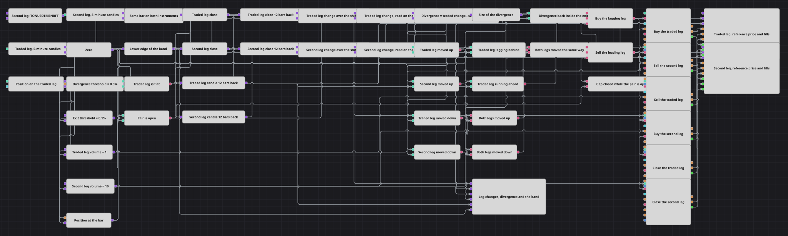

# Схема стратегии дивергенции спреда двух ног
[English](README.md) | [中文](README_zh.md) | [Español](README_es.md) | [Deutsch](README_de.md) | [Português](README_pt.md) | [日本語](README_ja.md)

Два инструмента, которые обычно ходят вместе, иногда проходят разное расстояние, и тот, что отстал, как правило, догоняет. Схема измеряет, насколько далеко ушёл каждый из двух за одно и то же число баров, вычитает одну величину из другой, и когда разрыв раскрывается достаточно широко, одновременно покупает отставшую ногу и продаёт ушедшую вперёд. Обе ноги закрываются, когда разрыв снова сходится.

## Обзор стратегии

- Переменная типа Security задаёт второй инструмент, поэтому пара — это настройка, а не решение на уровне связей, и та же переменная направляет на него вторую серию свечей и каждый кубик заявки по второй ноге. Первая нога — инструмент, на который настроена сама стратегия.
- Обе серии свечей настроены только на завершённые свечи, поэтому незавершённый бар не может ни сдвинуть решение, ни проставить время заявке.
- Sync держит по одной линии на инструмент и выпускает обе свечи вместе с пятиминутным тактом. Два потока приходят независимо, и только после такого удержания две свечи относятся к одному и тому же бару — а это единственное, что делает сравнение двух инструментов осмысленным.
- Для каждой выпущенной свечи конвертер берёт цену закрытия, кубик Previous value хранит свечу на фиксированное число баров назад, а второй конвертер читает цену закрытия из этой более старой свечи. Кубик хранит саму свечу, а поле читается уже после — именно такой порядок даёт значение на каждом баре.
- Две формулы превращают каждую пару цен в одно число: насколько далеко ушла эта нога со старого бара, в процентах от старой цены.
- Две переменные привязывают эти два процента к торгуемой свече: каждая хранит последнюю величину, которую дала пара, и выпускает её, когда завершается бар на торгуемом инструменте, поэтому все дальнейшие сравнения, условия и заявки идут по часам того инструмента, куда отправляются заявки.
- Формула вычитает пройденный путь второй ноги из пути торгуемой — это и есть дивергенция, — а другая берёт её величину без учёта знака для выхода. Сравнения сопоставляют дивергенцию с симметричным коридором, обе величины по ногам — с нулём и позицию — с нулём; два And и один Or сводят два показания знака в единый флаг корреляции.
- Три логических условия собирают решения, а шесть кубиков позиции их исполняют: два открывают пару в каждую сторону, по одной заявке на инструмент, и два закрывают обе ноги. Каждый открывающий кубик настроен срабатывать только из нулевой позиции по своему инструменту, поэтому сигнал, повторившийся при уже работающей паре, ничего к ней не добавляет.

## Правила входа и выхода

- **Вход в лонг**: Дивергенция находится ниже нижней границы коридора — торгуемая нога отстала от второй, — обе ноги прошли путь в одну сторону за выбранный сдвиг, а по торгуемой ноге позиция нулевая. По этому одному сигналу срабатывают сразу два кубика: один покупает по рынку объём торгуемой ноги на инструменте стратегии, другой продаёт по рынку объём второй ноги на заданном инструменте.
- **Вход в шорт**: Дивергенция находится выше верхней границы коридора — торгуемая нога ушла вперёд относительно второй, — обе ноги прошли путь в одну сторону за выбранный сдвиг, а по торгуемой ноге позиция нулевая. Зеркальная пара кубиков продаёт объём торгуемой ноги и покупает объём второй ноги, оба раза по рынку.
- **Выход**: Обе ноги закрываются вместе, когда разрыв, на котором их открыли, сошёлся: величина дивергенции, взятая без знака, опускается ниже порога выхода, пока пара открыта. По этому единственному сигналу срабатывают два закрывающих кубика, по одному на инструмент, и каждый сам определяет свой объём по тому, что найдёт открытым, поэтому ни одному из них не нужен собственный объём, а закрывающий кубик, сработавший на инструменте с нулевой позицией, просто ничего не делает. Никакой цели по деньгам, никакого стоп-лосса и никакого ограничения по времени здесь нет; схождение двух ног — это и есть весь выход.

## Параметры

| Параметр | По умолчанию | Описание |
|---|---|---|
| Second Instrument | TONUSDT@BNBFT | Инструмент, на котором торгуется вторая нога. Он должен присутствовать в подключённых данных и быть реально торгуемым инструментом: на него отправляются заявки, а не только читаются данные. |
| Traded Candles | 00:05:00 | Длина свечей на собственном инструменте стратегии. Решения и заявки идут в этом такте. |
| Second Leg Candles | 00:05:00 | Длина свечей на втором инструменте. Держите её равной торгуемой серии, иначе две ноги измеряются на разных отрезках времени и разница между ними ничего не значит. |
| Sync Interval | 00:05:00 | Такт, с которым удержание выпускает оба инструмента. Согласуйте его с длиной свечи. |
| Traded Leg Shift | 12 | На сколько баров назад отсчитывается пройденный путь торгуемой ноги. Двенадцать пятиминутных баров — это один час. |
| Second Leg Shift | 12 | То же число для второй ноги. Держите оба значения равными: два разных отрезка делают вычитание бессмысленным. |
| Divergence Threshold, % | 0.3 | Насколько далеко должны разойтись два пройденных пути, в процентах, чтобы пару стоило открывать. Коридор симметричен, поэтому это одно значение задаёт обе границы. |
| Exit Threshold, % | 0.1 | Насколько близко должны сойтись обратно два пройденных пути, в процентах, чтобы обе ноги были закрыты. Держите это значение ниже порога входа, иначе пара закроется на том же баре, на котором открылась. |
| Traded Leg Volume | 1 | Объём заявки на инструменте стратегии, в лотах. |
| Second Leg Volume | 10 | Объём заявки на втором инструменте, в лотах. Два объёма задаются независимо, поэтому соотношение между ногами — это настройка, а не величина, выведенная из цен: подбирайте его под масштабы цен двух инструментов и сверяйте с шагом объёма второго, иначе заявка будет округлена вниз. |

## Детали диаграммы

- Именно Sync соединяет бары в пары, но по его выпуску ничего не выставляется. Два потока завершаются не в один и тот же момент, и набор, выпущенный после удержания, несёт более раннее из двух времён; заявка со временем раньше текущего отклоняется. Две переменные, привязывающие величины к торгуемой свече, и держат всю дальнейшую часть схемы на одних часах.
- Следствие этой привязки стоит знать: величины, по которым принимается решение, — это последняя полная пара, поэтому пара открывается на баре, следующем за тем, который дал показание, а не внутри него.
- Каждая константа — ноль, оба порога и оба объёма — запускается торгуемой свечой. Сравнению для каждого вычисления нужно, чтобы оба его значения пришли заново, и константа, которая больше не отправляется повторно, тихо останавливает условие, которое она питает, не подавая никаких признаков этого.
- Нижняя граница коридора — это формула от порога, а не вторая константа, поэтому коридор остаётся симметричным при любом значении порога, и менять нужно одно число вместо двух, которые могут разойтись.
- Кубик позиции читает только торгуемый инструмент, и его значение привязывается к бару так же, как величины по ногам. Обе ноги открываются и закрываются одними и теми же сигналами, поэтому состояние торгуемой ноги отражает состояние всей пары.

## Использование

Импортируйте файл `.json` в Designer, прогоните схему на исторических данных в тестере, затем подстройте параметры или сами кубики под свой инструмент, прежде чем торговать вживую.
