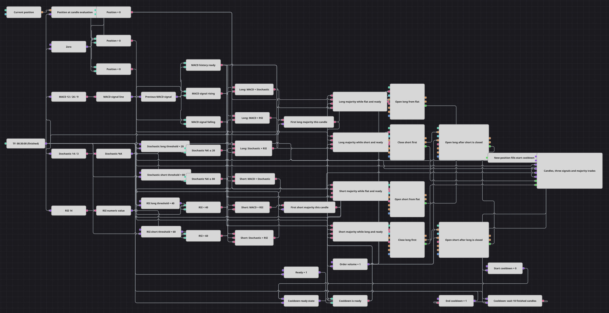

# Two-of-Three Directional Signals Strategy Diagram
[Русский](README_ru.md) | [中文](README_zh.md) | [Español](README_es.md) | [Deutsch](README_de.md) | [Português](README_pt.md) | [日本語](README_ja.md)

This diagram evaluates three directional votes on every finished 30-minute candle: the slope of the MACD Signal line, the Stochastic %K zone, and the RSI zone. Any agreeing pair produces one majority event for that candle. When the cooldown is ready, a flat position opens with volume 1, while an opposite position is reversed through a ReduceOnly close followed by a fill-confirmed entry in the new direction. Each new-position fill starts a ten-candle cooldown.

## Strategy Overview

- Finished 30-minute candles feed formed-only MACD 12/26/9, Stochastic 14/3, and RSI 14 indicators. A Previous value block retains the preceding MACD Signal value, and a history gate prevents a decision until that value exists.
- The long votes are `MACD Signal > Previous MACD Signal`, `Stochastic %K ≤ 20`, and `RSI < 40`. The short votes are `MACD Signal < Previous MACD Signal`, `Stochastic %K ≥ 80`, and `RSI > 60`. Equal MACD values and oscillator values outside the directional zones are neutral.
- Three pairwise Logical condition blocks represent every possible two-vote majority for each direction. A per-candle Flag passes only the first satisfied pair, so three agreeing indicators still create one directional event rather than three.
- Position and cooldown snapshots route each majority. A ready flat position submits one NoCondition market entry for Order Volume 1. An opposite position first submits a ReduceOnly market close for 1; only the fully matched close Order starts the NoCondition market entry for 1 in the new direction.
- A Combination block merges fills from the four new-position actions into one cooldown stream. A fill marks the diagram unavailable for entry, the next ten finished candles are skipped, and the eleventh finished candle is the first eligible decision candle. There is no independent exit, stop-loss, take-profit, or position-protection block.

## Entry and Exit Rules

- **Long entry**: When any two long votes agree and the cooldown is ready, a flat position submits a NoCondition market buy for Order Volume 1. If the position is short, the diagram first submits a ReduceOnly market buy for 1; only its fully matched close Order triggers the NoCondition market buy for 1. An existing long position is left unchanged.
- **Short entry**: When any two short votes agree and the cooldown is ready, a flat position submits a NoCondition market sell for Order Volume 1. If the position is long, the diagram first submits a ReduceOnly market sell for 1; only its fully matched close Order triggers the NoCondition market sell for 1. An existing short position is left unchanged.
- **Exit**: There is no separate exit rule. A majority in the opposite direction closes the current side and then opens the new side through the staged sequence. The ReduceOnly close cannot increase exposure, but both legs use the fixed Order Volume 1; the sequence is sized for the one-unit position created by the diagram, and a different actual position size may not close fully or finish in the signaled direction.

## Parameters

| Parameter | Default | Description |
|---|---|---|
| Candles Series | 00:30:00 | Thirty-minute candle series; only finished candles update indicators, reset the per-candle majority flags, advance the cooldown, and initiate decisions. |
| MACD Fast Length | 12 | Fixed inside the MACD Indicator block; edit that block to change the fast EMA period. |
| MACD Slow Length | 26 | Fixed inside the MACD Indicator block; edit that block to change the slow EMA period. |
| MACD Signal Length | 9 | Fixed inside the MACD Indicator block; edit that block to change the Signal EMA period whose one-candle slope supplies the MACD vote. |
| Stochastic K Length | 14 | Fixed inside the Stochastic Indicator block; edit that block to change the %K period. The long and short thresholds are 20 and 80. |
| Stochastic D Length | 3 | Fixed inside the Stochastic Indicator block; edit that block to change the %D period. The directional vote reads %K, while the complete indicator must be formed. |
| RSI Length | 14 | RSI period. The fixed directional thresholds are strictly below 40 and strictly above 60. |
| Cooldown Bars | 10 | Number of subsequent finished candles blocked after a new-position fill; decisions resume on candle 11. |
| Order Volume | 1 | Fixed quantity used by flat entries, ReduceOnly close actions, and fill-confirmed entries after a close. |

## Diagram Details

- The [Candles](https://doc.stocksharp.com/en/topics/designer/strategies/using_visual_designer/elements/data_sources/candles.html) block emits only finished 30-minute candles. Three formed-only [Indicator](https://doc.stocksharp.com/en/topics/designer/strategies/using_visual_designer/elements/common/indicator.html) blocks calculate MACD 12/26/9, Stochastic 14/3, and RSI 14.
- A [Converter](https://doc.stocksharp.com/en/topics/designer/strategies/using_visual_designer/elements/common/converter.html) extracts the MACD Signal line. A [Previous value](https://doc.stocksharp.com/en/topics/designer/strategies/using_visual_designer/elements/common/prev_value.html) block retains its value one candle back, and strict comparisons classify the current Signal as rising, falling, or unchanged.
- Further [Comparison](https://doc.stocksharp.com/en/topics/designer/strategies/using_visual_designer/elements/common/comparison.html) blocks implement the exact fixed oscillator boundaries: Stochastic %K uses `≤ 20` and `≥ 80`, while RSI uses `< 40` and `> 60`. The thresholds and the required two votes are fixed diagram settings rather than exposed parameters.
- Six pairwise [Logical condition](https://doc.stocksharp.com/en/topics/designer/strategies/using_visual_designer/elements/common/logical_condition.html) blocks cover the three possible long pairs and three possible short pairs. Two [Flag](https://doc.stocksharp.com/en/topics/designer/strategies/using_visual_designer/elements/common/flag.html) blocks reset for each candle and reduce multiple satisfied pairs to one majority event per direction.
- The current [Position](https://doc.stocksharp.com/en/topics/designer/strategies/using_visual_designer/elements/positions/current.html) and cooldown-ready state are captured for the candle cycle. Position comparisons distinguish flat, long, and short exposure, and the entry conditions require both a majority event and an available cooldown state.
- Six [Modify position](https://doc.stocksharp.com/en/topics/designer/strategies/using_visual_designer/elements/positions/modify.html) blocks implement two flat entries and two staged reversals. Flat routes are externally guarded by `Position = 0`; reversal close blocks use ReduceOnly, and their fully matched Order outputs trigger the fixed NoCondition entries in the opposite direction.
- A [Combination](https://doc.stocksharp.com/en/topics/designer/strategies/using_visual_designer/elements/common/combination.html) block immediately merges the MyTrade outputs of the four new-position blocks without counting or changing them. The merged fill disables entry readiness and triggers an [N values](https://doc.stocksharp.com/en/topics/designer/strategies/using_visual_designer/elements/common/delay_value.html) block, which counts ten subsequent finished candles before restoring readiness for candle 11. The [Chart panel](https://doc.stocksharp.com/en/topics/designer/strategies/using_visual_designer/elements/common/chart.html) receives the candles, three numeric signal streams, merged new-position fills, and both reversal-close fills.

## Usage

Import the `.json` file into Designer, run it in the backtester on historical data, then adjust the parameters or the blocks themselves to fit your instrument before trading it live.
