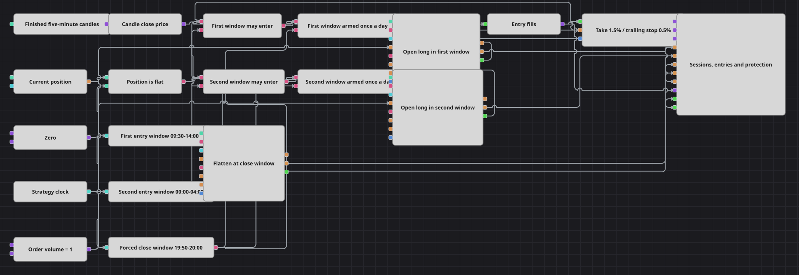

# Схема стратегии Two Session Open Time
[English](README.md) | [中文](README_zh.md) | [Español](README_es.md) | [Deutsch](README_de.md) | [Português](README_pt.md) | [日本語](README_ja.md)

В этой схеме нет ни одного индикатора: единственный источник сигналов — часы. Два отдельных окна торгового дня открывают по одной длинной позиции, Flag удерживает каждое окно в пределах одного входа в день, а третье окно закрывает всё, что осталось открытым, и заново взводит оба окна для следующего дня.

## Обзор стратегии

- Time передаёт текущий момент в три блока Working time: два окна входа, 09:30-14:00 и 00:00-04:00, и одно окно принудительного закрытия, 19:50-20:00.
- Каждое окно входа объединяется с проверкой нулевой позиции блоком Logical condition в режиме And, поэтому окно может запросить вход только пока ничего не открыто.
- Окно остаётся открытым часами, и его условие раз за разом повторяет одно и то же истинное значение. Flag стоит между условием и заявкой и пропускает только первое из них, превращая длинное окно в один вход.
- Оба окна покупают. Position modify работает с условием Open position, поэтому рыночная заявка на Order Volume уходит только тогда, когда позиция в точности равна нулю.
- Окно принудительного закрытия управляет третьим Position modify, настроенным на Close position, и этот же сигнал сбрасывает оба блока Flag, так что оба окна входа снова взведены на следующий день.
- Position protection следит за исполнениями обоих входов и закрывает позицию по тейк-профиту 1.5% или по трейлинг-стопу 0.5%, который следует за ценой закрытия свечи.
- Завершённые пятиминутные свечи задают темп всей схеме: они несут цену закрытия в Position protection, именно их рисует панель, и именно их приход двигает часы вперёд.
- Панель графика показывает свечи, линию цены, на которую реагирует защита, каждую заявку, которую схема отправляет, и каждое исполнение, которое она получает.

## Правила входа и выхода

- **Вход в лонг**: Внутри любого из окон, пока позиция нулевая, Flag этого окна выпускает первый истинный сигнал, и Position modify покупает Order Volume по рынку по условию Open position. Каждый следующий сигнал того же окна поглощается блоком Flag, пока окно закрытия не сбросит его.
- **Вход в шорт**: Короткой стороны нет. Оба окна открывают длинную позицию, и единственные заявки на продажу, которые схема вообще отправляет, — это те, что закрывают открытую длинную позицию.
- **Выход**: Position protection закрывает позицию по тейк-профиту 1.5% или по трейлинг-стопу 0.5%, который следует за ценой закрытия свечи. Всё, что остаётся открытым к началу окна закрытия, сворачивается действием Close position, которое заодно сбрасывает обе защёлки.

## Параметры

| Параметр | По умолчанию | Описание |
|---|---|---|
| Candles | 00:05:00 | Пятиминутный таймфрейм; обрабатываются только завершённые свечи, и именно из их цен закрытия строятся цена, которую проверяет защита, и линия на графике. |
| First Window From | 09:30:00 | Начало первого окна входа во времени воспроизведения или сервера. |
| First Window Until | 14:00:00 | Конец первого окна входа; после него это окно больше не может взвести вход. |
| Second Window From | 00:00:00 | Начало второго окна входа во времени воспроизведения или сервера. |
| Second Window Until | 04:00:00 | Конец второго окна входа. |
| Close Window From | 19:50:00 | Начало окна принудительного закрытия, которое сворачивает открытую позицию и сбрасывает обе защёлки. |
| Close Window Until | 20:00:00 | Конец окна принудительного закрытия. |
| Order Volume | 1 | Фиксированный объём, который используют входы обоих окон. |
| Take Profit, % | 1.5 | Благоприятное движение в процентах, при котором Position protection закрывает позицию. |
| Stop Loss, % | 0.5 | Неблагоприятное движение стопа в процентах; техника трейлинга подтягивает его вслед за ценой закрытия свечи, как только цена идёт в пользу позиции. |

## Детали диаграммы

- Блок [Candles](https://doc.stocksharp.com/en/topics/designer/strategies/using_visual_designer/elements/data_sources/candles.html) выдаёт завершённые пятиминутные свечи. [Converter](https://doc.stocksharp.com/en/topics/designer/strategies/using_visual_designer/elements/converters/converter.html) берёт их цену закрытия — именно относительно неё [Position protection](https://doc.stocksharp.com/en/topics/designer/strategies/using_visual_designer/elements/positions/protect.html) отмеряет тейк-профит и трейлинг-стоп, и именно она рисуется линией рядом со свечами. Больше из цены ничего не рассчитывается: в схеме нет ни одного индикатора.
- [Time](https://doc.stocksharp.com/en/topics/designer/strategies/using_visual_designer/elements/time/current_time.html) подаёт текущий момент в три блока [Working time](https://doc.stocksharp.com/en/topics/designer/strategies/using_visual_designer/elements/time/working_time.html). Два из них задают окна входа, третий — окно принудительного закрытия; воспроизведение упакованной истории идёт в UTC, поэтому границы окон читаются как время UTC.
- [Position](https://doc.stocksharp.com/en/topics/designer/strategies/using_visual_designer/elements/positions/current.html), сравниваемая с нулевой [Variable](https://doc.stocksharp.com/en/topics/designer/strategies/using_visual_designer/elements/data_sources/variable.html) через [Comparison](https://doc.stocksharp.com/en/topics/designer/strategies/using_visual_designer/elements/common/comparison.html), даёт проверку нулевой позиции, общую для обоих And-условий [Logical condition](https://doc.stocksharp.com/en/topics/designer/strategies/using_visual_designer/elements/common/logical_condition.html), так что открытая позиция незаметно блокирует и второе окно.
- Именно [Flag](https://doc.stocksharp.com/en/topics/designer/strategies/using_visual_designer/elements/common/flag.html) превращает окно в одиночное событие. Его триггер — And-условие, а сброс — окно закрытия; значение он пропускает только в момент установки, поэтому сотни истинных отсчётов, которые даёт четырёхчасовое окно, схлопываются в один вход.
- Работают три блока [Position modify](https://doc.stocksharp.com/en/topics/designer/strategies/using_visual_designer/elements/positions/modify.html): два входа Open position, берущие Order Volume, и одно закрытие Close position, которому объём не нужен, потому что оно читает ту позицию, которую должно свернуть. Исполнения обоих входов объединяются блоком [Combination](https://doc.stocksharp.com/en/topics/designer/strategies/using_visual_designer/elements/common/combination.html) и передаются в Position protection, чьё собственное закрывающее исполнение рисуется на панели, но обратно на его вход сделок не заводится.

## Использование

Импортируйте файл `.json` в Designer, прогоните схему на исторических данных в тестере, затем подстройте параметры или сами кубики под свой инструмент, прежде чем торговать вживую.
