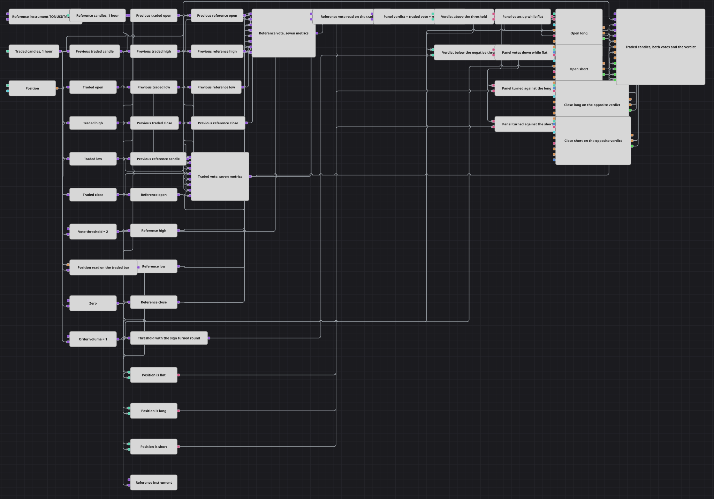

# Схема стратегии голосования по двум инструментам
[English](README.md) | [中文](README_zh.md) | [Español](README_es.md) | [Deutsch](README_de.md) | [Português](README_pt.md) | [日本語](README_ja.md)

Панель голосования по двум инструментам. На каждом завершённом часе каждый инструмент сравнивается с собственным предыдущим часом по семи ценовым показателям — открытие, максимум, минимум, закрытие, срединная цена, типичная цена и взвешенное закрытие, — и каждый выросший показатель отдаёт один голос вверх, каждый упавший — один голос вниз. Две оценки складываются в общий вердикт, и торгуемый инструмент покупается или продаётся только по этому вердикту. В схеме нет ни одного индикатора: всё решение построено на ценах свечей, арифметике и сравнениях.

## Обзор стратегии

- Схему питают два блока свечей. Один работает на собственном инструменте стратегии — именно он и торгуется; второй направлен на заданный инструмент переменной Security, поэтому второй символ — это настройка, а не решение на уровне связей.
- Обе серии берут только завершённые свечи. Голос, посчитанный по ещё формирующемуся бару, менялся бы несколько раз внутри часа и датировал бы порождённую им заявку открытием этого часа.
- На каждой серии Previous value хранит свечу целиком на шаг назад, а конвертеры читают открытие, максимум, минимум и закрытие из текущей свечи и из сохранённой. Сначала свеча удерживается, и только потом читаются её поля — именно такой порядок возвращает значение на каждом баре.
- Эти восемь чисел уходят в одну Formula на инструмент. Семь слагаемых sign(), по одному на показатель, каждое возвращает +1, 0 или -1, и они складываются: результат — голоса вверх минус голоса вниз, он лежит между -7 и +7. Именно sign делает сравнение возможным внутри формулы, которая сама по себе не умеет вернуть истину или ложь.
- Оценка эталонного инструмента переносится на торгуемый бар переменной с выключенным режимом «вход как триггер»: оценка приходит на вход и ждёт там, торгуемая свеча приходит на триггер и выпускает её. Два потока никогда не тикают в один и тот же момент, и именно это ставит второй инструмент на такты торгуемого.
- Вторая Formula складывает две оценки в вердикт панели, от -14 до +14, и вердикт рисуется на графике под свечами вместе с обеими оценками, из которых он собран.
- Один порог управляет обеими сторонами. Сравнение проверяет вердикт относительно него, однострочная формула меняет его знак на обратный, а второе сравнение проверяет вердикт относительно полученного значения — так повышение настройки одинаково ужесточает и длинный, и короткий случай.
- Позиция привязывается к бару переменной и сравнивается с нулём тремя способами: нулевая допускает вход, длинная или короткая — выход. Четыре элемента AND управляют четырьмя блоками Position modify — два открывают, два закрывают, — а вторая панель графика рисует эталонный инструмент рядом с торгуемым.

## Правила входа и выхода

- **Вход в лонг**: На завершённом баре вердикт панели выше порога — два инструмента вместе отдают явное большинство своих четырнадцати голосов вверх — и позиция нулевая. Срабатывает длинный элемент AND, и Position modify покупает объём заявки по рынку с условием Open position, поэтому следующий бар, повторяющий тот же вердикт, ничего к позиции не добавляет.
- **Вход в шорт**: Зеркальный случай: вердикт ниже порога с обратным знаком, большинство из четырнадцати голосов направлено вниз, позиция нулевая. Срабатывает короткий элемент AND, и второй Position modify продаёт объём заявки по рынку — снова с условием Open position.
- **Выход**: Ни стоп-лосса, ни тейк-профита здесь нет. Позицию отдаёт та же панель, что её и открыла: вердикт ниже порога с обратным знаком при длинной позиции запускает выходной элемент, и Close position возвращает всю позицию по рынку; вердикт выше порога при короткой позиции делает то же самое с другой стороны. Поскольку закрывающие блоки закрывают то, что открыто, а не продают фиксированный размер, выход никогда не может перевернуть позицию — при развороте панели схема сначала остаётся вне рынка, а новую сторону открывает следующий бар, который читается так же.

## Параметры

| Параметр | По умолчанию | Описание |
|---|---|---|
| Reference Instrument | TONUSDT@BNBFT | Второй инструмент, бар которого отдаёт вторую половину голосов; он должен быть доступен из подключения наравне с торгуемым. |
| Traded Candles | 01:00:00 | Таймфрейм торгуемых свечей: такт, на котором считывается вердикт и отправляются заявки. |
| Reference Candles | 01:00:00 | Таймфрейм эталонных свечей. Держите его равным торгуемому, иначе две оценки считаются на интервалах разной длины и их сумма перестаёт означать то, что заявлено. |
| Vote Threshold | 2 | Насколько большое большинство должны отдать два инструмента, прежде чем позиция будет открыта, и насколько далеко вердикт должен качнуться в обратную сторону, прежде чем она будет отдана. Считается в голосах из четырнадцати, которые отдаёт панель. |
| Order Volume | 1 | Размер заявки, в лотах. |

## Детали диаграммы

- Каждый блок заявок настроен так, чтобы не требовать онлайн-подключения, поэтому схема ведёт себя на истории так же, как на живом потоке; оставленный со значением по умолчанию блок задерживал бы все транзакции на воспроизводимых данных.
- Входы несут условие Open position, а выходы — условие Close position с противоположной стороной. Без условия блок отрабатывал бы на каждое изменение позиции, через которое он сработал, и один вердикт превращался бы в поток заявок.
- Каждая константа — ноль, порог и объём заявки — триггерится торгуемой свечой. Переменная выдаёт значение по своему триггеру, а не в момент установки значения, поэтому не оттриггеренная константа оставила бы соседнее сравнение немым на весь прогон.
- Показатель, повторившийся в точности, не отдаёт голоса вовсе: sign возвращает ноль на неизменившемся значении, поэтому считается только реальное движение, а неподвижный час на одном инструменте просто оставляет решение за другим.
- Именно порог превращает панель из спускового крючка в фильтр. На нуле схема действует по малейшему большинству и переворачивается почти на каждом баре; поднятый, он ждёт, пока два инструмента согласятся достаточно сильно, и позиция удерживается через разногласия в промежутке.

## Использование

Импортируйте файл `.json` в Designer, прогоните схему на исторических данных в тестере, затем подстройте параметры или сами кубики под свой инструмент, прежде чем торговать вживую.
