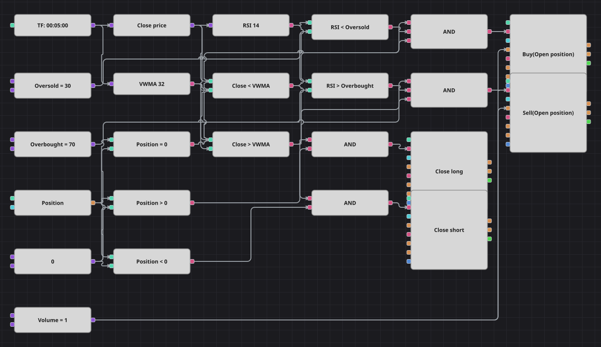

# Diagrama de la estrategia de reversión con VWMA y RSI
[English](README.md) | [Русский](README_ru.md) | [中文](README_zh.md) | [Deutsch](README_de.md) | [Português](README_pt.md) | [日本語](README_ja.md)

Una media móvil ponderada por volumen marca dónde se ha negociado realmente el dinero, y el RSI dice si el alejamiento de esa media se ha excedido. El diagrama compra por debajo de la media solo con el RSI en zona de sobreventa, vende por encima solo con el RSI sobrecomprado y mantiene la operación hasta que el precio vuelve al otro lado de la media.

## Resumen de la estrategia

- La media es una VolumeWeightedMovingAverage móvil de 32 velas, no un VWAP de sesión. Pese al nombre, es el indicador que usa la estrategia original: pondera cada cierre por el volumen de su vela.
- El índice de fuerza relativa se calcula sobre precios de cierre y solo confirma la entrada; por sí mismo no abre nada.
- Ambos bloques de indicador emiten únicamente valores formados, lo que evita operar con la media incompleta de las primeras velas.
- El original deja de procesar velas durante 100 barras tras cada operación, lo que congela también la salida y mantiene la posición al menos ocho horas. Designer no tiene contador de bloqueo, así que esa pausa no se reproduce: aquí la posición se cierra en cuanto el precio vuelve a cruzar la media.

## Reglas de entrada y salida

- **Entrada en largo**: El cierre está por debajo de la VWMA, el RSI está bajo el nivel de sobreventa y la posición es plana. La orden compra el volumen configurado.
- **Entrada en corto**: El cierre está por encima de la VWMA, el RSI está sobre el nivel de sobrecompra y la posición es plana. La orden vende el volumen configurado.
- **Salida**: El largo se cierra cuando el cierre vuelve por encima de la VWMA; el corto, cuando vuelve por debajo. No hay stop loss ni take profit, igual que en la estrategia original.

## Parámetros

| Parámetro | Por defecto | Descripción |
|---|---|---|
| VWMA Length | 32 | Número de velas de la media móvil ponderada por volumen. |
| RSI Length | 14 | Periodo de suavizado del índice de fuerza relativa. |
| Oversold | 30 | Nivel por debajo del cual el índice se considera sobrevendido. |
| Overbought | 70 | Nivel por encima del cual el índice se considera sobrecomprado. |
| Volume | 1 | Volumen de la orden, en lotes. |
| Candles | 00:05:00 | Marco temporal de las velas con el que trabaja todo el diagrama. |

## Detalles del diagrama

- El bloque de velas alimenta directamente la media ponderada por volumen, que necesita el volumen de la vela, y alimenta el RSI a través de un conversor del precio de cierre.
- Dos bloques de comparación sitúan el cierre a un lado u otro de la media, y esas dos señales sirven tanto para las entradas como para las salidas.
- Otras dos comparaciones contrastan el RSI con las constantes de umbral.
- El bloque de posición se compara con cero tres veces, lo que da los indicadores de plano, largo y corto para las Y lógicas.
- Cada Y de entrada une tres condiciones —lado de la media, extremo del RSI y posición plana— y dispara un bloque de modificación con la condición Abrir posición; las salidas usan bloques con la condición Cerrar posición, que no necesitan volumen.

## Uso

Importe el archivo `.json` en Designer, ejecútelo sobre datos históricos en el probador y después ajuste los parámetros o los propios bloques a su instrumento antes de operar en real.
