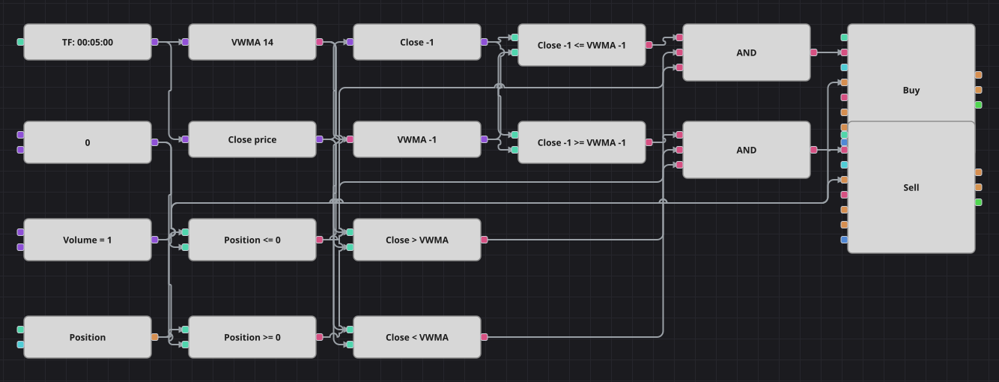

# 价格穿越 VWMA 策略图
[English](README.md) | [Русский](README_ru.md) | [Español](README_es.md) | [Deutsch](README_de.md) | [Português](README_pt.md) | [日本語](README_ja.md)

成交量加权移动平均线按每个价位的成交量给价格加权，因此更贴近资金真正换手的位置。本图跟踪收盘价穿越该均线的过程：由下向上穿越则买入，由上向下穿越则卖出。原策略使用一分钟K线，并在每笔交易后停顿若干根K线；本图改用五分钟K线，并省去了停顿，因为持仓判断本身已经阻止同方向的重复入场。

## 策略概览

- VolumeWeightedMovingAverage 接收整根K线而不仅仅是价格，因为它还需要成交量。
- 收盘价和均线都额外保存了前一根K线的值，因此穿越的判定与原始代码完全一致。
- 每次入场都受持仓保护：只有在持仓不是多头时才买入，只有在持仓不是空头时才卖出。
- 原策略的冷却时间没有复现，所以本图会对看到的每一次穿越作出反应。

## 入场与出场规则

- **做多入场**: 上一根K线的收盘价等于或低于当时的 VWMA，当前收盘价高于当前 VWMA，且持仓不是多头。订单买入一手：空仓时开多，持空时平空。
- **做空入场**: 上一根K线的收盘价等于或高于当时的 VWMA，当前收盘价低于当前 VWMA，且持仓不是空头。订单卖出一手：空仓时开空，持多时平多。
- **离场**: 没有专门的离场方块，也没有保护性止损：由于所有订单数量相同，反向穿越即可把持仓归零。

## 参数

| 参数 | 默认值 | 说明 |
|---|---|---|
| VWMA Length | 14 | 成交量加权移动平均线的平滑周期。 |
| Volume | 1 | 下单数量（手）。 |
| Candles | 00:05:00 | 整张图使用的K线周期；原策略为一分钟。 |

## 图表详情

- K线方块同时供给两条支路：含 VolumeWeightedMovingAverage 的指标方块，以及读取收盘价的转换方块。
- 两个前值方块保存上一根K线的收盘价与均线值。
- 四个比较方块组成两次穿越，另外两个把持仓与零常量对比，每个逻辑与合并其中三个信号。
- 两个修改持仓方块都发送市价单，数量取自同一个共享常量。

## 使用方法

将 `.json` 文件导入 Designer，在回测器中用历史数据运行，然后根据自己的交易品种调整参数或方块，确认无误后再用于实盘。
