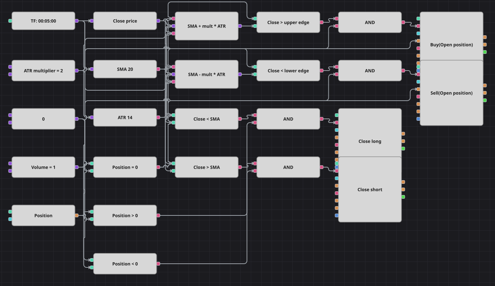

# ボラティリティ調整移動平均戦略のダイアグラム
[English](README.md) | [Русский](README_ru.md) | [中文](README_zh.md) | [Español](README_es.md) | [Deutsch](README_de.md) | [Português](README_pt.md)

このダイアグラムは単純移動平均の周りに、幅が Average True Range の数倍となるチャネルを描きます。相場が荒れれば帯は広がり、静まれば狭まります。終値が帯の外で引ければ本物のブレイクと見なし、価格が平均線まで戻ったところで建玉を手放します。

## 戦略の概要

- SimpleMovingAverage が中心線を描き、AverageTrueRange が帯の幅を決めるため、チャネルはその時々のボラティリティに合わせて伸縮します。
- 2つの数式ブロックが同じ3つの入力から SMA + 倍率 * ATR と SMA - 倍率 * ATR という上下の帯を組み立てます。
- エントリーはノーポジションのときだけ、エグジットは終値が中心線を戻ってくることだけです。C# の原典と同じく損切りも利確もありません。
- 原典との相違は2点。売買後の500本の休止は再現しておらず取引回数が増えること、そして作業足が1分ではなく5分であること（同梱の履歴データが5分足のためです）。

## エントリーとエグジットの条件

- **ロングエントリー**: 終値が上側の帯 SMA + 倍率 * ATR を上回り、ポジションがゼロのとき。ポジション変更ブロックが共通数量を成行で買います。
- **ショートエントリー**: 終値が下側の帯 SMA - 倍率 * ATR を下回り、ポジションがゼロのとき。ポジション変更ブロックが共通数量を成行で売ります。
- **エグジット**: 買い建ては SMA を下回って引けた最初の足で、売り建ては SMA を上回って引けた最初の足で手仕舞います。決済ブロックは建玉があるときにだけ動作します。

## パラメーター

| パラメーター | 既定値 | 説明 |
|---|---|---|
| SMA Length | 20 | 中心線とエグジット水準を作る単純移動平均の期間。 |
| ATR Length | 14 | その時々のボラティリティを測る Average True Range の期間。 |
| ATR multiplier | 2 | チャネルの帯を中心線から何 ATR 離すか。 |
| Volume | 1 | 注文数量（ロット）。 |
| Candles | 00:05:00 | ダイアグラム全体が用いるローソク足の時間軸。 |

## ダイアグラムの詳細

- ローソク足ブロックが2つの指標と、終値を取り出す変換ブロックの両方にデータを渡します。
- 2つの数式ブロックが移動平均・値幅・倍率の定数を上下の帯にまとめます。
- 4つの比較ブロックがシグナルを作ります。2つはエントリー用に帯と、2つはエグジット用に中心線と比べます。
- ポジションブロックはゼロの定数と比較され、すべての論理積に入るため、既存の建玉に注文が積み増されることはありません。

## 使い方

`.json` ファイルを Designer に読み込み、バックテスターで過去データを使って実行し、実運用の前にパラメーターやブロック自体を自分の銘柄に合わせて調整してください。
