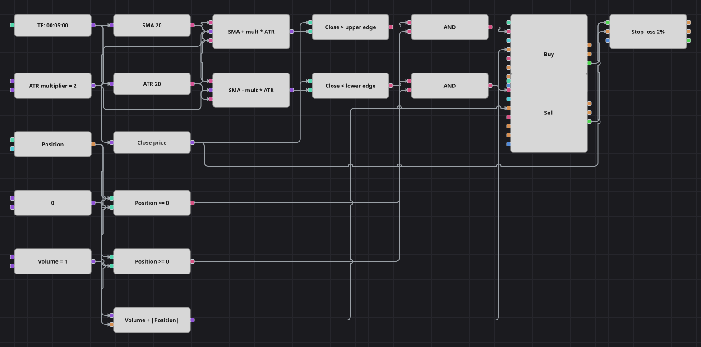

# Диаграмма стратегии пробоя волатильности
[English](README.md) | [中文](README_zh.md) | [Español](README_es.md) | [Deutsch](README_de.md) | [Português](README_pt.md) | [日本語](README_ja.md)

Канал, собранный вручную: простая скользящая средняя задаёт центр, Average True Range — ширину, а закрытие за пределами SMA плюс-минус несколько ATR считается движением, к которому стоит присоединиться. Канал дышит вместе с волатильностью, поэтому один и тот же множитель остаётся осмысленным и на спокойном, и на быстром рынке.

## Обзор стратегии

- SMA и ATR считаются по одному и тому же периоду на завершённых свечах, так что канал центрирован на средней цене и масштабирован недавним истинным диапазоном.
- Две формулы собирают границы: верхняя — это SMA плюс множитель на ATR, нижняя — SMA минус та же величина.
- Стратегия всегда в рынке: встречный пробой переворачивает позицию, а защитный стоп закрывает её раньше, если движение не состоялось.

## Правила входа и выхода

- **Вход в лонг**: Свеча закрылась выше SMA плюс множитель на ATR, и позиция не в лонге. Заявка покупает базовый объём плюс модуль позиции: шорт переворачивается в лонг, из нуля открывается лонг.
- **Вход в шорт**: Свеча закрылась ниже SMA минус множитель на ATR, и позиция не в шорте. Заявка продаёт базовый объём плюс модуль позиции: лонг переворачивается в шорт, из нуля открывается шорт.
- **Выход**: Выхода по индикатору нет. Позицию переворачивает встречный пробой либо раньше закрывает кубик защиты со стоп-лоссом, подключённый к сделкам обоих входов.

## Параметры

| Параметр | По умолчанию | Описание |
|---|---|---|
| Indicator period | 20 | Общий период для SMA, задающей центр канала, и для ATR, задающего его ширину. |
| ATR multiplier | 2 | На сколько ATR граница пробоя отстоит от скользящей средней. |
| Stop loss, % | 2 | Защитный стоп-лосс в процентах от цены входа. |
| Volume | 1 | Базовый объём заявки в лотах; при перевороте прибавляется модуль позиции. |
| Candles | 00:05:00 | Таймфрейм свечей, на котором работает вся диаграмма. |

## Детали диаграммы

- Кубик свечей подаёт данные на оба индикатора и через конвертер — цену закрытия, которая используется и в сравнениях, и как источник цены для кубика защиты.
- Константа хранит множитель, а два кубика формулы считают верхнюю и нижнюю границы из SMA, множителя и ATR.
- Два кубика сравнения проверяют закрытие против границ, ещё два сравнивают позицию с нулём, и каждое логическое И собирает из пары условий вход.
- Кубик формулы считает объём переворота как базовый объём плюс модуль позиции и подаёт его на оба кубика изменения позиции.
- В оригинале стоп задан как две абсолютные единицы цены — величина, подобранная под другой инструмент, на крипте она срабатывала бы мгновенно; в диаграмме вместо неё стоит стоп в два процента, который ведёт себя так, как задумывалось, на любом инструменте.

## Использование

Импортируйте файл `.json` в Designer, прогоните схему на исторических данных в тестере, затем подстройте параметры или сами кубики под свой инструмент, прежде чем торговать вживую.
