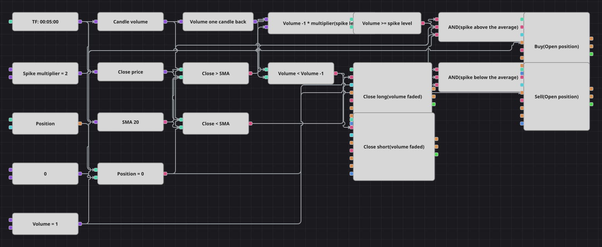

# Диаграмма стратегии на всплеске объёма
[English](README.md) | [中文](README_zh.md) | [Español](README_es.md) | [Deutsch](README_de.md) | [Português](README_pt.md) | [日本語](README_ja.md)

Свеча, которая несёт заметно больший объём, чем предыдущая, обычно означает, что кто-то только что сделал крупное движение. Схема ждёт такого скачка, спрашивает у простой скользящей средней, покупает толпа или продаёт, и идёт следом, пока объём продолжает расти. Как только объём опускается ниже объёма предыдущей свечи, сделка заканчивается.

## Обзор стратегии

- Объём свечи сравнивается с объёмом предыдущей свечи, а не со средним за много свечей, — ровно так, как это сделано в исходном коде.
- Сравнение записано умножением, а не делением, поэтому свеча с нулевым объёмом не ломает схему.
- Простая скользящая средняя цены закрытия за двадцать свечей выбирает сторону: выше неё всплеск покупается, ниже — продаётся.
- Входы выполняются только из нулевой позиции, а выходу не нужны ни средняя, ни всплеск — достаточно того, что объём перестал расти.

## Правила входа и выхода

- **Вход в лонг**: Объём свечи не меньше объёма предыдущей свечи, умноженного на множитель, свеча закрылась выше скользящей средней, позиция нулевая. Заявка покупает один лот по рынку.
- **Вход в шорт**: Объём свечи не меньше объёма предыдущей свечи, умноженного на множитель, свеча закрылась ниже скользящей средней, позиция нулевая. Заявка продаёт один лот по рынку.
- **Выход**: Обе стороны выходят на первой же свече, объём которой меньше объёма предыдущей, через кубики изменения позиции в режиме закрытия. В исходной стратегии нет ни стоп-лосса, ни тейк-профита — их нет и в диаграмме.

## Параметры

| Параметр | По умолчанию | Описание |
|---|---|---|
| Spike Multiplier | 2 | Во сколько раз объём текущей свечи должен превышать объём предыдущей, чтобы всплеск был засчитан. |
| SMA Length | 20 | Период простой скользящей средней, выбирающей сторону входа. |
| Volume | 1 | Объём заявки в лотах. |
| Candles | 00:05:00 | Таймфрейм свечей, на котором работает вся диаграмма. |

## Детали диаграммы

- Кубик свечей питает конвертер объёма, конвертер цены закрытия и кубик скользящей средней; кубик предыдущего значения со сдвигом в одну свечу отдаёт объём прошлой свечи.
- Формула умножает этот прошлый объём на константу-множитель, а кубик сравнения проверяет текущий объём против результата.
- Каждое логическое И объединяет всплеск, выбранную средней сторону и проверку нулевой позиции и запускает кубик изменения позиции в режиме только открытия.
- Сравнение падающего объёма заведено прямо на оба закрывающих кубика: они работают в режиме закрытия и потому бездействуют, пока позиции нет. В оригинале ещё есть пауза в пятьсот свечей после каждой сделки и минутный таймфрейм; кубика-счётчика для такой паузы нет, а поставляемая история грубее минуты, поэтому диаграмма работает на пятиминутках и торгует каждый всплеск.

## Использование

Импортируйте файл `.json` в Designer, прогоните схему на исторических данных в тестере, затем подстройте параметры или сами кубики под свой инструмент, прежде чем торговать вживую.
