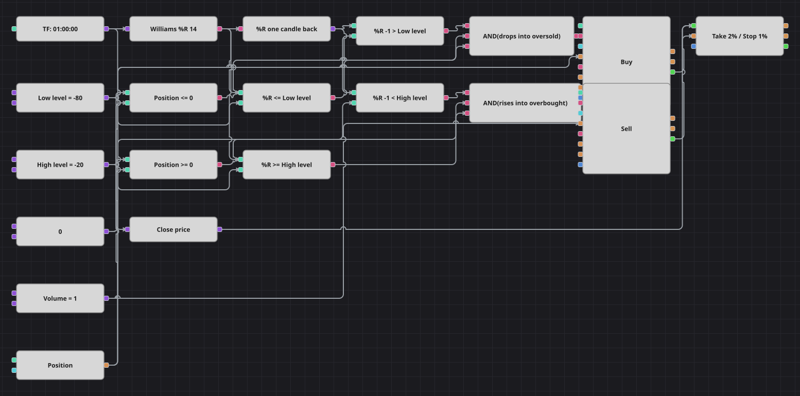

# Williams %R 水平穿越策略图
[English](README.md) | [Русский](README_ru.md) | [Español](README_es.md) | [Deutsch](README_de.md) | [Português](README_pt.md) | [日本語](README_ja.md)

Williams %R 表示收盘价在最近若干根K线区间中的位置，顶部为 0，底部为 -100。本图交易的是振荡指标走进区间的那一刻，而不是走出区间的时刻：向下穿过下轨买入，向上穿过上轨卖出。百分比保护负责了结仓位。

## 策略概览

- 周期为 14 的 Williams %R 基于已完成的小时K线计算，测试器用随包提供的五分钟历史数据合成这些K线。
- 信号就是穿越本身：前一个读数在水平的一侧，当前读数在另一侧，因此长时间停留在区间内也只会触发一次。
- 这是进入区间的做法，与等待振荡指标重新走出区间的经典读法正好相反，对应原策略的 Direct 模式。
- 原策略还有分别允许做多与做空的开关，默认都打开，所以本图接好两条支路，需要关闭某一侧时直接断开该支路即可。

## 入场与出场规则

- **做多入场**: 上一根K线的 %R 高于下轨，本根K线的 %R 等于或低于下轨，且持仓不是多头。订单买入一手：空仓时开多，持空时平空。
- **做空入场**: 上一根K线的 %R 低于上轨，本根K线的 %R 等于或高于上轨，且持仓不是空头。订单卖出一手：空仓时开空，持多时平多。
- **离场**: 保护方块按入场价的 2% 止盈或 1% 止损平仓；在此之前，反向穿越也会把仓位归零，因为所有订单数量相同。

## 参数

| 参数 | 默认值 | 说明 |
|---|---|---|
| Williams %R Length | 14 | Williams %R 的回溯长度。 |
| Low Level | -80 | 振荡指标必须向下穿过该水平才允许做多。 |
| High Level | -20 | 振荡指标必须向上穿过该水平才允许做空。 |
| Take profit, % | 2 | 相对入场价的止盈幅度（百分比）。 |
| Stop loss, % | 1 | 相对入场价的止损幅度（百分比）。 |
| Volume | 1 | 下单数量（手）。 |
| Candles | 01:00:00 | 整张图使用的K线周期。 |

## 图表详情

- K线方块把数据送入装有 Williams %R 的指标方块，前值方块保存上一根K线的读数。
- 四个比较方块用前值和当前值对照两个水平常量，构成两次穿越。
- 另外两个比较方块把持仓与零常量对比，每个逻辑与把一次穿越和对应的持仓判断结合起来。
- 两个修改持仓方块都发出市价单，数量取自同一个常量，其成交进入带有止盈止损的保护方块。
- 原策略用绝对价格距离设置保护，本图改为入场价的百分比，这样同一组数值在任何品种上都成立。

## 使用方法

将 `.json` 文件导入 Designer，在回测器中用历史数据运行，然后根据自己的交易品种调整参数或方块，确认无误后再用于实盘。
