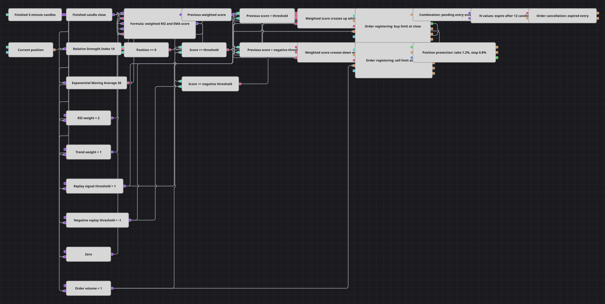

# Взвешенная корзина сигналов с истекающими лимитами
[English](README.md) | [中文](README_zh.md) | [Español](README_es.md) | [Deutsch](README_de.md) | [Português](README_pt.md) | [日本語](README_ja.md)

Схема объединяет голос зоны RSI и голос положения относительно EMA в единый счёт от −3 до +3. Пересечение порога при нулевой позиции регистрирует лимит на закрытии свечи, Combination<Order> передаёт именно эту заявку двенадцатисвечному таймеру N values и Order cancellation, а исполнения запускают Position protection 1,2%/0,8%.

## Обзор стратегии

- RSI ниже 30 даёт +2, RSI выше 70 даёт −2, а средняя зона — ноль.
- Close выше EMA(20) даёт +1, ниже — −1; Formula складывает два взвешенных голоса.
- Сравнения текущего и Previous value находят свежее пересечение +1 для лонга или −1 для шорта, причём обе стороны требуют Position == 0.
- Покупка и продажа используют завершённый close и объём один; их Order сходятся в Combination, а MyTrade поступают в Position protection.
- N values отсчитывает двенадцать завершённых свечей после регистрации и просит Order cancellation снять текущую неисполненную заявку.

## Правила входа и выхода

- **Вход в лонг**: Взвешенный счёт стал не меньше +1 после предыдущего значения ниже +1 при нулевой позиции. Order registering ставит buy limit по завершённому close.
- **Вход в шорт**: Взвешенный счёт стал не больше −1 после предыдущего значения выше −1 при нулевой позиции. Order registering ставит sell limit по завершённому close.
- **Выход**: Исполненный вход защищается на +1,2% и −0,8% от цены сделки. Неисполненный лимит как объект Order поступает в Order cancellation после того, как N values отсчитает двенадцать закрытых свечей.

## Параметры

| Параметр | По умолчанию | Описание |
|---|---|---|
| Candle Time Frame | 00:05:00 | Интервал завершённых свечей; пять минут адаптируют 60-минутный дефолт C# для месячного replay. |
| RSI Length | 14 | Период RSI; дефолт исполняемого C# — 21, компактная схема использует 14. |
| EMA Length | 20 | Период EMA; дефолт исполняемого C# — 50, схема использует 20. |
| RSI Weight | 2 | Модуль голоса RSI в зонах перепроданности и перекупленности. |
| Trend Weight | 1 | Модуль голоса положения close относительно EMA. |
| Replay Signal Threshold | 1 | Граница пересечения в replay; значение плана 2 остаётся документированной альтернативой настройки. |
| Cancel After N Candles | 12 | Число завершённых свечных значений до попытки снять неисполненный вход. |
| Take Profit, % | 1.2 | Процент прибыли от исполнения для Position protection. |
| Stop Loss, % | 0.8 | Процент убытка от исполнения для Position protection. |
| Order Volume | 1 | Объём каждой лимитной покупки или продажи. |

## Детали диаграммы

- Дефолты исполняемого C#: свечи 60 минут, RSI(21), EMA(50), поведение с порогом 2 и cooldown четыре свечи. Код также учитывает направление свечи и промежуточные зоны RSI. Компактная схема сознательно использует 5 минут, RSI(14), EMA(20), два голоса и без отдельного cooldown.
- Отрецензированный план предлагал порог 2. С двумя оставленными голосами мартовский replay не создал ни одной заявки: перепроданный RSI обычно совпадал с ценой ниже EMA, и голоса гасили друг друга. Поэтому прозрачный replay-дефолт равен 1; параметр выставлен наружу и может быть возвращён к 2.
- Соседний README описывает восемь взвешенных паттернов, смещение pending-заявок, срок жизни и защиту из исходного советника. Текущий C# реализует три семейства счёта и рыночные входы, без кубиков истечения и защиты.
- Лимит по close вместо рыночного входа C# выбран намеренно: он даёт Combination, N values и Order cancellation настоящий жизненный цикл заявки. Округление по шагу цены отключено, потому что replay-инструмент шага не сообщает.
- В отличие от гейтов C# Position <= 0 / >= 0, схема flat-only и не переворачивает встречную позицию. Процентная защита 1,2/0,8 — учебный риск-модуль галереи, а не исполняемая логика C#.

## Использование

Импортируйте файл `.json` в Designer, прогоните схему на исторических данных в тестере, затем подстройте параметры или сами кубики под свой инструмент, прежде чем торговать вживую.
