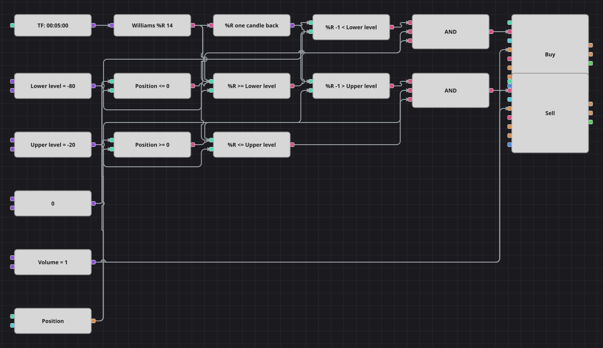

# Williams %R Level Crossing Strategy Diagram
[Русский](README_ru.md) | [中文](README_zh.md) | [Español](README_es.md) | [Deutsch](README_de.md) | [Português](README_pt.md) | [日本語](README_ja.md)

Williams %R says where the last close sits inside the highest high and the lowest low of the recent window, on a scale that runs from -100 at the very bottom to 0 at the very top. This diagram does not trade the time spent in an extreme zone, it trades the moment the indicator leaves it: the return above -80 is the buy, the return below -20 is the sell.

## Strategy Overview

- Williams %R is calculated on finished candles of a single instrument and is fully equivalent to the highest-high / lowest-low formula the original strategy computes by hand.
- Two levels split the scale: below -80 the market counts as oversold, above -20 as overbought.
- A previous-value block keeps the reading of the preceding candle, so a level is tested twice and only the crossing candle produces a signal.
- The current position takes part in both decisions, so no order ever adds to a position already held.

## Entry and Exit Rules

- **Long entry**: The previous %R reading was below the lower level, the current one is at or above it, and the position is not long. The order buys one lot, which opens a long from flat or brings an existing short back to zero.
- **Short entry**: The previous %R reading was above the upper level, the current one is at or below it, and the position is not short. The order sells one lot, which opens a short from flat or brings an existing long back to zero.
- **Exit**: There is no separate exit block: the opposite crossing sends a market order of the same volume, so it flattens the position exactly as the original strategy does. The original also stands aside for fifty candles after every trade; a bar counter has no block of its own here, so the level crossing carries that job alone and the diagram trades somewhat more often than the source.

## Parameters

| Parameter | Default | Description |
|---|---|---|
| Williams %R Length | 14 | Window of the highest high and the lowest low Williams %R is measured over. |
| Lower Level | -80 | Level the indicator has to climb back through to give a buy signal. |
| Upper Level | -20 | Level the indicator has to drop back through to give a sell signal. |
| Volume | 1 | Order volume, in lots. |
| Candles | 00:05:00 | Candle time frame the whole diagram works on. |

## Diagram Details

- The candle block feeds the Williams %R indicator block, whose output goes both to the comparison blocks and to a previous-value block.
- Four comparison blocks build the two crossings: the earlier reading against a level and the current reading against the same level.
- The position block is compared with a zero constant twice, giving a not-long guard for the buy side and a not-short guard for the sell side.
- Each logical AND joins the two halves of a crossing with its position guard and fires a position modify block; both take their volume from one shared constant.

## Usage

Import the `.json` file into Designer, run it in the backtester on historical data, then adjust the parameters or the blocks themselves to fit your instrument before trading it live.
