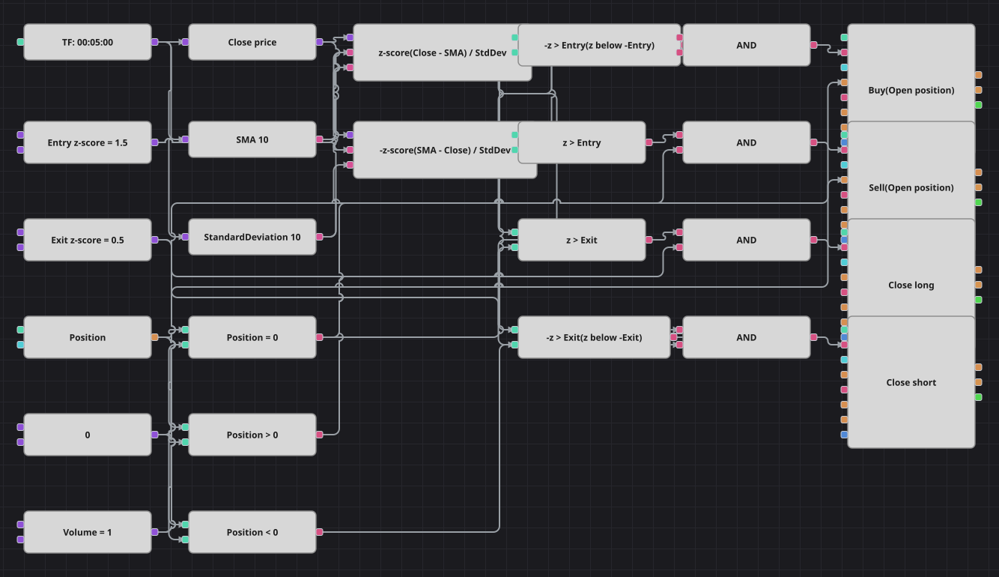

# Diagrama de la estrategia de reversión por z-score
[English](README.md) | [Русский](README_ru.md) | [中文](README_zh.md) | [Deutsch](README_de.md) | [Português](README_pt.md) | [日本語](README_ja.md)

El cierre se convierte en un z-score: la distancia a una media móvil medida en desviaciones típicas. Así, un solo número describe cuánto se ha estirado el mercado, sea cual sea el precio del instrumento. El diagrama se posiciona en contra del estiramiento y devuelve la operación en cuanto la puntuación vuelve cerca de cero.

## Resumen de la estrategia

- El z-score se construye a mano con SimpleMovingAverage y StandardDeviation: (Close - SMA) / StandardDeviation se calcula en un único bloque de fórmula.
- Una fórmula espejo produce la misma puntuación con signo cambiado, de modo que un nivel de entrada y otro de salida sirven para ambos lados en vez de cuatro constantes.
- Solo se entra desde posición plana; además los bloques de entrada llevan la condición de apertura de posición, así que el diagrama nunca promedia sobre una operación abierta.
- El original trabaja con velas de un minuto y bloquea la operativa durante 500 barras tras cada operación. El histórico incluido es de cinco minutos, por lo que el diagrama usa velas de cinco minutos; el bloqueo no se reproduce porque Designer no tiene un contador de barras con estado, y por eso el diagrama opera con más frecuencia y mantiene menos tiempo.

## Reglas de entrada y salida

- **Entrada en largo**: El z-score está por debajo del nivel de entrada en negativo, es decir, el cierre queda más de las desviaciones típicas configuradas por debajo de la media, y la posición está plana. La orden compra el volumen configurado.
- **Entrada en corto**: El z-score supera el nivel de entrada, es decir, el cierre queda más de las desviaciones típicas configuradas por encima de la media, y la posición está plana. La orden vende el volumen configurado.
- **Salida**: El largo se cierra cuando el z-score vuelve por encima del nivel de salida; el corto, cuando cae por debajo de ese nivel en negativo. No hay stop de pérdidas ni toma de beneficios, igual que en la estrategia original.

## Parámetros

| Parámetro | Por defecto | Descripción |
|---|---|---|
| SMA Length | 10 | Periodo de la media móvil desde la que se mide la puntuación. |
| StandardDeviation Length | 10 | Periodo de la desviación típica por la que se divide la distancia. |
| Entry z-score | 1.5 | Distancia a la media, en desviaciones típicas, que abre una operación. |
| Exit z-score | 0.5 | Distancia a la media, en desviaciones típicas, a la que se devuelve la operación abierta. |
| Volume | 1 | Volumen de la orden, en lotes. |
| Candles | 00:05:00 | Marco temporal de las velas con el que trabaja todo el diagrama. |

## Detalles del diagrama

- El bloque de velas alimenta el conversor del precio de cierre y los dos bloques de indicador, ajustados para emitir solo cuando están formados.
- Dos bloques de fórmula construyen la puntuación y su opuesta a partir de las mismas tres entradas, de forma que las comparaciones espejo no necesitan constantes extra.
- Cuatro bloques de comparación contrastan ambas puntuaciones con los niveles de entrada y salida, y otros tres comparan la posición con cero.
- Cada Y lógica une una condición de puntuación con una de posición; los bloques de entrada toman el volumen de una constante compartida y los de cierre usan la condición de cierre y no lo necesitan.

## Uso

Importe el archivo `.json` en Designer, ejecútelo sobre datos históricos en el probador y después ajuste los parámetros o los propios bloques a su instrumento antes de operar en real.
