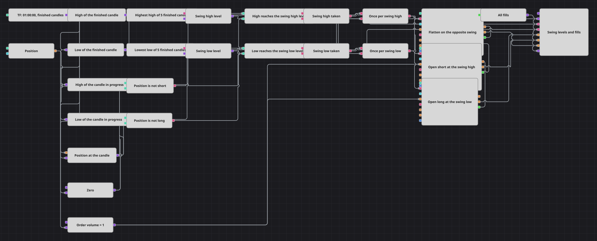

# Diagrama de la estrategia Zigzag Candles
[English](README.md) | [Русский](README_ru.md) | [中文](README_zh.md) | [Deutsch](README_de.md) | [Português](README_pt.md) | [日本語](README_ja.md)

Este diagrama mantiene activos dos niveles de swing —el máximo más alto y el mínimo más bajo de las últimas cinco velas horarias terminadas— y actúa sobre la vela que alcanza uno de ellos. Un par de bloques Flag que se reinician mutuamente permiten una sola acción por swing, de modo que un nivel tocado una y otra vez dentro del mismo movimiento produce una orden y no más. Cada swing cierra primero lo que esté abierto; el swing siguiente abre el lado contrario.

## Resumen de la estrategia

- Una única serie de velas horarias alimenta todo, y entrega solo velas terminadas, así que ningún nivel y ninguna orden se construye a partir de un precio que un tick posterior aún podría revertir.
- Dos convertidores leen el máximo y el mínimo de cada vela y alimentan un Highest de cinco y un Lowest de cinco. Ambos indicadores publican solo una vez formados, así que no existe ningún nivel hasta que hayan cerrado cinco velas.
- Dos bloques Variable retienen los niveles. Cada uno toma el valor más reciente del indicador sin emitirlo y vuelve a publicar lo que retiene en cada vela, de modo que un nivel sigue disponible para las comparaciones en todas las barras y no solo en la barra que lo cambió.
- Otros dos convertidores leen el máximo y el mínimo de la vela que acaba de cerrar, y dos bloques Comparison los miden contra los niveles retenidos: un máximo que alcanza o supera el nivel superior, un mínimo que alcanza o perfora el inferior.
- Una instantánea de Position se fija una vez por vela y se compara dos veces con cero, lo que da una prueba de no-corto y una prueba de no-largo. Cada una de las dos rupturas se une con la prueba correspondiente mediante un Logical condition AND, así que sobre el nivel superior solo se actúa mientras la posición no esté ya corta, y sobre el inferior solo mientras no esté ya larga.
- Cada AND acciona el Trigger de un Flag, y la ruptura opuesta acciona el Reset de ese Flag. Un Flag deja pasar un true y luego calla hasta que se reinicia, lo que convierte un nivel tocado muchas veces dentro de un mismo swing en exactamente una acción.
- Un Flag que se dispara alcanza a la vez un Modify position configurado como Close position y un Modify position configurado como Open position. Solo uno de ellos se aplica: una posición existente se cierra a mercado, una posición plana se abre en el lado que pide el swing, y el bloque que no corresponde rechaza la señal.
- El panel del gráfico dibuja las velas horarias, ambas líneas extremas, los tres flujos de órdenes y cada ejecución, de modo que los niveles de swing y las acciones tomadas sobre ellos pueden leerse en una sola imagen.

## Reglas de entrada y salida

- **Entrada en largo**: El mínimo de una vela terminada alcanza o cae por debajo del nivel inferior retenido mientras la posición no está larga. El Flag inferior se dispara una vez: una posición corta se recompra a mercado y queda plana, y una posición plana se convierte en un largo de Order Volume. Después el Flag permanece en silencio, por muchas veces que se vuelva a visitar el mínimo, hasta que se alcance el nivel superior.
- **Entrada en corto**: El máximo de una vela terminada alcanza o supera el nivel superior retenido mientras la posición no está corta. El Flag superior se dispara una vez: una posición larga se vende a mercado y queda plana, y una posición plana se convierte en un corto de Order Volume. Ese Flag permanece en silencio hasta que se alcance el nivel inferior.
- **Salida**: No hay stop, ni objetivo, ni temporizador: la posición se cierra con el swing opuesto. El mismo Flag que abre un lado alimenta también el bloque Close position, así que el primer toque del otro nivel cierra lo que esté abierto. Como el volumen de entrada es fijo y el bloque de apertura solo acepta una posición plana, una reversión completa siempre requiere dos swings: uno para cerrar y el siguiente para abrir el lado contrario.

## Parámetros

| Parámetro | Por defecto | Descripción |
|---|---|---|
| Candles | 01:00:00 | Marco temporal de la serie de velas. Solo se entregan velas terminadas, así que se toma una decisión por barra. |
| Swing High Length | 5 | Número de velas terminadas sobre las que se toma el extremo superior. Una ventana más larga hace más difícil de alcanzar el nivel superior y alarga los swings; una más corta convierte casi cada vela en un nuevo extremo. |
| Swing Low Length | 5 | Número de velas terminadas sobre las que se toma el extremo inferior. Se mantiene separado del superior para poder hacer los dos lados deliberadamente asimétricos. |
| Initial Swing High | 999999999 | Valor que retiene el nivel superior hasta que el indicador superior está formado. Es deliberadamente inalcanzable, de modo que ningún máximo pueda tocarlo durante el calentamiento y no pueda abrirse ningún corto antes de que exista un extremo real. |
| Initial Swing Low | 0 | Valor que retiene el nivel inferior hasta que el indicador inferior está formado. El cero no puede alcanzarse desde arriba con un precio negociado, lo que mantiene quieto el lado largo por la misma razón. |
| Order Volume | 1 | Cantidad utilizada por ambas acciones de apertura. La acción de cierre no necesita volumen —cierra lo que esté abierto—, así que con una cantidad fija la posición solo se mueve entre un lote corto, plana y un lote largo. |

## Detalles del diagrama

- El bloque [Candles](https://doc.stocksharp.com/en/topics/designer/strategies/using_visual_designer/elements/data_sources/candles.html) está suscrito solo a velas terminadas, y eso es lo que hace honestos los niveles. Los indicadores se alimentan a través de [Converters](https://doc.stocksharp.com/en/topics/designer/strategies/using_visual_designer/elements/converters/converter.html), y un convertidor emite un número simple, que siempre cuenta como final; una vela todavía en curso entraría por tanto en las ventanas de Highest y Lowest como si estuviera completa y el extremo acabaría conteniéndose a sí mismo. La misma suscripción es lo que mantiene legales las órdenes: una orden construida a partir de una actualización de una vela sin terminar lleva la hora de apertura de esa barra y se rechaza por llegar desde el pasado.
- Una ruptura se mide contra los niveles tal como estaban antes de la vela que se está juzgando: las variables de retención vuelven a publicar lo que ya tenían, y los indicadores incorporan la nueva vela en esa misma barra, así que el nivel contra el que se prueba una vela es el extremo de las cinco velas que la precedieron y no uno que la incluya a ella misma.
- Los dos bloques [Flag](https://doc.stocksharp.com/en/topics/designer/strategies/using_visual_designer/elements/common/flag.html) están cableados en cruz: la ruptura superior reinicia el Flag inferior y la ruptura inferior reinicia el superior. Ese par es toda la memoria del diagrama: dice hacia dónde fue el último swing y si ya se ha actuado sobre él. Un Flag ignora un false en cualquiera de los dos conectores, así que las comparaciones que publican false en cada actualización de vela no cuestan nada, y vuelve a emitir solo después de que se haya alcanzado el nivel opuesto.
- Los niveles los retienen bloques [Variable](https://doc.stocksharp.com/en/topics/designer/strategies/using_visual_designer/elements/data_sources/variable.html) cuya entrada no actúa como disparador; en su lugar, la serie de velas acciona su Trigger. El mismo patrón fija el valor de [Position](https://doc.stocksharp.com/en/topics/designer/strategies/using_visual_designer/elements/positions/current.html) una vez por vela, de modo que las dos [Comparisons](https://doc.stocksharp.com/en/topics/designer/strategies/using_visual_designer/elements/common/comparison.html) de posición y los dos bloques [Logical condition](https://doc.stocksharp.com/en/topics/designer/strategies/using_visual_designer/elements/common/logical_condition.html) AND leen todos la misma instantánea en lugar de un valor que cambia bajo sus pies.
- Actúan tres bloques [Modify position](https://doc.stocksharp.com/en/topics/designer/strategies/using_visual_designer/elements/positions/modify.html), todos a mercado: uno con Close position que recibe ambos Flags, y uno con Open position para cada lado. En una vela exterior, una que a la vez supera el máximo anterior y perfora el mínimo anterior, ambos Flags pueden dispararse en la misma pasada y se envían dos órdenes a mercado; se anulan entre sí en la posición, pero ambas aparecen como ejecuciones en el registro y en el [Chart panel](https://doc.stocksharp.com/en/topics/designer/strategies/using_visual_designer/elements/common/chart.html).

## Uso

Importe el archivo `.json` en Designer, ejecútelo sobre datos históricos en el probador y después ajuste los parámetros o los propios bloques a su instrumento antes de operar en real.
