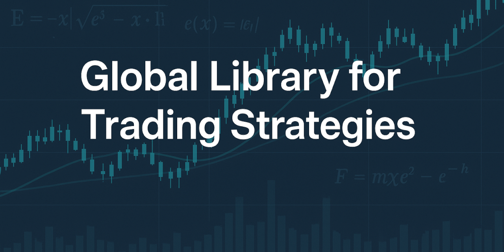

# StockSharp アルゴリズム取引サンプル

[English](README.md) | [Русский](README_ru.md) | [中文](README_zh.md) | [Español](README_es.md) | [Deutsch](README_de.md) | [Português](README_pt.md)

これは、アルゴリズム取引のサンプルを提供する StockSharp 公式リポジトリです。整理された大規模な API 戦略カタログ、Strategy Designer のビジュアルサンプル、学習資料、およびサンプルをビルド可能な状態に保つ自動チェックをまとめています。

このリポジトリは、学習、研究、プロトタイピング、回帰テストを目的としています。各戦略は取引アイデアと StockSharp API の使い方を示すものであり、そのまま利用できる投資推奨ではありません。

## はじめに

| 目的 | 場所 |
|---|---|
| 取引アイデア別に戦略を探す | [API 戦略カタログ](API/README_ja.md) |
| C# と Python の実装を学ぶ | [`API`](API/) |
| ビジュアルスキーマと Designer サンプルを見る | [`Designer`](Designer/) |
| 1 つの C# 戦略をコンパイルしてバックテストする | [`Backtester`](Backtester/) |
| 自動戦略テスト環境を確認する | [`Tests`](Tests/) |

## リポジトリの内容

### API 戦略カタログ

[`API`](API/) ディレクトリには、移動平均クロス、ブレイクアウト、モメンタム、ボラティリティ、平均回帰といった一般的な手法から、ペアトレード、裁定取引、マーケットメイク、ポートフォリオ手法、注文フローモデル、機械学習の実験、多数の専門的なバリエーションまで収録されています。

カタログでは主な取引アイデアごとに戦略を分類しています。一方、ファイルシステムでは大規模なコレクションを GitHub 上で効率よく表示できるよう、番号範囲のディレクトリに分けています。一般的なサンプルの構成は次のとおりです。

```text
API/0001-0100/0001_MA_CrossOver/
├── CS/
│   ├── MaCrossoverStrategy.cs
│   └── logo.svg
├── PY/
│   ├── ma_crossover_strategy.py
│   └── logo.svg
├── README.md
├── README_ru.md
├── README_zh.md
├── README_es.md
├── README_de.md
├── README_pt.md
└── README_ja.md
```

各 API サンプルでは、同じ戦略アイデアを C# と Python の両方で実装しています。7 言語のドキュメントで、考え方、パラメーター、シグナルロジック、リスク上の注意点を説明しています。透明な SVG ロゴは戦略と実装言語を表し、ライトテーマとダークテーマの両方で読みやすく表示されます。

### Strategy Designer サンプル

[`Designer`](Designer/) ディレクトリには、[StockSharp Strategy Designer](https://doc.stocksharp.com/en/topics/designer.html) 用のビジュアルスキーマ、再利用可能な戦略タイプ、学習サンプルがあります。ソースコードから始める代わりに、戦略を視覚的に組み立てて確認したい場合に役立ちます。

### ビルドおよびテストツール

このリポジトリには 2 つの小規模な .NET プロジェクトがあります。

- [`Backtester`](Backtester/) は指定した C# 戦略を動的にコンパイルし、同梱のサンプル履歴データで実行します。
- [`Tests`](Tests/) は API サンプルをコンパイルし、StockSharp の履歴エミュレーション環境で検証します。

テストプロジェクトはソースジェネレーターを使用するため、通常の戦略に手書きのテストメソッドは不要です。生成された各テストはサンプル市場データで戦略を実行し、注文と約定が生成されることに加えて、複製と設定のシリアライズも確認します。複数銘柄や特別な準備を必要とする戦略には、テストプロジェクト内に明示的なオーバーライドがあります。

.NET ビルドの前に、[`Tools/validate_api_structure.py`](Tools/validate_api_structure.py) が高速な構造チェックを実行します。番号付きディレクトリの配置、C# と Python の対応、必須翻訳、ソースファイルの存在、および一方の言語版が利用できないという古い記述がないことを確認します。

## 必要な環境

ソリューション全体をローカルでビルドするには、次のものが必要です。

- .NET 10 SDK
- 構造バリデーター用の Python 3
- 同じ親ディレクトリに配置した StockSharp プラットフォームリポジトリ

プロジェクト参照では、次のディレクトリ構成を想定しています。

```text
<workspace>/
├── AlgoTrading/
└── StockSharp (GitHub)/
```

このリポジトリを `AlgoTrading` としてクローンし、[StockSharp プラットフォームリポジトリ](https://github.com/StockSharp/StockSharp)を同じ親ディレクトリの `StockSharp (GitHub)` としてクローンしてください。

## 検証、ビルド、テスト

最初に高速なリポジトリチェックを実行します。

```bash
python Tools/validate_api_structure.py
```

次に、CI と同じ構成でソリューションをビルドしてテストします。

```bash
dotnet build AlgoTrading.slnx --configuration Release
dotnet test AlgoTrading.slnx --no-build --configuration Release
```

生成された 1 つの戦略テストだけを実行するには、戦略フォルダー名を PascalCase にした名前でフィルターします。例：

```bash
dotnet test Tests/Tests.csproj --no-build --configuration Release \
  --filter "FullyQualifiedName~MaCrossover"
```

1 つの C# サンプルを直接コンパイルしてバックテストするには、次を実行します。

```bash
dotnet run --project Backtester/Backtester.csproj -- \
  API/0001-0100/0001_MA_CrossOver/CS/MaCrossoverStrategy.cs
```

## サンプルの使い方

[カタログ](API/README_ja.md)から戦略を選び、前提条件とパラメーターを読み、C# と Python の実装を比較してください。各サンプルは出発点として扱い、アイデアを評価する前に、適切な市場データ、手数料、スリッページ、レイテンシー、ポジションサイズ、リスク上限を設定してください。

ビジュアル開発では、[Strategy Designer](https://stocksharp.com/en/store/strategy-designer/) をインストールし、[Strategy Gallery](https://doc.stocksharp.com/en/topics/designer/strategy_gallery.html) を開いて、[`Designer`](Designer/) 内のスキーマを学習資料やプロトタイプとして利用できます。

変更した戦略をライブ運用の候補にする前に、必ずアウトオブサンプルデータとシミュレーションで検証してください。バックテストは特定のデータセットにおける挙動を示すだけで、将来の収益性を証明するものではありません。

## コントリビューション

正確性、明確さ、網羅性、学習価値を高めるコントリビューションを歓迎します。API 戦略を追加または変更する場合は、次の規則に従ってください。

1. 戦略を該当する番号範囲ディレクトリに配置します。
2. C# と Python の両方の実装を維持します。
3. 7 つのローカライズされた README を実際のパラメーターと動作に合わせます。
4. 戦略の視覚的な表現を変更した場合は、各実装言語の透明 SVG ロゴも更新します。
5. Pull request を作成する前に、構造バリデーター、Release ビルド、関連テストを実行します。

通常の戦略はテストソースジェネレーターによって自動検出されます。標準テスト環境では用意できない特別な銘柄、ポートフォリオ、市場データ、その他の初期設定が必要な場合にのみ、手動のオーバーライドを追加してください。

## リソース

- [StockSharp ウェブサイト](https://stocksharp.com/)
- [ドキュメント](https://doc.stocksharp.com/en/)
- [Strategy Designer](https://stocksharp.com/en/store/strategy-designer/)
- [コミュニティチャット](https://stocksharp.com/en/chat/)
- [Issue トラッカー](https://github.com/StockSharp/AlgoTrading/issues)

## ライセンスとリスクに関する注意

このリポジトリに適用される条件については、[LICENSE](LICENSE) と [NOTICE](NOTICE) を参照してください。

アルゴリズム取引には大きなリスクがあります。このリポジトリのサンプルは教育および技術目的で提供され、成果を保証するものではありません。実資金を使用する前に、コードの確認、前提条件の検証、適切な運用上および財務上のリスク管理を行う責任は利用者にあります。
